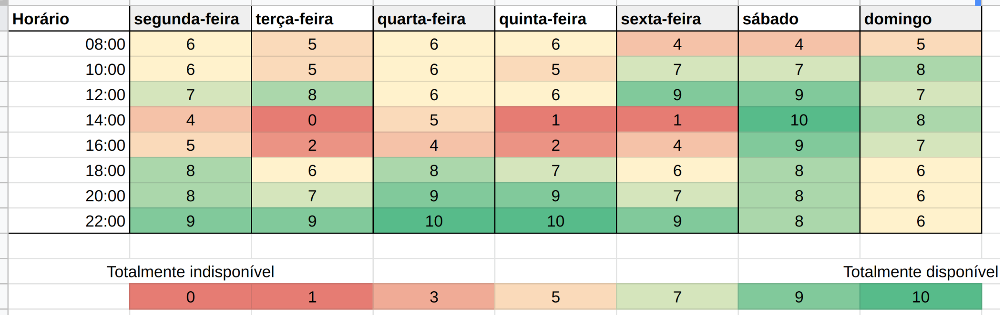

# Quadro de disponibilidade

| Data       | Autor                                        | Modificações                       | Versão |
| ---------- | -------------------------------------------- | ---------------------------------- | ------ |
| 18/02/2021 | [Welison Regis](https://github.com/WelisonR) | Adiciona disponibilidade da equipe | 1.0    |

O quadro de disponibilidade foi desenvolvido após a formação dos grupos da disciplina com a finalidade de gerir os horários de encontro da equipe 08 e, além disso, oferecer informações estratégicas sobre a disponibilidade dos membros durante o semestre. Nesse sentido, é possível organizar as tarefas da equipe de maneira que maximize a participação de todos.

!!! info
    O Quadro de disponibilidade foi gerado automaticamente com base na disponibilidade individual dos membros da equipe.
