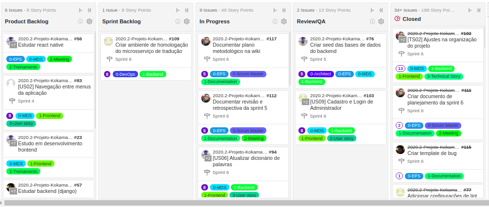

# Plano metodológico

## Histórico de revisão

| Data       | Autor                                        | Modificações                          | Versão |
| ---------- | -------------------------------------------- | ------------------------------------- | ------ |
| 23/03/2021 | [Welison Regis](https://github.com/WelisonR) | Adiciona Plano metodológico da equipe | 1.0    |

## Introdução

O presente documento visa descrever o plano metodológico utilizado no desenvolvimento do Projeto Kokama, além de detalhar as técnicas e as metodologias aplicadas durante a elaboração do projeto. Utiliza-se de conceitos e práticas de múltiplas metodologias de modo a fazer uma adaptação ao contexto do trabalho.

## Papéis

Na situação do projeto, os papéis são definidos de acordo com a metodologia _Scrum_ e com base nos requisitos da disciplina, sendo que cada membro tem responsabilidades e compromissos conforme definido no documento de **[Roadmap de papéis](role-roadmap.md)**.

Na análise de risco do projeto, definiu-se que a priori não ocorrerão rotações de papéis durante o curso do semestre de modo que fique livre ao time essa possibilidade futuramente, caso a maturidade da equipe, o custo, o escopo e o tempo proporcione essa experiência.

## Metodologias

### Scrum

No Projeto Kokama, adota-se elementos metodológicos do scrum com encontros definidos no **[Plano de Comunicaçao](communication-plan.md)**, que utilizam como base o **[Quadro de Disponibilidade](availability-board.md)** para decisão dos horários. Utiliza-se principalmente os seguintes artefatos do Scrum [^2]:

- **_Sprint_**: período de tempo durante o qual é produzida uma versão incremental do produto. No projeto, uma _sprint_ possui 7 dias;
- **_Daily_**: acompanhamento diário do desenvolvimento da _sprint_ de modo a identificar o que foi feito, o que será feito e as dificuldades a fim de mitigar e prevenir riscos. No projeto, a _daily_ ocorre durante um período de 15 minutos;
- **Revisão de _sprint_**: reunião para validar o incremento do produto produzido na _sprint_ atual e adaptar o backlog do produto (se necessário). No projeto, a revisão dura até 1 hora e a documentação segue o **[modelo de revisão definido nas sprints](sprints/sprint-4-review-retrospective.md)**. Ademais, realiza-se uma reunião de revisão mais curta com a dona do produto para validação do que foi desenvolvido na _sprint_;
- **Retrospectiva da _Sprint_**: momento da equipe inspecionar a si própria de modo a criar um plano para melhorias a serem aplicadas na próxima _sprint_. No projeto, a retrospectiva dura até 1 hora e a documentação segue o **[modelo de retrospectiva definido nas sprints](sprints/sprint-4-review-retrospective.md)**. Ademais, levanta-se em reunião mais curta com a dona do produto quais os pontos positivos e os pontos de melhoria dos entregáveis da _sprint_;
- **Planejamento da _Sprint_**: com a colaboração de todos os papéis, define-se nessa etapa o trabalho a ser realizado na nova _sprint_. No projeto, o processo de planejamento dura até 2 horas e leva em consideração artefatos, objetivos e priorizações trazidos nas **[reuniões com a dona do produto](po-meetings/meeting-1.md)**. Define-se histórias de usuários e tarefas que serão desenvolvidas nas novas _sprints_ levando em consideração a aprendizagem das últimas semanas. O **[documento de planejamento da sprint](sprints/sprint-4-planning.md)** é criado automaticamente através de **_scripts_** desenvolvido pela equipe.
    - **_Planning Poker_**: define-se no planejamento da _sprint_ a estimativa de pontos (fibonnaci) dos artefatos que serão desenvolvidos na _sprint_ em relação a medida de esforço, complexidade e risco.

### Kanban

Para monitorar o trabalho da equipe, utiliza-se a metodologia Kanban através da ferramenta [ZenHub](https://www.zenhub.com/) integrada às _issues_ do GitHub [^4]. Nesse sentido, definiu-se um fluxo de trabalho dividido em cinco etapas: _product backlog_, _sprint backlog_, _in progress_, _review/QA_ e _closed_.

- Ferramenta _ZenHub_ [^3]: auxilia na geração de relatórios de métricas do desenvolvimento das _sprints_, além de realizar a integração entre os diferentes repositórios do projeto dentro da organização. Pode-se ver o fluxo de trabalho na imagem abaixo.
- Categorização (labels): os artefatos presentes no fluxo do Kanban são categorizados com os rótulos "0-Papel", "1-Tecnologias", "2-Treinamento e Encontros" e "3-US/TS".

### Extremming Programming (codificação)

No projeto, adotou-se metodologias do Extremming Programming (XP) no processo de desenvolvimento de código, como pode-se citar: programação em pares, refatorações (se aplicável), integração contínua e _feedback_ constante, tanto da parte interessada do projeto como da equipe de desenvolvimento e gerência[^2].

No projeto, adota-se os pares de programação conforme expertise dos membros relativo a tecnologia, metodologia, entregas, entre outros fatores, de modo a homogeneizar o conhecimento e melhorar as entregas no contexto da equipe.

## Métricas de gerenciamento

O projeto utiliza como métricas de gerenciamento os seguintes recursos:

- **_Burndown_**: gráfico que mostra como o projeto está andando ao longo de um périodo de tempo de modo a auxilar no planejamento das entregas das _sprints_.
- **_Velocity_**: gráfico elaborado com base na pontuação das histórias finalizadas em um determinado período de tempo, no caso do projeto as _sprints_ semanais. A acurária do velocity da equipe evolui com o tempo e, após estabilizado, é uma ótima métrica para o planejamento das atividades das _sprints_.
- **_Cumulative flow_**: gráfico que indica como tem se dado o fluxo de entrega de atividades da equipe ao longo do tempo, conforme marcos (divisões) definidos no Kanban. O _cumulative flow_ tem por objetivo realizar o acompanhamento e melhoria no processo de entrega contínua por parte da equipe, além de ajudar no acompanhamento da quantidade de trabalho presente em cada etapa do Kanban.
- **_Quadro de Conhecimentos_**: representação visual do acompanhamento da evolução da aprendizagem em relação a tecnologias e metodologias adotadas pelo projeto. Tem como objetivo manter o rastreamento sobre os pontos de falhas na aprendizagem dos integrantes da equipe.
- **_Tempo gasto por sprint_**: representação visual do tempo gasto por _sprint_ por parte da equipe de Métodos de Desenvolvimento de Software e Engenharia de Produto de Software. Além de estar relacionada ao custo do projeto, essa métrica visa acompanhar e melhorar a organização e a eficiência do tempo gasto nas atividades por parte dos membros da equipe.

Pode-se verificar um exemplo de aplicação das métricas nas **[sprints](sprints/sprint-4-review-retrospective.md)**.

## Comunicação

A comunicação da equipe ocorre conforme definido no **[Plano de Comunicaçao](communication-plan.md)**, ademais, o grupo realiza reuniões conforme definido no texto acima, além de priorizações e validações de protótipo, produto e projeto com a dona do produto e as partes interessadas periodicamente.

## Referências

[^1]: BECK, Kent et al. Manifesto para Desenvolvimento Ágil de Software. 2001. Disponível em: https://agilemanifesto.org/iso/ptbr/manifesto.html. Acesso em: 23 mar. 2021.

[^2]: SCRUM e XP. 2013. Disponível em: https://www.desenvolvimentoagil.com.br/scrum/. Acesso em: 22 mar. 2021.

[^3]: RACASAN, Mariana. GitHub for Project Management - How to Organize and Track Your Agile Processes. Disponível em: https://blog.zenhub.com/how-to-use-github-agile-project-management/. Acesso em: 22 mar. 2021.

[^4]: FIRMINO, Júlia. O que é kanban e como ele pode ajudar na organização do trabalho. Disponível em: https://blog.runrun.it/o-que-e-kanban/. Acesso em: 23 mar. 2021.
