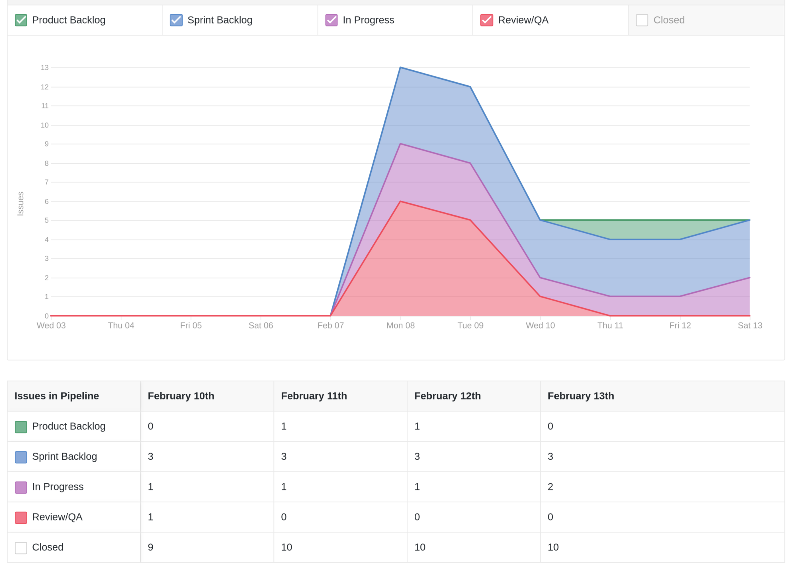
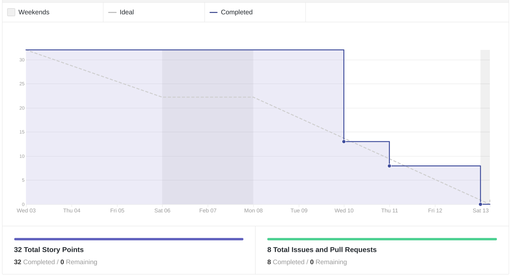
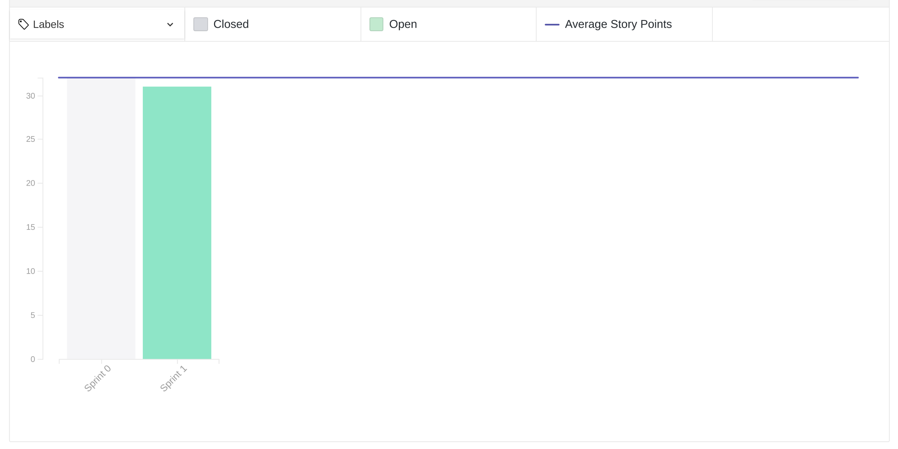
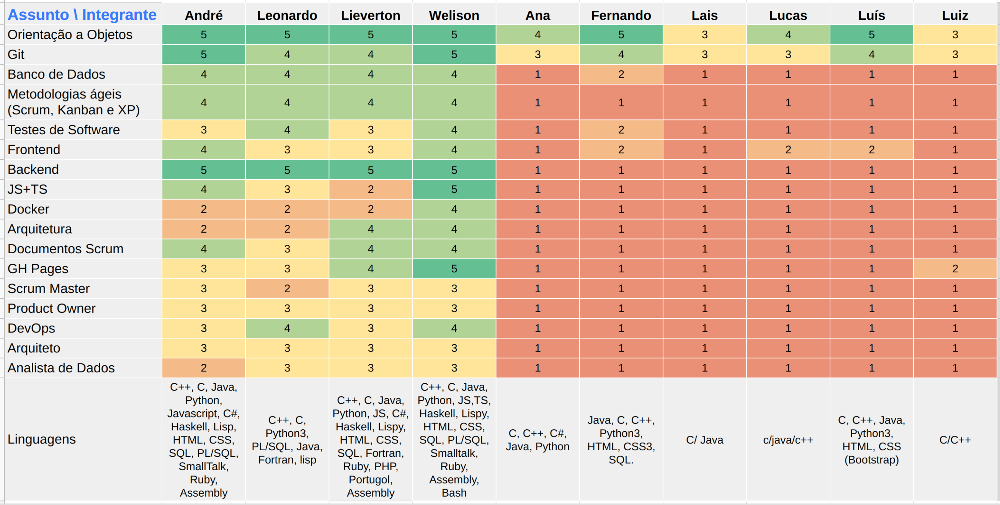
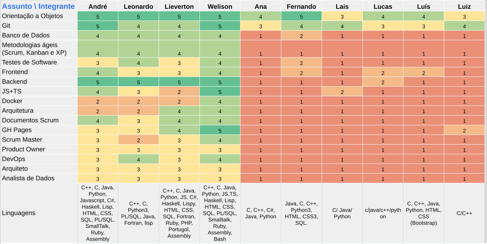

# Review da sprint 0

## Histórico de revisão

| Data       | Autor                                        | Modificações                      | Versão |
| ---------- | -------------------------------------------- | --------------------------------- | ------ |
| 16/02/2020 | [Welison Regis](https://github.com/WelisonR) | Adiciona documentação da sprint 0 | 1.0    |

## Visão Geral

|        Duração da sprint        | Planejado | Entregue  | Divida técnica | Membros ausentes |
| :-----------------------------: | :-------: | :-------: | :------------: | :--------------: |
| **03/02/2020** a **13/02/2020** |     -     | 35 pontos |       -        |      Nenhum      |

## Tarefas Realizadas

| Tarefa | Responsáveis | Pontuação | Concluída? |
| ------ | ------------ | :-------: | :--------: |
| [Criar templates de *issues*, *pull requests* e outros](https://github.com/fga-eps-mds/EPS-2020-2-G3/issues/1) | [Welison Regis](https://github.com/WelisonR) e [Lieverton Silva](https://github.com/lievertom) | 3 | :heavy_check_mark: |
| [Adicionar licença do projeto](https://github.com/fga-eps-mds/EPS-2020-2-G3/issues/2) | [Lieverton Silva](https://github.com/lievertom) | 1 | :heavy_check_mark: |
| [Configurar wiki com MKDocs Material](https://github.com/fga-eps-mds/EPS-2020-2-G3/issues/3) | [Welison Regis](https://github.com/WelisonR) e [Lieverton Silva](https://github.com/lievertom) | 5 | :heavy_check_mark: |
| [Pensar situações, problemas e oportunidades de projeto](https://github.com/fga-eps-mds/EPS-2020-2-G3/issues/4) | Todo o time | 8 | :heavy_check_mark: |
| [Criar documento de contribuição do repositório](https://github.com/fga-eps-mds/EPS-2020-2-G3/issues/5) | [Welison Regis](https://github.com/WelisonR) e [Lieverton Silva](https://github.com/lievertom) | 3 | :heavy_check_mark: |
| [Criar documento de disponibilidade da equipe](https://github.com/fga-eps-mds/EPS-2020-2-G3/issues/6) | [Welison Regis](https://github.com/WelisonR) | 2 | :heavy_check_mark: |
| [Criar quadro de conhecimentos da equipe (inicial)](https://github.com/fga-eps-mds/EPS-2020-2-G3/issues/7) | [Welison Regis](https://github.com/WelisonR) | 3 | :heavy_check_mark: |
| [Definir canais iniciais do projeto](https://github.com/fga-eps-mds/EPS-2020-2-G3/issues/8) | [Welison Regis](https://github.com/WelisonR) | 5 | :heavy_check_mark: |
| [Dojo de git e trabalho em equipe](https://github.com/fga-eps-mds/EPS-2020-2-G3/issues/10) | [André Lucas](https://github.com/andrelucax) e [Leonardo Medeiro](https://github.com/leomedeiros1?tab=repositories) | 5 | :heavy_check_mark: |

## Cumulative Flow

## Burndown

## Velocity

## Quadro de Conhecimentos

### Antes

### Depois

## Retrospectiva

### Pontos Positivos

1. Todos os membros estiveram presentes em todas as reuniões;
2. Treinamentos realizados pela equipe foram proveitosos;
3. Time reagiu muito bem às adversidades da *sprint*;
4. Time conseguiu cumprir as principais *issues* pendentes, o que possibilitará focar em assuntos relacionados ao tema na próxima *sprint*;
5. Boa integração e comunicação do grupo.

### Pontos de Melhoria

1. Dificuldade com a definição do tema do projeto;
2. Falta de proatividade;
3. Divisão ineficiente de *issues*;
4. Dificuldades por membros da equipe nas tecnologias que serão utilizadas durante o decorrer do projeto;
5. Falta de acompanhamento mais atento ao desenvolvimento de atividades por membros da equipe.

### Medidas a serem tomadas

1. Definir bot de lembrete de dailys e fazer acompanhamento dos resultados alcançados pelos membros;
2. Delegar e distribuir mais atividades entre os membros da equipe;
3. Realizar novos treinamentos em tecnologia para melhorar a capacidade técnica do time.

## Avaliação do Scrum Master

Conforme pode-se observar no gráfico **cumulative flow**, o *backlog* da *sprint* 0 foi construído sob demanda durante a própria *sprint*. Ocorre que, durante essa *sprint* inicial, a formação dos grupos e a definição do tema trouxe dificuldades de gerenciamento de time no sentido de haver maior imprevisibilidade sobre as demandas desenvolvidas na *sprint*, como é o caso de só conseguirmos definir o tema no último dia da *sprint*. Portanto, teve-se que adaptar o *backlog* da *sprint* e as tarefas de maneira ágil.

O **burndown** e o **velocity** da *sprint* alcançaram 32 pontos, 8 *issues* finalizadas e nenhuma *issue* pendente. Por se tratar de uma *sprint* conturbada, acredita-se que o desempenho da equipe esteja acima dos valores obtidos e, para alçar melhores resultados, deve-se organizar melhor as atividades e tentar manter um ambiente mais previsível de tarefas que serão desenvolvidas pela equipe.

O **quadro de conhecimentos** aponta que será necessário trabalhar em treinamentos, principalmente com a equipe de MDS, no sentido de realizar dojôs ou recomendar materiais de estudo para que seja possível desenvolver o *software* e diversificar o conhecimento entre os membros do time. Além disso, é possível visualizar que o conhecimento dos membros de MDS está equitativo, entretanto, é notório que há muito a aprender para as próximas sprints.

Por fim, percebe-se que o **time** já está mais integrado, com mais conhecimento e com melhor comunicação. Entretanto, será necessário melhorar nos pontos apresentados acima, além de adotar as mudanças relativas aos pontos de melhoria elencados.
