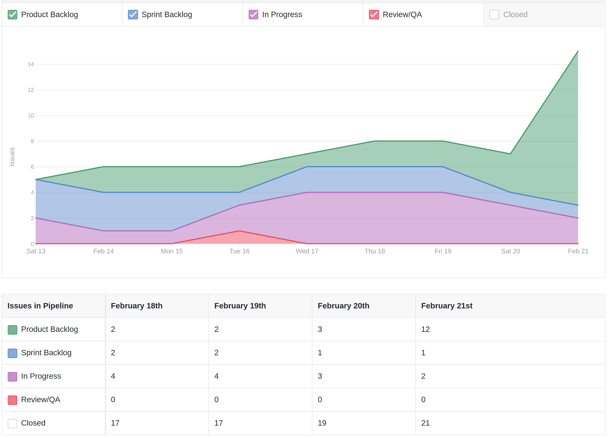
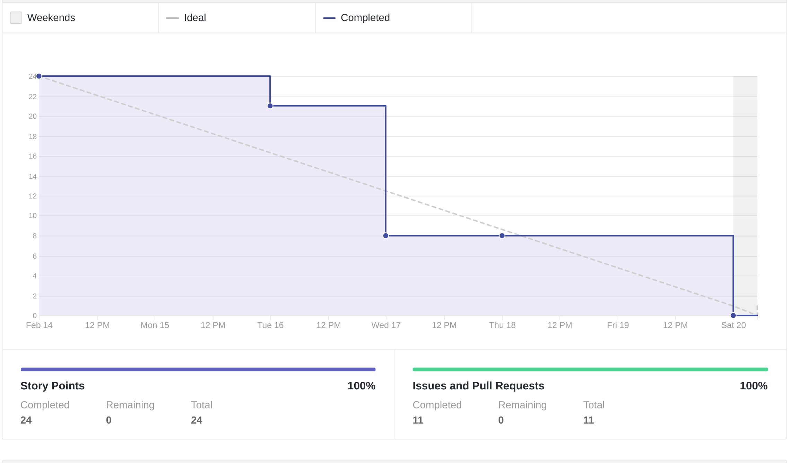
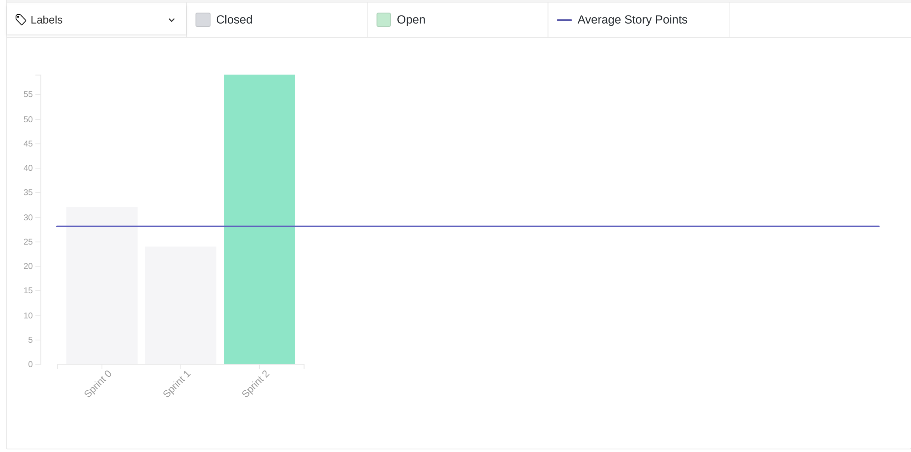
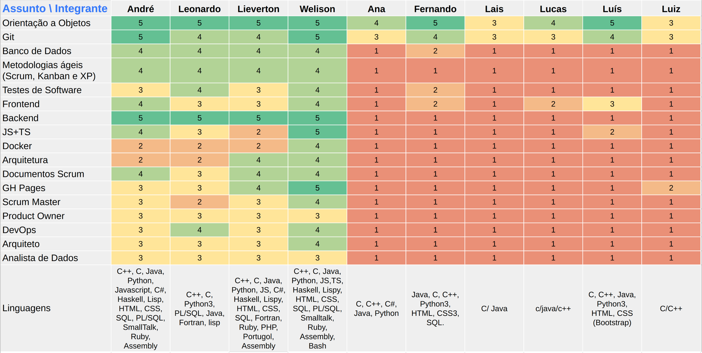
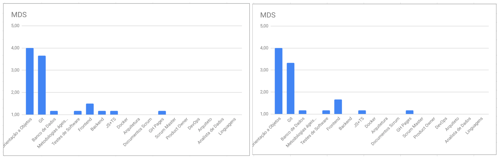

# Review da sprint 1

## Histórico de revisão

| Data       | Autor                                        | Modificações                                 | Versão |
| ---------- | -------------------------------------------- | -------------------------------------------- | ------ |
| 25/02/2021 | [Welison Regis](https://github.com/WelisonR) | Adiciona revisão e retrospectiva da sprint 1 | 1.0    |

## Visão Geral

|        Duração da sprint        | Planejado | Entregue  | Divida técnica | Membros ausentes |
| :-----------------------------: | :-------: | :-------: | :------------: | :--------------: |
| **13/02/2021** a **20/02/2021** | 24 pontos | 24 pontos |       -        |      Nenhum      |

## Tarefas Realizadas

| Tarefa                                                                                                     | Pontos | Responsáveis                                                                                                        |     Concluída?     |
| ---------------------------------------------------------------------------------------------------------- | :----: | ------------------------------------------------------------------------------------------------------------------- | :----------------: |
| [Criar documento de contribuição do repositório](https://github.com/fga-eps-mds/2020.2-Projeto-Kokama-Wiki/issues/5)    |   3    | [Welison Regis](https://github.com/WelisonR) e [Lieverton Silva](https://github.com/lievertom)                      | :heavy_check_mark: |
| [Criar documento de código de conduta](https://github.com/fga-eps-mds/2020.2-Projeto-Kokama-Wiki/issues/12)             |   2    | [Leonardo Medeiro](https://github.com/leomedeiros1?tab=repositories)                                                | :heavy_check_mark: |
| [Criar landing page para a wiki](https://github.com/fga-eps-mds/2020.2-Projeto-Kokama-Wiki/issues/15)                   |   5    | [Lieverton Silva](https://github.com/lievertom)                                                                     | :heavy_check_mark: |
| [Documentar sprint 0](https://github.com/fga-eps-mds/2020.2-Projeto-Kokama-Wiki/issues/18)                              |   5    | [Welison Regis](https://github.com/WelisonR)                                                                        | :heavy_check_mark: |
| [Dojo de python e programação orientada a objetos](https://github.com/fga-eps-mds/2020.2-Projeto-Kokama-Wiki/issues/19) |   8    | [André Lucas](https://github.com/andrelucax) e [Leonardo Medeiro](https://github.com/leomedeiros1?tab=repositories) | :heavy_check_mark: |
| [Levantamento de dúvidas sobre o projeto](https://github.com/fga-eps-mds/2020.2-Projeto-Kokama-Wiki/issues/22)          |   1    | Todos os membros                                                                                                    | :heavy_check_mark: |

## Cumulative Flow

## Burndown

## Velocity

## Quadro de Conhecimentos

### Antes

### Depois

### Antes x Depois por assunto

## Retrospectiva

### Pontos Positivos

1. Excelente revisão de Git
2. Proatividade de >>ALGUNS<< membros
3. Excelente revisão de python
4. Arrumamos um tema UHUL
5. Muitas reuniões pontuais e proveitosas
6. Equipe entusiasmada com o trabalho
7. Dojo de Python
8. Professora disponível a ajudar com o projeto
9. Melhoria de comunicação entre a equipe
10. Grupo de EPS tem sido bem organizado e auxilia bem os MDS
11. Temos um tema
12. A professora parece animada pra ajudar a gente
13. Ter cliente ajuda no aprendizado e entender melhor uma situacao da vida real

### Pontos de Melhoria

1. Dificuldade de definir um tema com o professor
2. Conversa com Hilmer/Altaci pode ser feita de forma melhor?
3. Mais trabalho em equipe
4. Alguns membros de mds não estão se mostrando tão animados/proativos como outros
5. Mais iniciativa e compromentimento para resolver problemas
6. Não ter reuniões em horário de almoço
7. Melhor noção de que já estamos atrasados e o projeto é longo
8. Melhorar nos aprendizados de tecnologia e da teoria necessária para realizar o projeto
9. Começar a definir missões/metas individuais/dupla
10. MDS não tá ligando a câmera :(

### Medidas a serem tomadas

1. Melhorar distribuição das issues no início da sprint
2. Promover novos treinamentos e materiais de estudo em tecnologias
3. Delegar mais atividades a membros de MDS e definir as metas individuais e de pareamento
4. Com o tema definido, começar a delinear o seu escopo
5. Envolver todos os membros da equipe no sentido de mostrar que é importante haver a colaboração de todos

## Avaliação do Scrum Master

Conforme pode-se observar no gráfico **cumulative flow**, a equipe atendeu bem as demandas planejadas para a semana, observado que as issues que restaram em progresso se referem a atividades de aprendizagem contínua (estudo de tecnologias e metodologias). Além disso, pode-se observar que houve novos planejamentos de atividades após o fim da sprint 1, representada pelo incremento do backlog do produto.

O **burndown** revela que os 24 pontos foram bem distribuídos e desempenhados ao longo da semana, fora o fato de que se conseguiu atingir os pontos planejados para a sprint. Já o **velocity** da sprint 1, embora um pouco abaixo da média se comparado a sprint passada, indica que o foco da equipe tem sido no estudo e aplicação das tecnologias e metodologias, além da iniciação do projeto propriamente dito, que ocorreu na sexta-feira com uma entrevista com a PO.

O **quadro de conhecimentos** indica que os integrantes ainda estão timidamente se apropriando do conhecimento das tecnologias e metodologias desempenhadas na disciplina, o que levanta a necessidade de adotar medidas para que o conhecimento da equipe se torne melhor e mais homogêneo.

De modo geral, percebe-se que será necessário acelerar atividades relacionadas ao tema, melhorar o trabalho em equipe através de atividades colaborativas e investir mais em conhecimento e treinamento da equipe.
