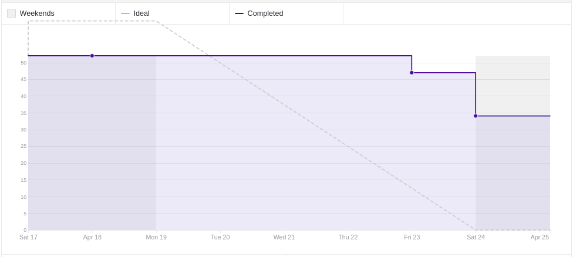
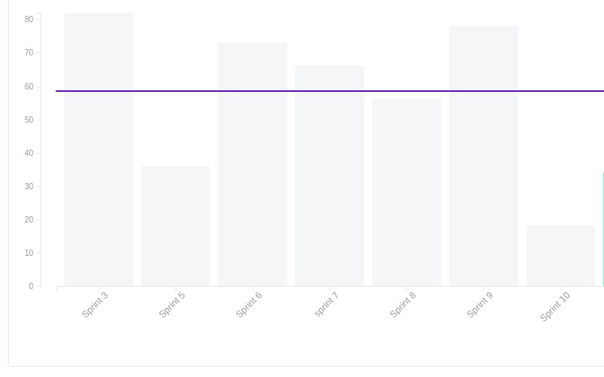
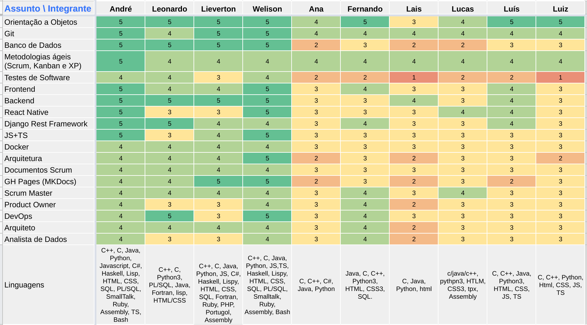
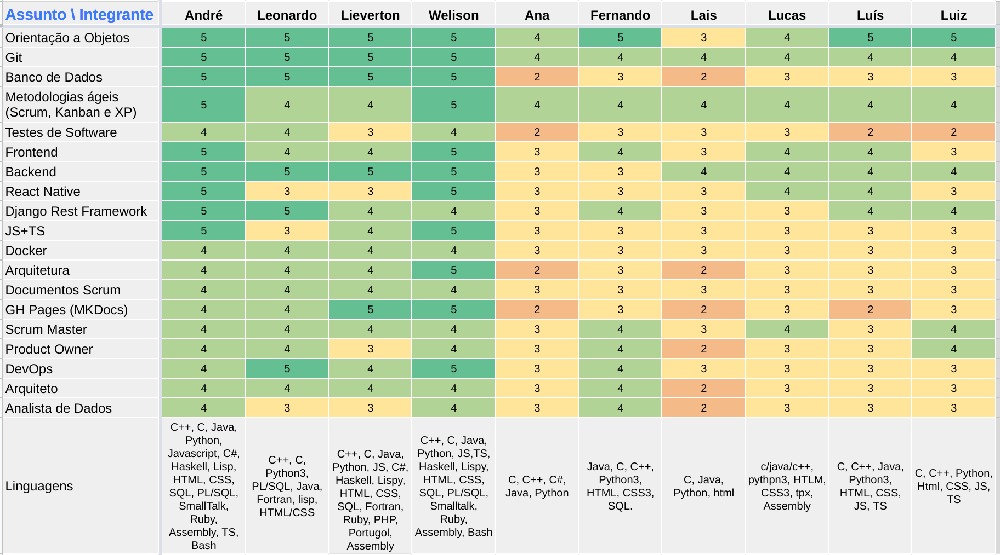
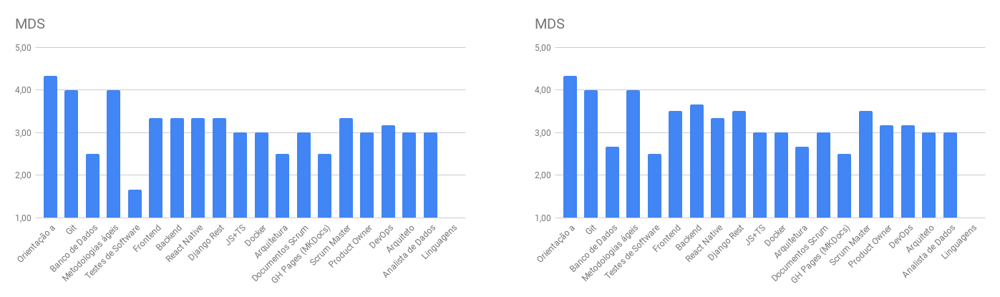
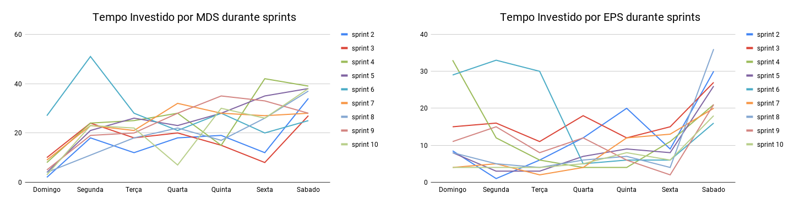
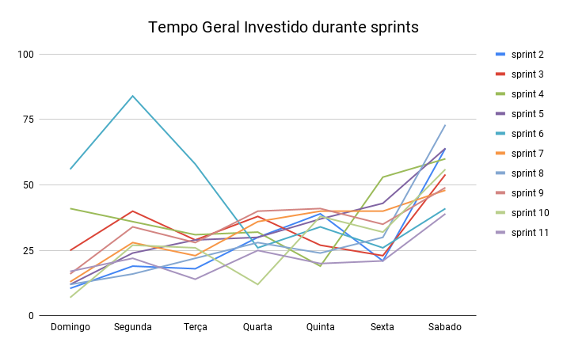

# Review da sprint 10

## Histórico de revisão

| Data       | Autor                                        | Modificações                                  | Versão |
| ---------- | -------------------------------------------- | --------------------------------------------- | ------ |
| 22/05/2021 | [Welison Regis](https://github.com/WelisonR) | Adiciona revisão e retrospectiva da sprint 10 | 1.0    |

## Visão Geral

|        Duração da sprint        | Planejado | Entregue  | Divida técnica | Membros ausentes |
| :-----------------------------: | :-------: | :-------: | :------------: | :--------------: |
| **18/04/2021** a **24/04/2021** | 52 pontos | 18 pontos |   34 pontos    |        -         |

## Tarefas finalizadas

| Issue                                                                                                                                          | Pontos | Responsáveis                                                                                    |
| ---------------------------------------------------------------------------------------------------------------------------------------------- | :----: | ----------------------------------------------------------------------------------------------- |
| [Documentar revisão e retrospectiva da sprint 9](https://github.com//fga-eps-mds/2020.2-Projeto-Kokama-Wiki/issues/167)                        |   5    | [Welison Regis](https://github.com/WelisonR)                                                    |
| [Criar documento de planejamento da sprint 10](https://github.com//fga-eps-mds/2020.2-Projeto-Kokama-Wiki/issues/168)                          |   2    | [Welison Regis](https://github.com/WelisonR)                                                    |
| [Atualizar protótipo de alta fidelidade do produto](https://github.com//fga-eps-mds/2020.2-Projeto-Kokama-Wiki/issues/166)                     |   5    | [André Lucas](https://github.com/andrelucax)                                                    |
| [Levantamento de provisionamento de software e hardware para o projeto](https://github.com//fga-eps-mds/2020.2-Projeto-Kokama-Wiki/issues/155) |   3    | [Lieverton Silva](https://github.com/lievertom)                                                 |
| [[US20] Compartilhar tradução](https://github.com//fga-eps-mds/2020.2-Projeto-Kokama-Wiki/issues/163)                                          |   3    | [Ana Júlia](https://github.com/aluzianobriceno) e [Lucas Rodrigues](https://github.com/nickby2) |

## Dívidas técnicas

| Tarefa                                                                                                                                           | Pontos | Responsáveis                                                                                    | Justificativa                                                                                                                                                     |
| ------------------------------------------------------------------------------------------------------------------------------------------------ | :----: | ----------------------------------------------------------------------------------------------- | ----------------------------------------------------------------------------------------------------------------------------------------------------------------- |
| [[TS06] Melhorar a segurança das requisições do backend para o backend](https://github.com//fga-eps-mds/2020.2-Projeto-Kokama-Wiki/issues/161)   |   8    | [Luís Guilherme](https://github.com/luisgaboardi) e [Luiz Gustavo](https://github.com/LightZX)  | Verificou-se que a comunicação realizada entre os microsserviços não era segura. Portanto, a atividade ficou como dívida para ser desenvolvida na próxima sprint. |
| [[TS07] Testes unitários na tela de tradução do front end (react native)](https://github.com//fga-eps-mds/2020.2-Projeto-Kokama-Wiki/issues/162) |   13   | [Fernando Vargas](https://github.com/SFernandoS) e [Lais Portela](https://github.com/laispa)    | Testes não efetivos para a garantia de qualidade do produto                                                                                                       |
| [[TS08] Testes unitários no microsserviço de ensino](https://github.com//fga-eps-mds/2020.2-Projeto-Kokama-Wiki/issues/164)                      |   8    | [Ana Júlia](https://github.com/aluzianobriceno) e [Lucas Rodrigues](https://github.com/nickby2) | Dupla teve dificuldades no primeiro contato com testes unitários no back-end, não conseguindo expandir muito os testes realizados                                 |
| [[US10] Recuperar a senha do administrador](https://github.com//fga-eps-mds/2020.2-Projeto-Kokama-Wiki/issues/124)                               |   5    | [Luís Guilherme](https://github.com/luisgaboardi) e [Luiz Gustavo](https://github.com/LightZX)  | Foi priorizada a comunicação entre os microsserviços, visto que era mais prioritária no fluxo de implementações. Logo, a presente US não foi desenvolvida         |

## Burndown

## Velocity

## Quadro de Conhecimentos

### Antes

### Depois

### Antes e depois por assunto

## Tempo gasto na sprint

### MDS e EPS

### Geral

## Presença em daily

| Integrante / Dia |      Segunda       |       Terça        |       Quarta       |       Quinta       |       Sexta        |       Sábado       |
| :--------------: | :----------------: | :----------------: | :----------------: | :----------------: | :----------------: | :----------------: |
|       Ana        | :heavy_check_mark: | :heavy_check_mark: | :heavy_check_mark: | :heavy_check_mark: | :heavy_check_mark: | :heavy_check_mark: |
|      André       | :heavy_check_mark: | :heavy_check_mark: | :heavy_check_mark: | :heavy_check_mark: | :heavy_check_mark: | :heavy_check_mark: |
|     Fernando     | :heavy_check_mark: | :heavy_check_mark: | :heavy_check_mark: | :heavy_check_mark: | :heavy_check_mark: | :heavy_check_mark: |
|    Lieverton     | :heavy_check_mark: | :heavy_check_mark: | :heavy_check_mark: | :heavy_check_mark: | :heavy_check_mark: | :heavy_check_mark: |
|       Lais       |                    | :heavy_check_mark: | :heavy_check_mark: |                    | :heavy_check_mark: | :heavy_check_mark: |
|     Leonardo     | :heavy_check_mark: | :heavy_check_mark: | :heavy_check_mark: | :heavy_check_mark: | :heavy_check_mark: | :heavy_check_mark: |
|      Lucas       | :heavy_check_mark: | :heavy_check_mark: | :heavy_check_mark: | :heavy_check_mark: | :heavy_check_mark: | :heavy_check_mark: |
|       Luís       | :heavy_check_mark: |                    | :heavy_check_mark: | :heavy_check_mark: | :heavy_check_mark: | :heavy_check_mark: |
|       Luiz       | :heavy_check_mark: | :heavy_check_mark: | :heavy_check_mark: | :heavy_check_mark: | :heavy_check_mark: | :heavy_check_mark: |
|     Welison      | :heavy_check_mark: | :heavy_check_mark: | :heavy_check_mark: | :heavy_check_mark: | :heavy_check_mark: | :heavy_check_mark: |

## Retrospectiva

Os textos abaixo são opiniões e visões relatadas anonimamente por parte da equipe e, portanto, utiliza um formato mais livre na escrita com a finalidade de captar todos os elogios, ideias, sugestões e reclamações da _sprint_.

### Pontos positivos

1. Consegui distribuir melhor o meu tempo de MDS e as outras esferas da vida.
2. Professora Altaci satisfeita com o trabalho.
3. A interface do backend tá elegante, valeu.
4. Professora está bem entusiasmada com o projeto. Acredito que temos uma oportunidade muito boa de entregar uma boa aplicação para o povo kokama.
5. Melhorei Ass:Tomtom

### Pontos a melhorar e sugestões de melhoria

1. A ideia da semana ser mais tranquila foi por água a baixo, levou o mesmo trabalho das outras senão mais, sugestão não têm o que fazer mesmo.
2. Issues que eram pra ser de 1 semana não estão conseguindo ser entregues :-1:
3. A Ana ficou sem internet :(
4. Baixa produtividade da equipe de desenvolvimento
5. Não consegui aproveitar o feriado pra descansar perdi o dia com MDS e ainda n tá pronto. sugestão: n sei.
6. Animação.

### Medidas a serem tomadas

1. Acompanhar de maneira mais próxima o desenvolvimento das atividades, visto que às vezes aparenta que o desenvolvimento está bom, entretanto, esse fato não se materializa no fim da sprint;
2. Promover maior engajamento da equipe nas atividades que são desenvolvidas.

## Avaliação do Scrum Master

Considerações sobre a _sprint 10_:

Conforme pode-se ver visto nos gráficos e nos relatórios, o desempenho dessa sprint foi bem aquém as entregas que estavam sendo realizadas pela equipe de desenvolvimento. Nesse sentido, pode-se ver no **burndown e no velocity** que as entregas da sprint fugiram muito às expectativas de planejamento da equipe, visto que foram resolvidos apenas 18 de 52 pontos planejados. Quanto ao **quadro de conhecimento**, percebe-se que a equipe evoluiu bastante no quesito testes de software. Já quanto ao **tempo gasto**, é possível notar uma má distribuição de tempo por parte de MDS.

Portanto, deve-se observar os fatos elencados nessa avaliação e também no tópico "medidas a serem tomadas" para que seja possível ajustar as entregas por parte da equipe, especialmente de MDS.
