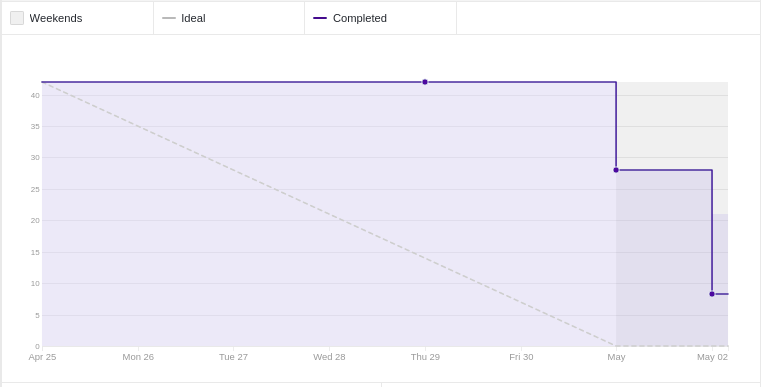
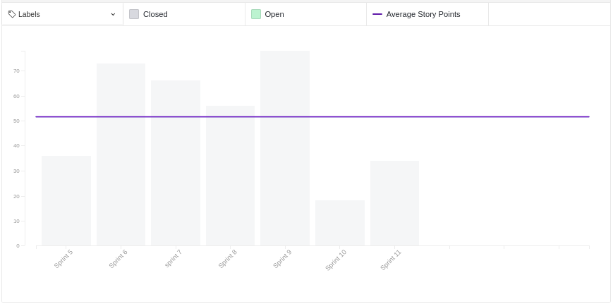
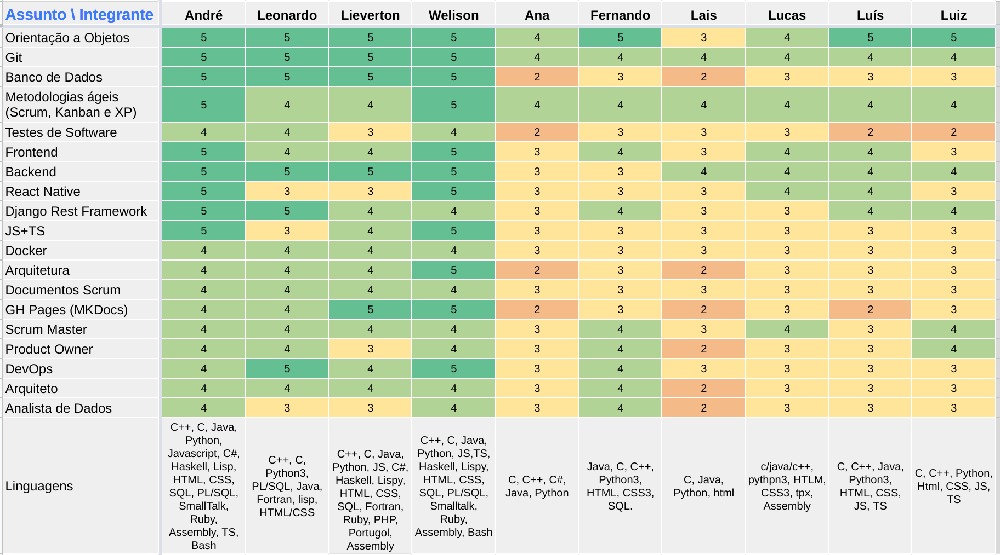
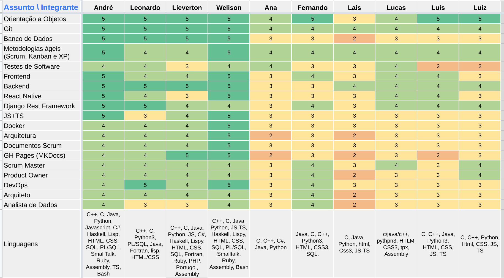
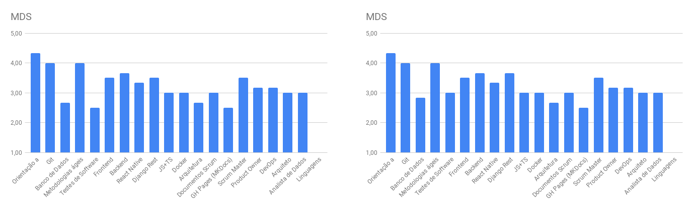
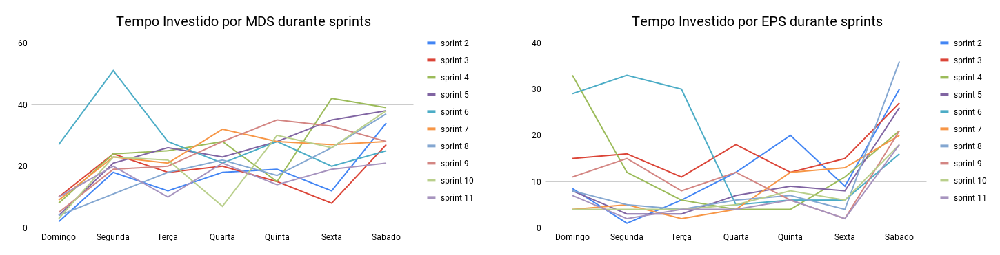

# Review da sprint 11

## Histórico de revisão

| Data       | Autor                                        | Modificações                                  | Versão |
| ---------- | -------------------------------------------- | --------------------------------------------- | ------ |
| 22/05/2021 | [Welison Regis](https://github.com/WelisonR) | Adiciona revisão e retrospectiva da sprint 11 | 1.0    |

## Visão Geral

|        Duração da sprint        | Planejado | Entregue  | Divida técnica | Membros ausentes |
| :-----------------------------: | :-------: | :-------: | :------------: | :--------------: |
| **25/04/2021** a **01/05/2021** | 42 pontos | 34 pontos |    8 pontos    |        -         |

## Tarefas finalizadas

| Issue                                                                                                                                            | Pontos | Responsáveis                                                                                   |
| ------------------------------------------------------------------------------------------------------------------------------------------------ | :----: | ---------------------------------------------------------------------------------------------- |
| [Documentar reunião com a PO (09/04)](https://github.com//fga-eps-mds/2020.2-Projeto-Kokama-Wiki/issues/175)                                     |   3    | [Lieverton Silva](https://github.com/lievertom)                                                |
| [Documentar reunião com a PO (23/04)](https://github.com//fga-eps-mds/2020.2-Projeto-Kokama-Wiki/issues/174)                                     |   3    | [André Lucas](https://github.com/andrelucax)                                                   |
| [Documentar revisão e retrospectiva da sprint 10](https://github.com//fga-eps-mds/2020.2-Projeto-Kokama-Wiki/issues/172)                         |   5    | [Welison Regis](https://github.com/WelisonR)                                                   |
| [Criar documento de planejamento da sprint 11](https://github.com//fga-eps-mds/2020.2-Projeto-Kokama-Wiki/issues/171)                            |   2    | [Welison Regis](https://github.com/WelisonR)                                                   |
| [[TS06] Melhorar a segurança das requisições do backend para o backend](https://github.com//fga-eps-mds/2020.2-Projeto-Kokama-Wiki/issues/161)   |   8    | [Luís Guilherme](https://github.com/luisgaboardi) e [Luiz Gustavo](https://github.com/LightZX) |
| [[TS07] Testes unitários na tela de tradução do front end (react native)](https://github.com//fga-eps-mds/2020.2-Projeto-Kokama-Wiki/issues/162) |   13   | [Fernando Vargas](https://github.com/SFernandoS) e [Lais Portela](https://github.com/laispa)   |

## Dívidas técnicas

| Tarefa                                                                                                                      | Pontos | Responsáveis                                                                                    | Justificativa                                                                         |
| --------------------------------------------------------------------------------------------------------------------------- | :----: | ----------------------------------------------------------------------------------------------- | ------------------------------------------------------------------------------------- |
| [[TS08] Testes unitários no microsserviço de ensino](https://github.com//fga-eps-mds/2020.2-Projeto-Kokama-Wiki/issues/164) |   8    | [Ana Júlia](https://github.com/aluzianobriceno) e [Lucas Rodrigues](https://github.com/nickby2) | Dupla teve dificuldades em desenvolver testes unitários em python com o framework DRF |

## Burndown

## Velocity

## Quadro de Conhecimentos

### Antes

### Depois

### Antes e depois por assunto

## Tempo gasto na sprint

### MDS e EPS

### Geral

## Presença em daily

| Integrante / Dia |      Segunda       |       Terça        |       Quarta       |       Quinta       |       Sexta        |       Sábado       |
| :--------------: | :----------------: | :----------------: | :----------------: | :----------------: | :----------------: | :----------------: |
|       Ana        | :heavy_check_mark: | :heavy_check_mark: |                    | :heavy_check_mark: | :heavy_check_mark: | :heavy_check_mark: |
|      André       | :heavy_check_mark: | :heavy_check_mark: | :heavy_check_mark: | :heavy_check_mark: | :heavy_check_mark: | :heavy_check_mark: |
|     Fernando     | :heavy_check_mark: | :heavy_check_mark: | :heavy_check_mark: | :heavy_check_mark: | :heavy_check_mark: | :heavy_check_mark: |
|    Lieverton     | :heavy_check_mark: | :heavy_check_mark: | :heavy_check_mark: | :heavy_check_mark: | :heavy_check_mark: | :heavy_check_mark: |
|       Lais       | :heavy_check_mark: | :heavy_check_mark: | :heavy_check_mark: | :heavy_check_mark: | :heavy_check_mark: | :heavy_check_mark: |
|     Leonardo     | :heavy_check_mark: | :heavy_check_mark: | :heavy_check_mark: |                    | :heavy_check_mark: | :heavy_check_mark: |
|      Lucas       | :heavy_check_mark: | :heavy_check_mark: | :heavy_check_mark: | :heavy_check_mark: | :heavy_check_mark: | :heavy_check_mark: |
|       Luís       | :heavy_check_mark: |                    | :heavy_check_mark: | :heavy_check_mark: | :heavy_check_mark: | :heavy_check_mark: |
|       Luiz       | :heavy_check_mark: | :heavy_check_mark: | :heavy_check_mark: | :heavy_check_mark: | :heavy_check_mark: | :heavy_check_mark: |
|     Welison      | :heavy_check_mark: | :heavy_check_mark: | :heavy_check_mark: | :heavy_check_mark: | :heavy_check_mark: | :heavy_check_mark: |

## Retrospectiva

Os textos abaixo são opiniões e visões relatadas anonimamente por parte da equipe e, portanto, utiliza um formato mais livre na escrita com a finalidade de captar todos os elogios, ideias, sugestões e reclamações da _sprint_.

### Pontos positivos

1. Acabamos uma issue e fizemos metade de outra no pouco tempo disponivel e sem se matar de trabalhar
2. Aprendi muito sobre dual boot pena que não funcionou ;-;
3. EPS tem dado suporte para MDS desenvolver as atividades ao longo da sprint
4. Tá acabando

### Pontos a melhorar e sugestões de melhoria

1. As críticas são sempre construtivas vejo que as vezes pessoas acabam que sentem mais alguma coisa, mas as críticas são sempre construtivas, não olhem o lado ruim delas.
2. Duplas estão lentas nos testes. Trocar duplas.
3. MDS não está sabendo lidar com os testes, são testes que não testam e testes que não são nem teste sendo feito.
4. Estamos no fim no semestre e vejo MDS ainda muito dependente e pouco auto didata. Vejo também que aparentemente coisas simples não foram aprendendidas e acaba gerando dúvidas "estranhas", fim de semestre tendo feito issue em todos os repositórios e não saber olhar onde está uma URL do código é estranho.
5. Galera está um pouco abalada, não quiseram nem preencher o HackMD, não temos mais estrelinhas. Não se abalem, é isso.

### Medidas a serem tomadas

1. Planejar melhor as duplas que assumirão as próximas atividades de testes de software, visto que tais artefatos são importantes e que a equipe ainda não avançou o desejável em testes;
2. Recomendar material de leitura e vídeos para MDS aprimorar o conhecimento em testes, visto a realização de testes estranhos em código;
3. Continuar a acompanhar as atividades desempenhadas ao longo da semana.

## Avaliação do Scrum Master

Considerações sobre a _sprint 11_:

Comparado a _sprint 10_, a equipe tem conseguido se reestruturar para atender as demandas que ficaram pendentes, entretanto, nessa sprint pode-se perceber que há muito a melhorar no quesito testes de software. Conforme o **burnwdown e o velocity**, pode-se perceber avanços em relação a sprint passada de modo que ficou apenas uma dívida para a próxima sprint. Já o **quadro de conhecimentos**, revela um avanço tímido na área de testes de software, situação que deve ser melhor ajustada para que as próximas entregas das sprints sejam mais bem sucedidas.

Portanto, deve-se observar os fatos elencados nessa avaliação e também no tópico "medidas a serem tomadas".
