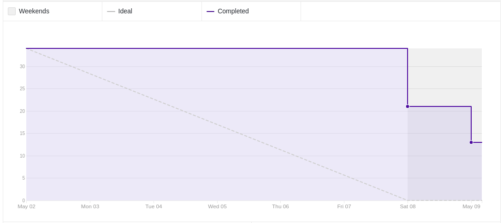
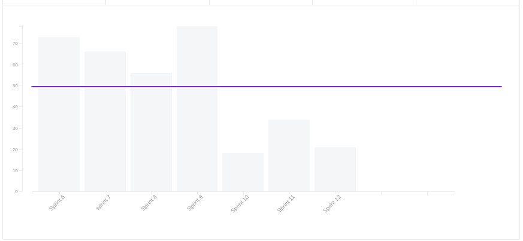
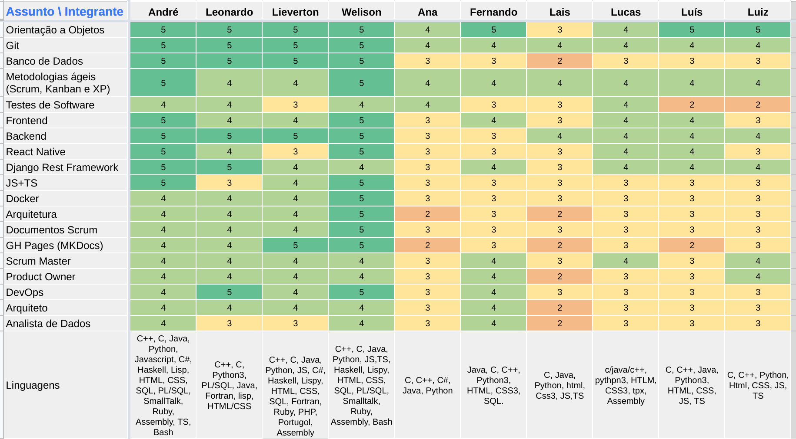
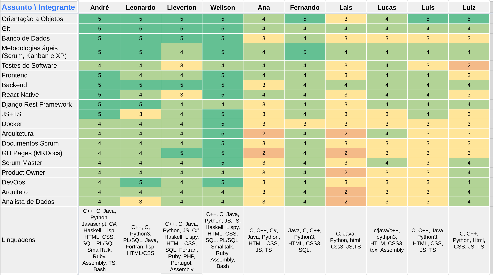
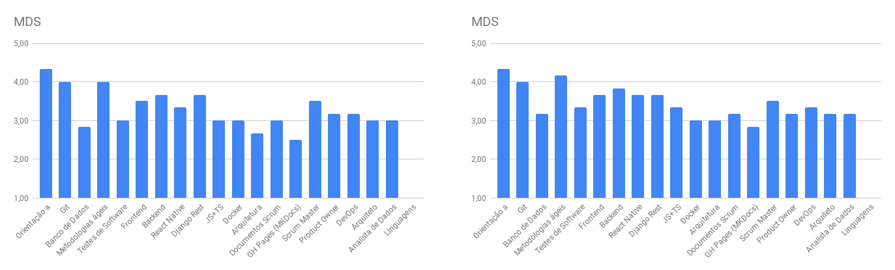
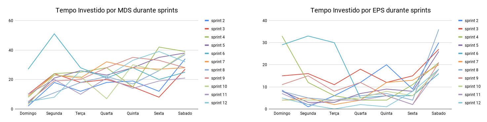
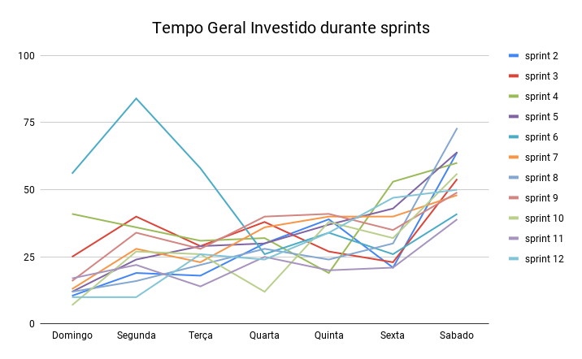

# Review da sprint 12

## Histórico de revisão

| Data       | Autor                                        | Modificações                                  | Versão |
| ---------- | -------------------------------------------- | --------------------------------------------- | ------ |
| 22/05/2021 | [Welison Regis](https://github.com/WelisonR) | Adiciona revisão e retrospectiva da sprint 12 | 1.0    |

## Visão Geral

|        Duração da sprint        | Planejado | Entregue  | Divida técnica | Membros ausentes |
| :-----------------------------: | :-------: | :-------: | :------------: | :--------------: |
| **02/05/2021** a **08/05/2021** | 42 pontos | 34 pontos |    8 pontos    |        -         |

## Tarefas finalizadas

| Issue                                                                                                                       | Pontos | Responsáveis                                                                                                                                                                                       |
| --------------------------------------------------------------------------------------------------------------------------- | :----: | -------------------------------------------------------------------------------------------------------------------------------------------------------------------------------------------------- |
| [Corrigir arquivos de métricas do sonarcloud](https://github.com//fga-eps-mds/2020.2-Projeto-Kokama-Wiki/issues/181)        |   8    | [André Lucas](https://github.com/andrelucax), [Leonardo Medeiros](https://github.com/leomedeiros1), [Lieverton Silva](https://github.com/lievertom) e [Welison Regis](https://github.com/WelisonR) |
| [[US10] Recuperar a senha do administrador ](https://github.com//fga-eps-mds/2020.2-Projeto-Kokama-Wiki/issues/124)         |   5    | [Lucas Rodrigues](https://github.com/nickby2) e [Lais Portela](https://github.com/laispa)                                                                                                          |
| [[TS08] Testes unitários no microsserviço de ensino](https://github.com//fga-eps-mds/2020.2-Projeto-Kokama-Wiki/issues/164) |   8    | [Fernando Vargas](https://github.com/SFernandoS) e [Luís Guilherme](https://github.com/luisgaboardi)                                                                                               |

## Dívidas técnicas

| Tarefa                                                                                                                                  | Pontos | Responsáveis                                                                                 | Justificativa                                                                                                                                                   |
| --------------------------------------------------------------------------------------------------------------------------------------- | :----: | -------------------------------------------------------------------------------------------- | --------------------------------------------------------------------------------------------------------------------------------------------------------------- |
| [US - História do povo Kokama disponíveis em português e Kokama](https://github.com//fga-eps-mds/2020.2-Projeto-Kokama-Wiki/issues/151) |   13   | [Ana Júlia](https://github.com/aluzianobriceno) e [Luiz Gustavo](https://github.com/LightZX) | Restaram ainda algumas pendências, especialmente no front-end, portanto, a atividade não atendeu os critérios de aceitação e foi realocada para uma nova sprint |

## Burndown

## Velocity

## Quadro de Conhecimentos

### Antes

### Depois

### Antes e depois por assunto

## Tempo gasto na sprint

### MDS e EPS

### Geral

## Presença em daily

| Integrante / Dia |      Segunda       |       Terça        |       Quarta       |       Quinta       |       Sexta        |       Sábado       |
| :--------------: | :----------------: | :----------------: | :----------------: | :----------------: | :----------------: | :----------------: |
|       Ana        | :heavy_check_mark: | :heavy_check_mark: | :heavy_check_mark: | :heavy_check_mark: | :heavy_check_mark: | :heavy_check_mark: |
|      André       |                    | :heavy_check_mark: | :heavy_check_mark: | :heavy_check_mark: | :heavy_check_mark: | :heavy_check_mark: |
|     Fernando     | :heavy_check_mark: | :heavy_check_mark: | :heavy_check_mark: | :heavy_check_mark: | :heavy_check_mark: | :heavy_check_mark: |
|    Lieverton     | :heavy_check_mark: | :heavy_check_mark: | :heavy_check_mark: |                    | :heavy_check_mark: | :heavy_check_mark: |
|       Lais       | :heavy_check_mark: | :heavy_check_mark: | :heavy_check_mark: | :heavy_check_mark: | :heavy_check_mark: | :heavy_check_mark: |
|     Leonardo     |                    | :heavy_check_mark: | :heavy_check_mark: | :heavy_check_mark: |                    | :heavy_check_mark: |
|      Lucas       |                    | :heavy_check_mark: | :heavy_check_mark: | :heavy_check_mark: | :heavy_check_mark: | :heavy_check_mark: |
|       Luís       |                    |                    | :heavy_check_mark: | :heavy_check_mark: | :heavy_check_mark: | :heavy_check_mark: |
|       Luiz       | :heavy_check_mark: | :heavy_check_mark: | :heavy_check_mark: | :heavy_check_mark: | :heavy_check_mark: | :heavy_check_mark: |
|     Welison      | :heavy_check_mark: | :heavy_check_mark: | :heavy_check_mark: | :heavy_check_mark: | :heavy_check_mark: | :heavy_check_mark: |

## Retrospectiva

Os textos abaixo são opiniões e visões relatadas anonimamente por parte da equipe e, portanto, utiliza um formato mais livre na escrita com a finalidade de captar todos os elogios, ideias, sugestões e reclamações da _sprint_.

### Pontos positivos

- Estamos aumentando a cobertura de testes
- Semestre tá acabando
- Aos poucos o projeto tá ficando com cara de projeto pronto
- Essa semana MDS entregou tudo :)
- Essa semana melhorou muito em relação as duas últimas (E acho que foi menos desgastante também)
- MDS evoluiu bastante em relação ao inicio do curso.

### Pontos a melhorar e sugestões de melhoria

- Tem dúvida que o google responde de cara, às vezes parece que MDS não pesquisa e fica tentando adivinhar qual é o problema. Não adianta ficar parado olhando pro arquivo, tem que pesquisar ou simplesmente ir fazendo pra descobrir o que que tá errado na tentativa de solução
- EPS pouco disponível essa semana por conta de outras matérias. Tem o que fazer não
- Muita cobrança de analytics para pouco prazo, fim de semestre é dificil
- Hilmer, está reclamando bastante em relação as analytics. Como MDS pode colaborar, se for o caso?

### Medidas a serem tomadas

1. Revisar as entregas da disciplina, pois a release 2 já está chegando;
2. Continuar a prestar suporte e a integrar a equipe para que o time consiga desenvolver e entregar a versão desejada do produto;
3. Fazer as atividades de analytics com a maior urgência possível.

## Avaliação do Scrum Master

Considerações sobre a _sprint 12_:

Dado o **burndown**, é possível visualizar que as atividades de desenvolvimento foram entregues, sendo que uma US (13 pontos) ficou pendente por alguns pequenos aspectos na interface do aplicativo. No **velocity**, nota-se ainda uma baixa produtividade da equipe, entretanto, foram boas e importantes as entregas realizadas nessa sprint (espera-se que o velocity melhore nas próximas sprints como resultado da capacidade de entrega do time). Ademais, percebe-se um avanço da equipe no quesito testes de software e desenvolvimento back-end. Quanto ao tempo gasto nas atividades da disciplina, perceb-se maior constância e razoabilidade por parte da equipe.

Portanto, deve-se observar os fatos elencados nessa avaliação e também no tópico "medidas a serem tomadas".
