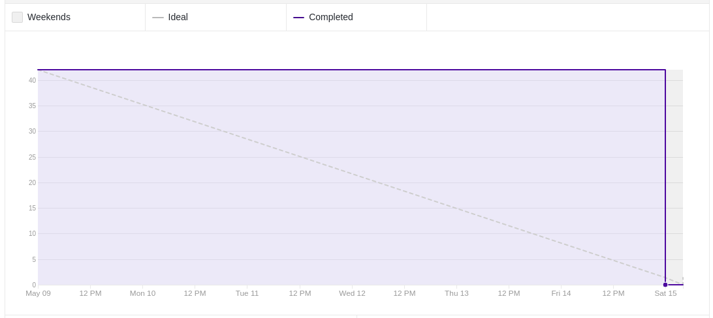
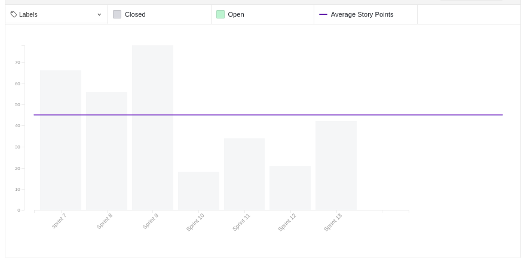
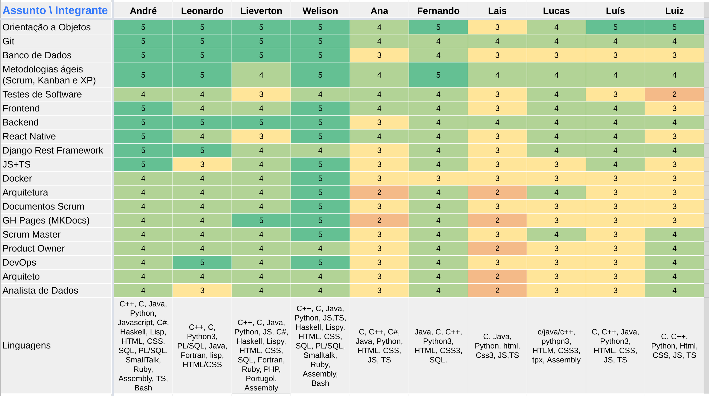
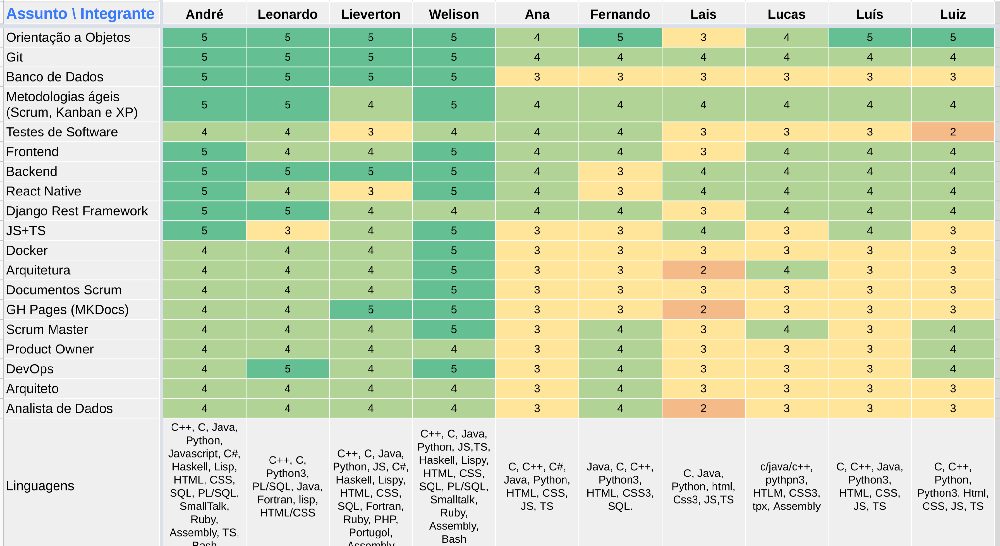
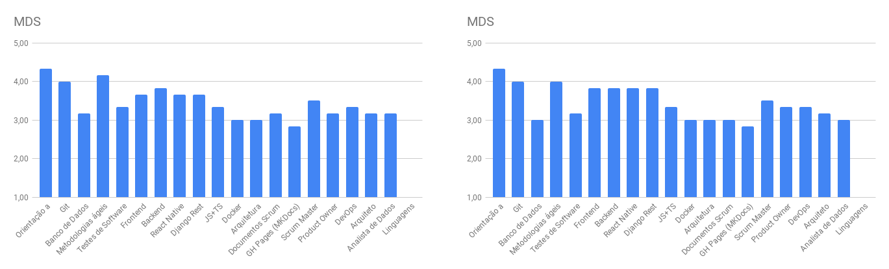
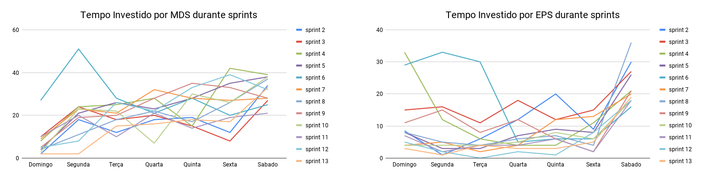
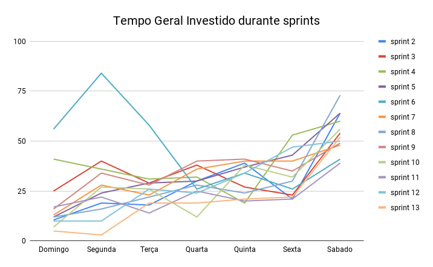

# Review da sprint 13

## Histórico de revisão

| Data       | Autor                                        | Modificações                                  | Versão |
| ---------- | -------------------------------------------- | --------------------------------------------- | ------ |
| 22/05/2021 | [Welison Regis](https://github.com/WelisonR) | Adiciona revisão e retrospectiva da sprint 13 | 1.0    |

## Visão Geral

|        Duração da sprint        | Planejado | Entregue  | Divida técnica | Membros ausentes |
| :-----------------------------: | :-------: | :-------: | :------------: | :--------------: |
| **09/05/2021** a **15/05/2021** | 42 pontos | 42 pontos |    0 pontos    |        -         |

## Tarefas finalizadas

| Issue                                                                                                                                   | Pontos | Responsáveis                                                                                       |
| --------------------------------------------------------------------------------------------------------------------------------------- | :----: | -------------------------------------------------------------------------------------------------- |
| [[TS11] Testes iniciais no repositório de usuário](https://github.com//fga-eps-mds/2020.2-Projeto-Kokama-Wiki/issues/184)               |   8    | [Lais Portela](https://github.com/laispa) e [Luís Guilherme](https://github.com/luisgaboardi)      |
| [[TS10] Testes Unitários no microsserviço de tradução](https://github.com//fga-eps-mds/2020.2-Projeto-Kokama-Wiki/issues/183)           |   8    | [Lais Portela](https://github.com/laispa) e [Luís Guilherme](https://github.com/luisgaboardi)      |
| [[TS09] Melhorias de código e de usabilidade do aplicativo](https://github.com//fga-eps-mds/2020.2-Projeto-Kokama-Wiki/issues/170)      |   13   | [Ana Júlia](https://github.com/aluzianobriceno) e [Fernando Vargas](https://github.com/SFernandoS) |
| [US - História do povo Kokama disponíveis em português e Kokama](https://github.com//fga-eps-mds/2020.2-Projeto-Kokama-Wiki/issues/151) |   13   | [Lucas Rodrigues](https://github.com/nickby2) e [Luiz Gustavo](https://github.com/LightZX)         |

## Burndown

## Velocity

## Quadro de Conhecimentos

### Antes

### Depois

### Antes e depois por assunto

## Tempo gasto na sprint

### MDS e EPS

### Geral

## Presença em daily

| Integrante / Dia |      Segunda       |       Terça        |       Quarta       |       Quinta       |       Sexta        |       Sábado       |
| :--------------: | :----------------: | :----------------: | :----------------: | :----------------: | :----------------: | :----------------: |
|       Ana        | :heavy_check_mark: | :heavy_check_mark: | :heavy_check_mark: | :heavy_check_mark: | :heavy_check_mark: | :heavy_check_mark: |
|      André       | :heavy_check_mark: | :heavy_check_mark: | :heavy_check_mark: | :heavy_check_mark: | :heavy_check_mark: | :heavy_check_mark: |
|     Fernando     | :heavy_check_mark: | :heavy_check_mark: | :heavy_check_mark: | :heavy_check_mark: | :heavy_check_mark: | :heavy_check_mark: |
|    Lieverton     | :heavy_check_mark: | :heavy_check_mark: | :heavy_check_mark: | :heavy_check_mark: | :heavy_check_mark: | :heavy_check_mark: |
|       Lais       | :heavy_check_mark: | :heavy_check_mark: | :heavy_check_mark: | :heavy_check_mark: | :heavy_check_mark: | :heavy_check_mark: |
|     Leonardo     | :heavy_check_mark: | :heavy_check_mark: | :heavy_check_mark: | :heavy_check_mark: | :heavy_check_mark: | :heavy_check_mark: |
|      Lucas       | :heavy_check_mark: | :heavy_check_mark: | :heavy_check_mark: | :heavy_check_mark: | :heavy_check_mark: | :heavy_check_mark: |
|       Luís       | :heavy_check_mark: | :heavy_check_mark: | :heavy_check_mark: | :heavy_check_mark: | :heavy_check_mark: | :heavy_check_mark: |
|       Luiz       | :heavy_check_mark: | :heavy_check_mark: | :heavy_check_mark: | :heavy_check_mark: | :heavy_check_mark: | :heavy_check_mark: |
|     Welison      | :heavy_check_mark: | :heavy_check_mark: | :heavy_check_mark: | :heavy_check_mark: | :heavy_check_mark: | :heavy_check_mark: |

## Retrospectiva

Os textos abaixo são opiniões e visões relatadas anonimamente por parte da equipe e, portanto, utiliza um formato mais livre na escrita com a finalidade de captar todos os elogios, ideias, sugestões e reclamações da _sprint_.

### Pontos positivos

- Finalmente me senti produtivo, menos horas semanais e mais resultados na issue.
- Orgulhoso de todo mundo, que aprendeu bastante coisa e trabalhou provavelmente mais do que já tinha trabalhado na vida inteira
- Todo mundo mandou bem demais. Valeu EPS pela gestão e MDS pelo escravismo xD
- Aprendi muita coisa durante o semestre
- ÚLTIMA SEMANA IUPIIIIIIIIIIIIIIII!!!
- Foi um aprendizado para todos (forçado maass... haha)
- Estamos com bons testes automatizados em todos os repositórios \o
- Ótimo trabalho em equipe
- Fim do semestre tá logo aí, então descansaremos no sono eterno
- Muitassss horas trabalhadas (a gente quase completou a grade horario do curso de Engenharia de Software kkkk)
- A Ana ta andando
- A partir da outra semana, a gente volta a ter uma vida
- Fechamos grande parte das issues de funcionalidade, MVP tá DALE

### Pontos a melhorar e sugestões de melhoria

- To com preguiça, desculpa @Wtab
- Cansaço do semestre acumulado, não tô querendo sair da cama pra fazer nada. Sugestão de melhoria: que venham as férias.
- Não da mais tempo de melhorar nada não, última semana. Mas torço que os próximos de mds tenham uma matéria menos cansativa
- Analitycs........ Sei fazer isso não.
- MDS provavelmente precisa interagir com EPS para desenvolver o analytics. (Conversar no meio da semana? Num sei)
- Coloca o Z pra testar, acho que foi o que menos testou na equipe

### Medidas a serem tomadas

1. Desenvolver analytics em conjunto com MDS;
2. Criar issues e fazer levantamento das pendências que faltam para finalizar o semestre;
3. Aumentar qualidade de testes e de usabilidade daquilo que seja viável de ser feito durante a semana.

## Avaliação do Scrum Master

Considerações sobre a _sprint 13_:

Conforme pode-se ver gráficos e nos relatórios, a semana se sucedeu muito bem, com a entrega de todas as atividades planejadas, conforme apresentado no **burndown**. A entrega da equipe evoluiu bastante, conforme é visto no **velocity** e, portanto, o time já está com um produto consolidado, funcional e testado. Logo, o foco da futura sprint será fazer pequenos reparos de modo a realizar melhorias de usabilidade e entregar um software mais seguro aos usuários e, fora isso, realizar os ajustes finais da disciplina.

Portanto, deve-se observar os fatos elencados nessa avaliação e também no tópico "medidas a serem tomadas".
