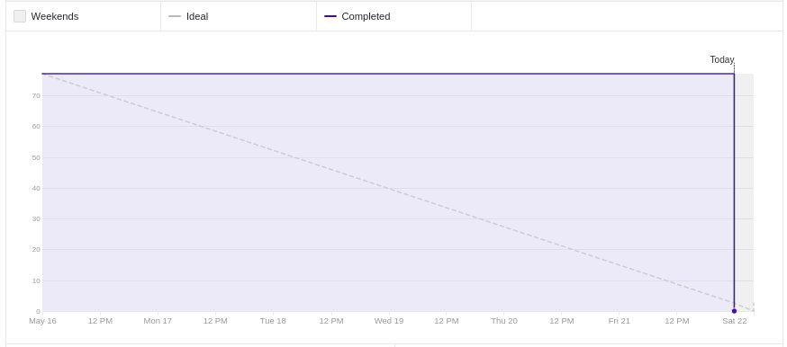
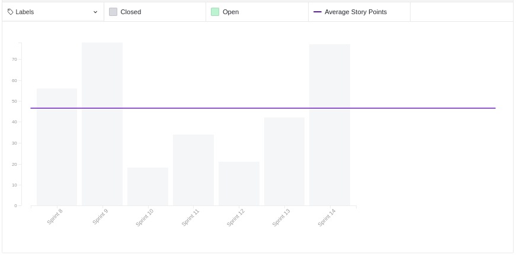
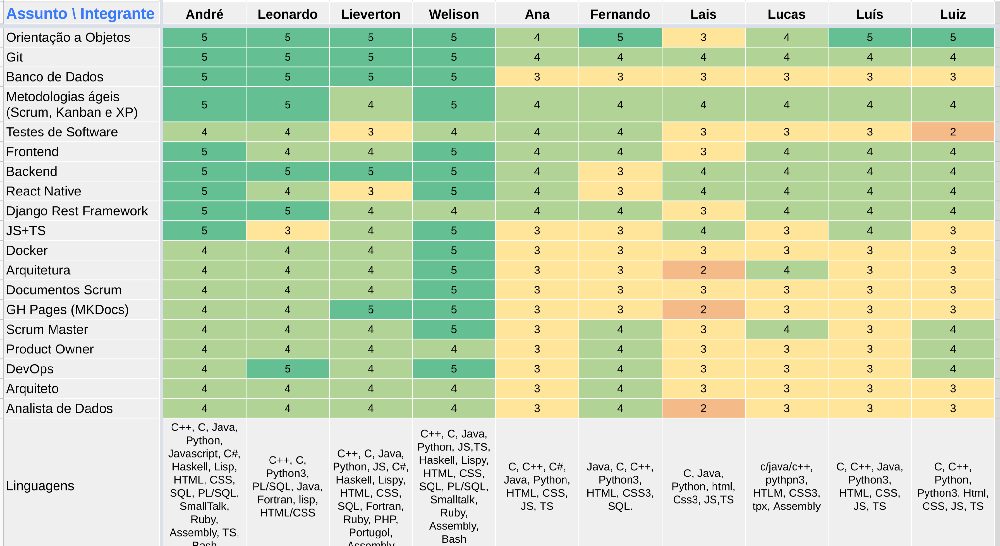
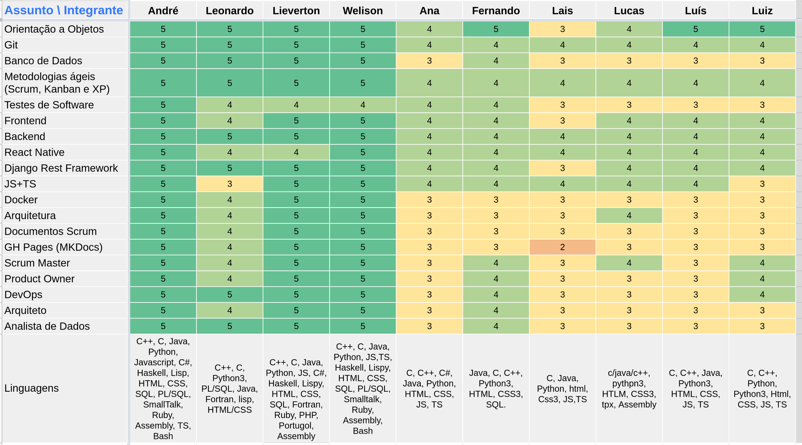
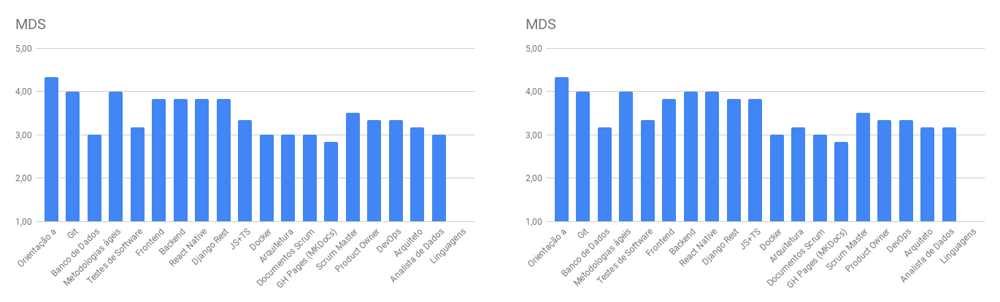
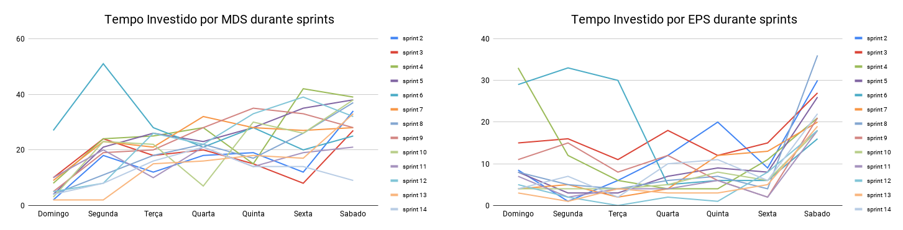
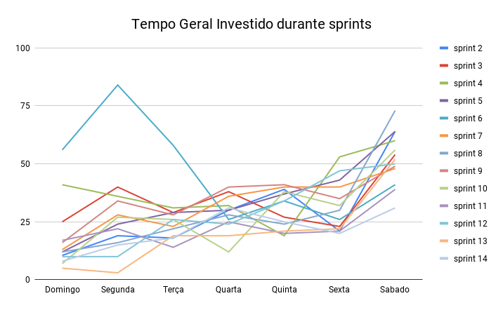

# Review da sprint 14

## Histórico de revisão

| Data       | Autor                                        | Modificações                                  | Versão |
| ---------- | -------------------------------------------- | --------------------------------------------- | ------ |
| 22/05/2021 | [Welison Regis](https://github.com/WelisonR) | Adiciona revisão e retrospectiva da sprint 14 | 1.0    |

## Visão Geral

|        Duração da sprint        | Planejado | Entregue  | Divida técnica | Membros ausentes |
| :-----------------------------: | :-------: | :-------: | :------------: | :--------------: |
| **16/05/2021** a **22/05/2021** | 42 pontos | 42 pontos |    0 pontos    |        -         |

## Tarefas finalizadas

| Issue                                                                                                                                                          | Pontos | Responsáveis                                                                                                                                                                                                                                                                                                                                                                                                                                                                                   |
| -------------------------------------------------------------------------------------------------------------------------------------------------------------- | :----: | ---------------------------------------------------------------------------------------------------------------------------------------------------------------------------------------------------------------------------------------------------------------------------------------------------------------------------------------------------------------------------------------------------------------------------------------------------------------------------------------------- |
| [Desenvolvimento analytics](https://github.com//fga-eps-mds/2020.2-Projeto-Kokama-Wiki/issues/190)                                                             |   40   | [Ana Júlia](https://github.com/aluzianobriceno), [Lucas Rodrigues](https://github.com/nickby2), [Fernando Vargas](https://github.com/SFernandoS), [Lais Portela](https://github.com/laispa), [Luís Guilherme](https://github.com/luisgaboardi), [Luiz Gustavo](https://github.com/LightZX), [André Lucas](https://github.com/andrelucax), [Leonardo Medeiros](https://github.com/leomedeiros1), [Lieverton Silva](https://github.com/lievertom) e [Welison Regis](https://github.com/WelisonR) |
| [Documentar sprints finais](https://github.com//fga-eps-mds/2020.2-Projeto-Kokama-Wiki/issues/191)                                                             |   13   | [Welison Regis](https://github.com/WelisonR)                                                                                                                                                                                                                                                                                                                                                                                                                                                   |
| [[TS11] Testes iniciais no repositório de usuário](https://github.com//fga-eps-mds/2020.2-Projeto-Kokama-Wiki/issues/184)                                      |   8    | [Lais Portela](https://github.com/laispa) e [Luís Guilherme](https://github.com/luisgaboardi)                                                                                                                                                                                                                                                                                                                                                                                                  |
| [[TS12] Aumentar qualidade de software realizando testes no microsserviço de Front-End](https://github.com//fga-eps-mds/2020.2-Projeto-Kokama-Wiki/issues/189) |   8    | [Ana Júlia](https://github.com/aluzianobriceno) e [Luís Guilherme](https://github.com/luisgaboardi)                                                                                                                                                                                                                                                                                                                                                                                            |
| [[TS13] Aumentar qualidade de software realizando testes no microsserviço de usuário](https://github.com//fga-eps-mds/2020.2-Projeto-Kokama-Wiki/issues/187)   |   8    | [Lucas Rodrigues](https://github.com/nickby2) e [Luiz Gustavo](https://github.com/LightZX)                                                                                                                                                                                                                                                                                                                                                                                                     |
| [Criar vídeo para a Release 2 (n)](https://github.com//fga-eps-mds/2020.2-Projeto-Kokama-Wiki/issues/188)                                                      |   3    | [Ana Júlia](https://github.com/aluzianobriceno), [Lucas Rodrigues](https://github.com/nickby2), [Fernando Vargas](https://github.com/SFernandoS), [Lais Portela](https://github.com/laispa), [Luís Guilherme](https://github.com/luisgaboardi), [Luiz Gustavo](https://github.com/LightZX), [André Lucas](https://github.com/andrelucax), [Leonardo Medeiros](https://github.com/leomedeiros1), [Lieverton Silva](https://github.com/lievertom) e [Welison Regis](https://github.com/WelisonR) |

## Burndown

## Velocity

## Quadro de Conhecimentos

### Antes

### Depois

### Antes e depois por assunto

## Tempo gasto na sprint

### MDS e EPS

### Geral

## Presença em daily

| Integrante / Dia |      Segunda       |       Terça        |       Quarta       |       Quinta       |       Sexta        |       Sábado       |
| :--------------: | :----------------: | :----------------: | :----------------: | :----------------: | :----------------: | :----------------: |
|       Ana        | :heavy_check_mark: | :heavy_check_mark: | :heavy_check_mark: | :heavy_check_mark: | :heavy_check_mark: | :heavy_check_mark: |
|      André       | :heavy_check_mark: | :heavy_check_mark: | :heavy_check_mark: | :heavy_check_mark: | :heavy_check_mark: | :heavy_check_mark: |
|     Fernando     | :heavy_check_mark: | :heavy_check_mark: | :heavy_check_mark: | :heavy_check_mark: | :heavy_check_mark: | :heavy_check_mark: |
|    Lieverton     | :heavy_check_mark: | :heavy_check_mark: | :heavy_check_mark: | :heavy_check_mark: | :heavy_check_mark: | :heavy_check_mark: |
|       Lais       | :heavy_check_mark: | :heavy_check_mark: | :heavy_check_mark: | :heavy_check_mark: | :heavy_check_mark: | :heavy_check_mark: |
|     Leonardo     | :heavy_check_mark: | :heavy_check_mark: | :heavy_check_mark: | :heavy_check_mark: | :heavy_check_mark: | :heavy_check_mark: |
|      Lucas       | :heavy_check_mark: | :heavy_check_mark: | :heavy_check_mark: | :heavy_check_mark: | :heavy_check_mark: | :heavy_check_mark: |
|       Luís       | :heavy_check_mark: | :heavy_check_mark: | :heavy_check_mark: | :heavy_check_mark: | :heavy_check_mark: | :heavy_check_mark: |
|       Luiz       | :heavy_check_mark: | :heavy_check_mark: | :heavy_check_mark: | :heavy_check_mark: | :heavy_check_mark: | :heavy_check_mark: |
|     Welison      | :heavy_check_mark: | :heavy_check_mark: | :heavy_check_mark: | :heavy_check_mark: | :heavy_check_mark: | :heavy_check_mark: |

## Retrospectiva

Os textos abaixo são opiniões e visões relatadas anonimamente por parte da equipe e, portanto, utiliza um formato mais livre na escrita com a finalidade de captar todos os elogios, ideias, sugestões e reclamações da _sprint_.

### Pontos positivos

1. Aprendi muita coisa e foi bom ter visto que a Altaci ficou satisfeita com o resultado.
2. Acabou
3. Falta só o Mikael aparecer e a gente fazer o Deploy
4. Mó orgulho
5. EPS foi god em Analytics
6. Rimel gostou do projeto, Altaci gostou do resultado. Dale
7. Semestre curto e muito cansativo, mas no final deu tudo certo, gosria de agradecer a todos, fizemos um excelente trabalho, muito obrigado galera.
8. Essa semana o Hilmer foi legal.
9. Foi um privilégio participar desse projeto com a equipe, valeu
10. Aquele lance de o projeto ser um template pras outras línguas? Bom? Mas quem vai fazer?
11. Acho que eu apresentei bem ontem, me elogiem kkkk
12. S arrasou na apresentação ontem
13. Resumindo, DALE

### Pontos a melhorar e sugestões de melhoria

1. Video podia ser só MDS falando
2. Ana não ligou a camera nenhuma vez durante o projeto td. @Atab ligar camera pra dar xau pra gnt
3. CADÊ A FOTO DO LEO??????
