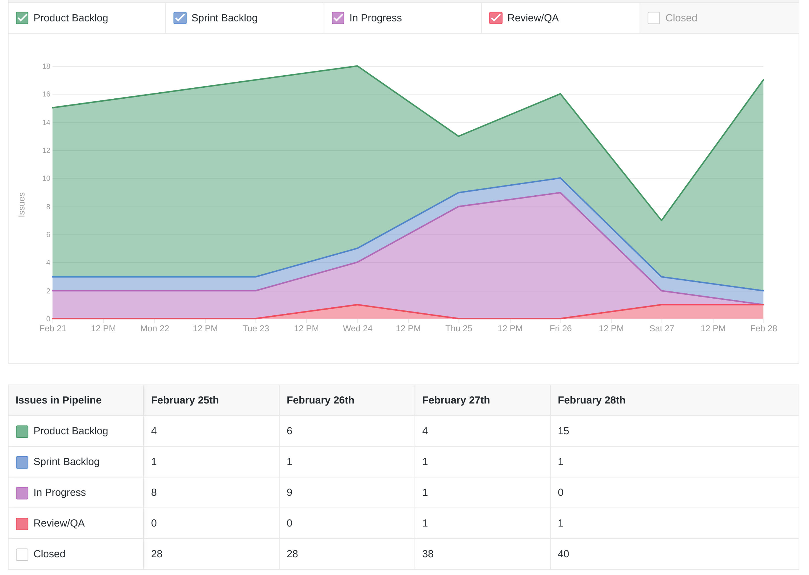
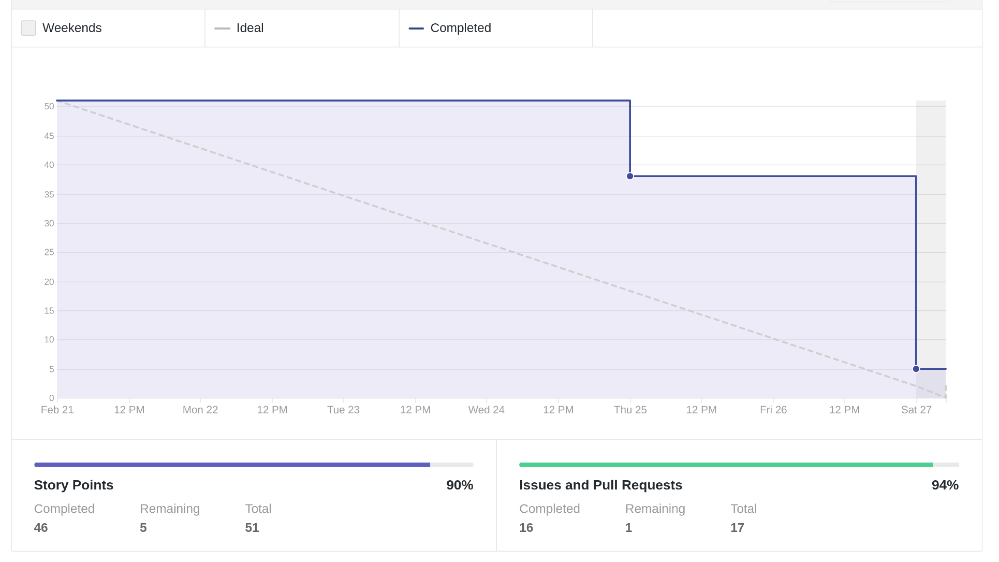
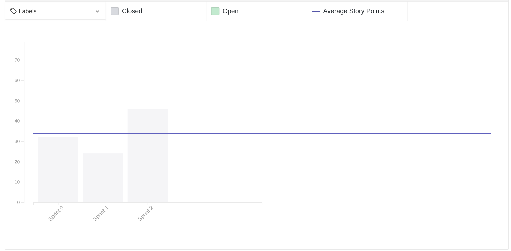
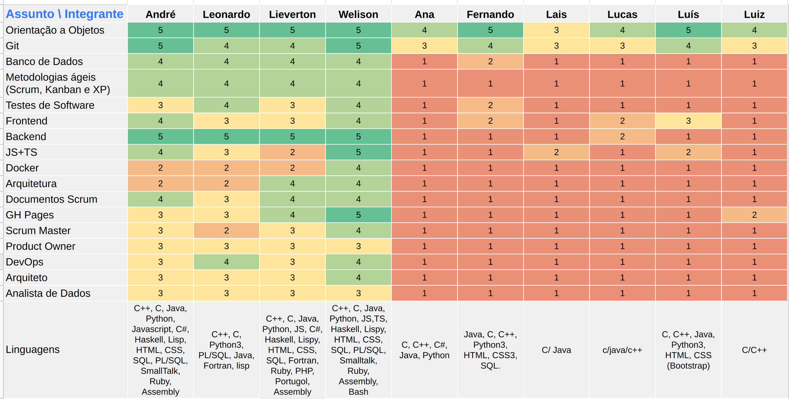
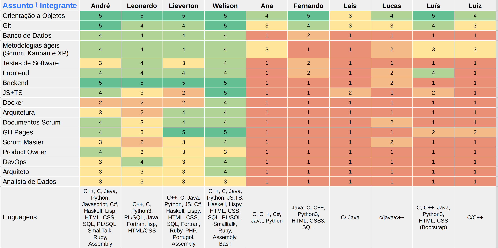
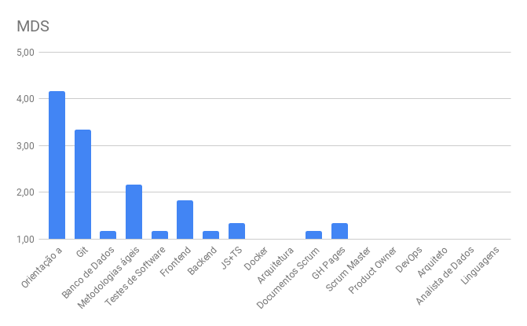
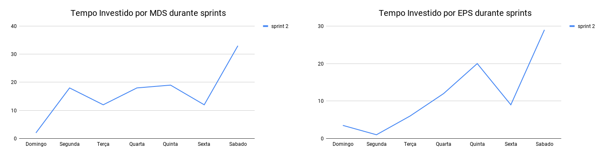

# Review da sprint 2

## Histórico de revisão

| Data       | Autor                                        | Modificações                                 | Versão |
| ---------- | -------------------------------------------- | -------------------------------------------- | ------ |
| 02/03/2021 | [Welison Regis](https://github.com/WelisonR) | Adiciona revisão e retrospectiva da sprint 2 | 1.0    |

## Visão Geral

|        Duração da sprint        | Planejado | Entregue  | Divida técnica | Membros ausentes |
| :-----------------------------: | :-------: | :-------: | :------------: | :--------------: |
| **21/02/2021** a **27/02/2021** | 52 pontos | 47 pontos |    5 pontos    |      Nenhum      |

## Tarefas finalizadas

| Tarefa                                                                                                            | Pontos | Responsáveis                                                                                                |
| ----------------------------------------------------------------------------------------------------------------- | :----: | ----------------------------------------------------------------------------------------------------------- |
| [Atualizar README.md](https://github.com/fga-eps-mds/2020.2-Projeto-Kokama-Wiki/issues/11)                                     |   3    | Welison Regis                                                                                               |
| [Documentar planejamento da sprint 1](https://github.com/fga-eps-mds/2020.2-Projeto-Kokama-Wiki/issues/27)                     |   3    | Leonardo Medeiros                                                                                           |
| [Documentar revisão e retrospectiva da sprint 1](https://github.com/fga-eps-mds/2020.2-Projeto-Kokama-Wiki/issues/28)          |   5    | Welison Regis                                                                                               |
| [Documentar entrevista com Product Owner](https://github.com/fga-eps-mds/2020.2-Projeto-Kokama-Wiki/issues/29)                 |   5    | Lieverton Silva                                                                                             |
| [Documentar plano de comunicação da equipe](https://github.com/fga-eps-mds/2020.2-Projeto-Kokama-Wiki/issues/31)               |   3    | Welison Regis                                                                                               |
| [Desenvolver primeira versão de rich picture do projeto](https://github.com/fga-eps-mds/2020.2-Projeto-Kokama-Wiki/issues/33)  |   5    | Luís Guilherme e Lucas Monteiro                                                                             |
| [Desenvolver primeira versão do documento de visão ](https://github.com/fga-eps-mds/2020.2-Projeto-Kokama-Wiki/issues/34)      |   13   | Ana Júlia e Luiz Gustavo                                                                                    |
| [Desenvolver protótipo de baixa fidelidade](https://github.com/fga-eps-mds/2020.2-Projeto-Kokama-Wiki/issues/35)               |   5    | Welison Regis, Lieverton Silva, André Pinto, Luís Guilherme, Laís Portela, Fernando Vargas e Lucas Monteiro |
| [Criar primeira versão do documento de identidade visual](https://github.com/fga-eps-mds/2020.2-Projeto-Kokama-Wiki/issues/36) |   5    | Lais Portela e Fernando Vargas                                                                              |
| [Documentar protótipo de média fidelidade](https://github.com/fga-eps-mds/2020.2-Projeto-Kokama-Wiki/issues/37)                |   5    | André Pinto e Leonardo Medeiros                                                                             |

## Dívidas técnicas

| Tarefa                                                                                                            | Pontos | Responsáveis                   | Justificativa                                                                                                                                                                                                                                                                |
| ----------------------------------------------------------------------------------------------------------------- | :----: | ------------------------------ | ---------------------------------------------------------------------------------------------------------------------------------------------------------------------------------------------------------------------------------------------------------------------------- |
| [Criar primeira versão do documento de identidade visual](https://github.com/fga-eps-mds/2020.2-Projeto-Kokama-Wiki/issues/36) |   5    | Lais Portela e Fernando Vargas | Gerou-se uma proposta de identidade visual, entretanto, não foi o suficiente para completar a atividade, faltou a definição da logo e a fundamentação das cores da aplicação. Professora Altaci nos deu algumas dicas e materiais para estudo, conforme pode-se ver na issue |

## Cumulative Flow

## Burndown

## Velocity

## Quadro de Conhecimentos

### Antes

### Depois

### Depois por assunto

## Tempo gasto na sprint

### MDS e EPS

### Geral

## Retrospectiva

### Pontos positivos

1. EPS sempre disposto a ajudar e ensinar a galera de MDS
2. MDS começou a commitar no projeto
3. S ta de parabens, parece ta pegando a dinamica bem, esforçado, vontade de contribuir bastante aparente
4. André também
5. Wally sempre
6. Professora se agradou com o nosso trabalho
7. Professora gostou muito dos artefatos apresentados
8. Lean Inception ajudou a organizar as ideias do projeto, apesar da demora para montar
9. O protótipo de média <s>qualidade</s> fidelidade ficou muito bom
10. Organização da equipe de EPS e MDS
11. Semana produtiva
12. Prototipo ta ficando bem bacana, elogios da professora
13. Produto está se desenvolvendo de acordo com esperado pelo cliente
14. Equipe soube interagir muito bem com a professora na apresentação e validação do conteúdo da sprint
15. excelente trabalho em equipe.
16. grupo está ficando cada vez mais pontual.
17. rich picture ficou muito bom.
18. Lean Inception ajudou a mapear, apresentar e validar as ideias do projeto para a professora
19. A equipe está começando a aquecer
20. Pareamento aparentemente tá dando certo com todas as duplas
21. O grupo tem se envolvido bem uns com os outros
22. Vários elogios da professora sobre o trabalho feito

### Pontos a melhorar e sugestões de melhoria

1. Membros se perdendo muito durante as reuniões. Parar de viajar tanto tantas vezes
2. Dificuldade de comunicação com o Hilmer. Quando entrar em contato com ele, todos interagirmos e sermos o mais direto possível
3. Alguns membros parecem querer fazer o mínimo trabalho, os invés de procurar fazer o melhor. Procurar revisitar a importância da disciplina e do projeto
4. Atrasos em reunioes. Comprometimento, tem o horario marcado, reserva ele e leva a risca.
5. Atrasos em Dailies. A Daily não está em um horário legal para esperar atrasados, remarca daaily pra outro horario ou COMPROMETIMENTO
6. Alguns membros continuam sem apresentar vontade de trabalhar. Fazer o minímo não adianta nem na disciplina nem na vida, se esforcem
7. Projeto parece atrasado ainda apesar dos avanços. ??? sei arrumar não
8. Membros com dificuldade em certas áreas do conhecimento e sem interesse de melhorar isso. Tudo bem não saber tudo, mas buscar melhorar e aprender sempre
9. Não temos as tecnologias bem definidas. Assim que tivermos o contato do responsável pelo servidor será possível definir as tecnologias
10. Linguajar muito técnico na hora de conversar com a professora Altaci
11. Pontualidade no início e final das reuniões
12. Acho que deveria existir mais issues. Criar mais issues
13. Sempre comunicar a equipe de possiveis atrasos e/ou problemas no geral, ter o máximo de transparência possivel.
14. Ser o mais paciente possível com membros da equipe. Demonstrar opnioes e pontos de melhoria de forma calma
15. "Tretas". Não levem os comentários pro pessoal, EPS precisa dar a opinião e pedir melhoras, é o trabalho da gerência.

### Medidas a serem tomadas

1. Manter o foco das reuniões, evitar e reduzir comentários dispersos dos membros da equipe;
2. Melhorar interação com o professor no sentido de esclarecer melhor as dúvidas;
3. Manter bots de daily e lembrar aos membros a importância desse encontro para o avanço do projeto;
4. Incentivar o ensino de tecnologias entre a equipe, seja por recomendação de material didático ou dojos;
5. Não utilizar palavras em inglês quando conversar com a professora e seus colaboradores.

## Avaliação do Scrum Master

No **cumulative flow** já percebe-se que nessa sprint o backlog do projeto estava com uma alta quantidade de issues, que foram reduzidas ao longo da semana. Além disso, pode-se perceber que, com uma pequena exceção, as issues da sprint foram finalizadas com sucesso.

No **velocity** percebe-se que a quantidade de pontos da sprint está bem acima das médias anteriores e, com base na análise dos dados, pode-se inferir que isso decorreu do fato de MDS adentrar mais no trabalho das issues da sprint. O **burndown** revela que 94% do planejado foi entregue, isto é, 46 pontos distribuídos em 10 issues, o que representa um ótimo resultado da sprint. Fora isso, não foi possível concluir uma das issues por questões que dependiam de validação do PO, entretanto, no domingo um pull request com a solução já havia sido aberto.

Sobre o **quadro de conhecimentos**, percebe-se uma boa melhora em relação ao estudo das tecnologias e metodologias, especialmente em relação a aprendizagem de metodologias ágeis, de forma a entender que o estudo ativo (por exemplo, por realização de questionário, no caso das metodologias ágeis) pode beneficiar e incentivar os membros a serem autodidatas.

Sobre o **tempo gasto na sprint**, pode-se perceber que MDS se mostra mais consistente, enquanto EPS tem uma distribuição de tempo mais anormal durante a sprint. Cabe ressaltar que sábado possui um alto número de horas devido à revisão, à retrospectiva e ao planejamento das sprints.

De modo geral, o rendimento e o comprometimento da equipe tem melhorado bastante. Como medidas de melhoria, cabe adotar ações em relação aos pontos acima e aqueles elencados no tópico
"Medidas a serem tomadas".
