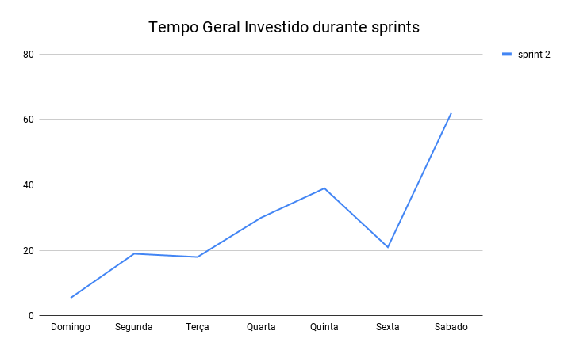

# Review da sprint 2

## Histórico de revisão

| Data       | Autor                                        | Modificações                                 | Versão |
| ---------- | -------------------------------------------- | -------------------------------------------- | ------ |
| 02/03/2020 | [Welison Regis](https://github.com/WelisonR) | Adiciona revisão e retrospectiva da sprint 2 | 1.0    |

## Visão Geral

|        Duração da sprint        | Planejado | Entregue  | Divida técnica | Membros ausentes |
| :-----------------------------: | :-------: | :-------: | :------------: | :--------------: |
| **21/02/2021** a **27/02/2021** | 52 pontos | 47 pontos |    5 pontos    |      Nenhum      |

## Tarefas finalizadas

| Tarefa                                                                                                            | Pontos | Responsáveis                                                                                                |
| ----------------------------------------------------------------------------------------------------------------- | :----: | ----------------------------------------------------------------------------------------------------------- |
| [Atualizar README.md](https://github.com/fga-eps-mds/EPS-2020-2-G3/issues/11)                                     |   3    | Welison Regis                                                                                               |
| [Documentar planejamento da sprint 1](https://github.com/fga-eps-mds/EPS-2020-2-G3/issues/27)                     |   3    | Leonardo Medeiros                                                                                           |
| [Documentar revisão e retrospectiva da sprint 1](https://github.com/fga-eps-mds/EPS-2020-2-G3/issues/28)          |   5    | Welison Regis                                                                                               |
| [Documentar entrevista com Product Owner](https://github.com/fga-eps-mds/EPS-2020-2-G3/issues/29)                 |   5    | Lieverton Silva                                                                                             |
| [Documentar plano de comunicação da equipe](https://github.com/fga-eps-mds/EPS-2020-2-G3/issues/31)               |   3    | Welison Regis                                                                                               |
| [Desenvolver primeira versão de rich picture do projeto](https://github.com/fga-eps-mds/EPS-2020-2-G3/issues/33)  |   5    | Luís Guilherme e Lucas Monteiro                                                                             |
| [Desenvolver primeira versão do documento de visão ](https://github.com/fga-eps-mds/EPS-2020-2-G3/issues/34)      |   13   | Ana Júlia e Luiz Gustavo                                                                                    |
| [Desenvolver protótipo de baixa fidelidade](https://github.com/fga-eps-mds/EPS-2020-2-G3/issues/35)               |   5    | Welison Regis, Lieverton Silva, André Pinto, Luís Guilherme, Laís Portela, Fernando Vargas e Lucas Monteiro |
| [Criar primeira versão do documento de identidade visual](https://github.com/fga-eps-mds/EPS-2020-2-G3/issues/37) |   5    | Lais Portela e Fernando Vargas                                                                              |
| [Documentar protótipo de média fidelidade](https://github.com/fga-eps-mds/EPS-2020-2-G3/issues/37)                |   5    | André Pinto e Leonardo Medeiros                                                                             |

## Dívidas técnicas

| Tarefa                                                                                                            | Pontos | Responsáveis                   | Justificativa                                                                                                                                                                                                                                                                |
| ----------------------------------------------------------------------------------------------------------------- | :----: | ------------------------------ | ---------------------------------------------------------------------------------------------------------------------------------------------------------------------------------------------------------------------------------------------------------------------------- |
| [Criar primeira versão do documento de identidade visual](https://github.com/fga-eps-mds/EPS-2020-2-G3/issues/37) |   5    | Lais Portela e Fernando Vargas | Gerou-se uma proposta de identidade visual, entretanto, não foi o suficiente para completar a atividade, faltou a definição da logo e a fundamentação das cores da aplicação. Professora Altaci nos deu algumas dicas e materiais para estudo, conforme pode-se ver na issue |

## Cumulative Flow

## Burndown

## Velocity

## Quadro de Conhecimentos

### Antes

### Depois

### Depois por assunto

## Tempo gasto na sprint

### MDS e EPS

### Geral

