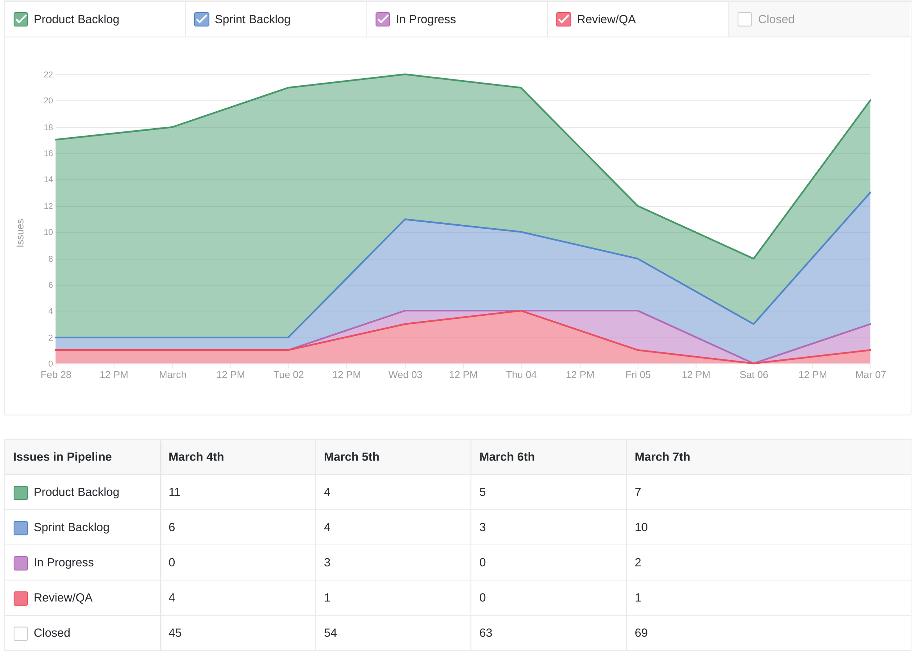
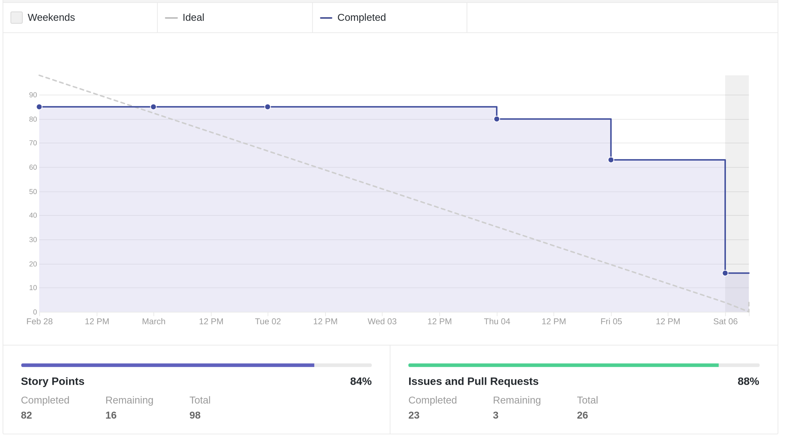
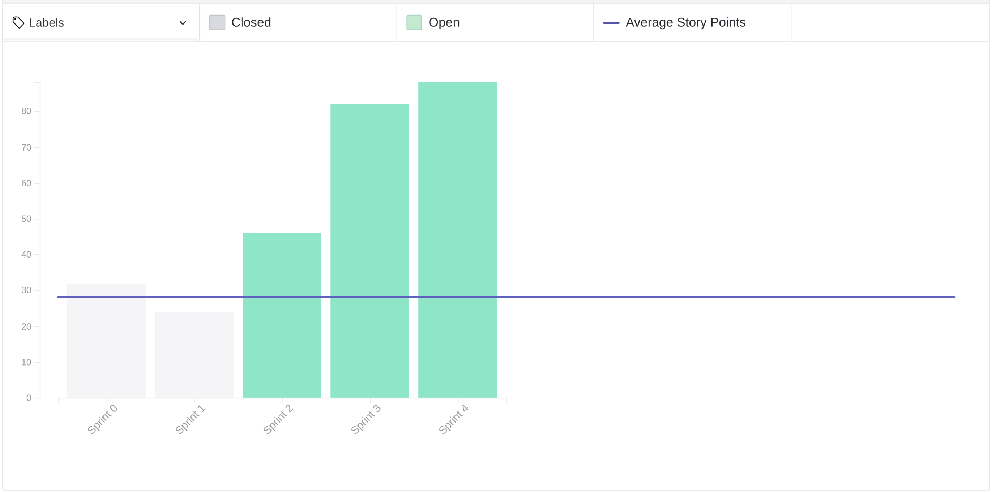
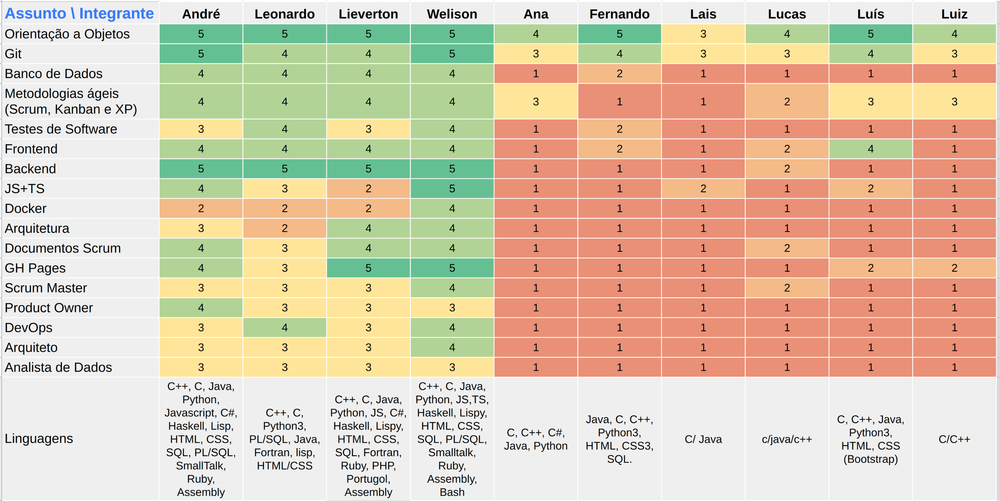
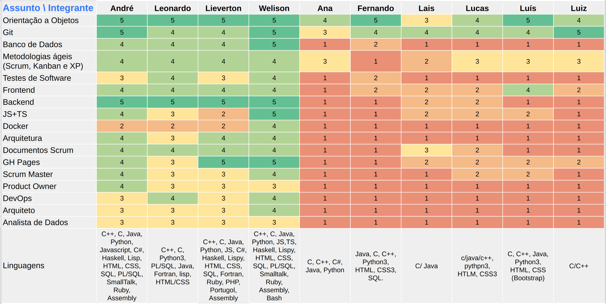
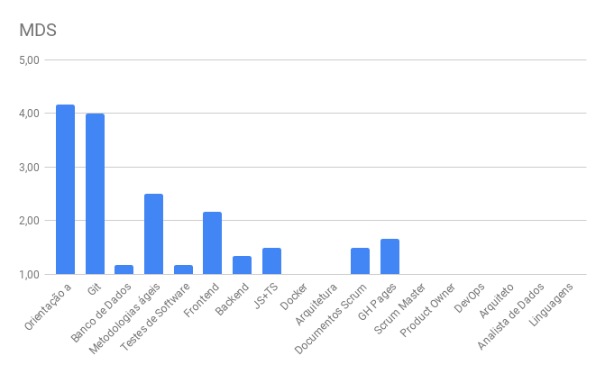
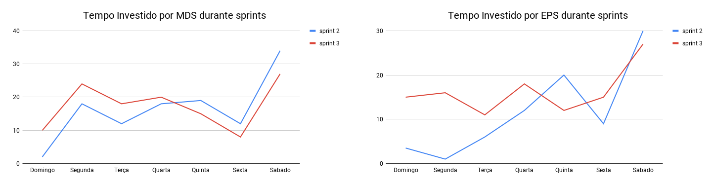
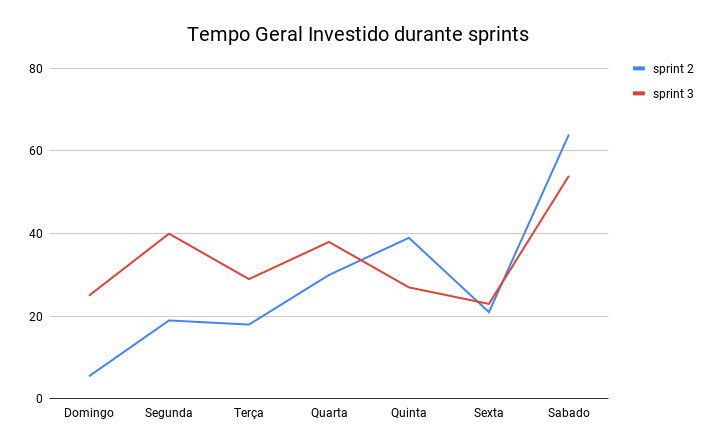

# Review da sprint 3

## Histórico de revisão

| Data       | Autor                                        | Modificações                                 | Versão |
| ---------- | -------------------------------------------- | -------------------------------------------- | ------ |
| 08/03/2021 | [Welison Regis](https://github.com/WelisonR) | Adiciona revisão e retrospectiva da sprint 3 | 1.0    |

## Visão Geral

|        Duração da sprint        | Planejado | Entregue  | Divida técnica | Membros ausentes |
| :-----------------------------: | :-------: | :-------: | :------------: | :--------------: |
| **28/02/2021** a **06/03/2021** | 98 pontos | 82 pontos |   16 pontos    |      Nenhum      |

## Tarefas finalizadas

| Tarefa                                                                                                                         | Pontos | Responsáveis                                               |
| ------------------------------------------------------------------------------------------------------------------------------ | :----: | ---------------------------------------------------------- |
| [Documentar roadmap de papéis](https://github.com/fga-eps-mds/2020.2-Projeto-Kokama-Wiki/issues/30)                            |   3    | André Pinto e Lieverton Silva                              |
| [Aplicar identidade visual na wiki](https://github.com/fga-eps-mds/2020.2-projeto-kokama-wiki/issues/50)                       |   3    | Lucas Monteiro e Luiz Gustavo                              |
| [Realizar Lean Inception com a equipe](https://github.com/fga-eps-mds/2020.2-Projeto-Kokama-Wiki/issues/32)                    |   13   | Welison Regis                                              |
| [Criar primeira versão do documento de identidade visual](https://github.com/fga-eps-mds/2020.2-Projeto-Kokama-Wiki/issues/36) |   5    | Lais Portela e Fernando Vargas                             |
| [Criar primeira versão do backlog do produto](https://github.com/fga-eps-mds/2020.2-Projeto-Kokama-Wiki/issues/48)             |   5    | Welison Regis, Luís Guilherme e Lais Portela               |
| [Realizar teste de usabilidade](https://github.com/fga-eps-mds/2020.2-Projeto-Kokama-Wiki/issues/51)                           |   5    | Leonardo Medeiros                                          |
| [Criar documento de planejamento da sprint 2](https://github.com/fga-eps-mds/2020.2-Projeto-Kokama-Wiki/issues/52)             |   3    | Leonardo Medeiros                                          |
| [Documentar revisão e retrospectiva da sprint 2](https://github.com/fga-eps-mds/2020.2-Projeto-Kokama-Wiki/issues/53)          |   5    | Welison Regis                                              |
| [Criar protótipo de alta fidelidade](https://github.com/fga-eps-mds/2020.2-Projeto-Kokama-Wiki/issues/54)                      |   21   | Lieverton Santos, André Pinto, Fernando Vargas e Ana Lúisa |
| [Desenvolver primeira versão do Documento de Arquitetura](https://github.com/fga-eps-mds/2020.2-Projeto-Kokama-Wiki/issues/55) |   13   | Lieverton Santos, Luís Guilherme e Lais Portela            |
| [Documentar reunião com PO (26/02/2021)](https://github.com/fga-eps-mds/2020.2-Projeto-Kokama-Wiki/issues/58)                  |   3    | Leonardo Medeiros                                          |
| [Criar documento de planejamento da sprint 3](https://github.com/fga-eps-mds/2020.2-Projeto-Kokama-Wiki/issues/60)             |   3    | Leonardo Medeiros                                          |

## Dívidas técnicas

| Tarefa                                                                                                   | Pontos | Responsáveis                     | Justificativa                                                                                                                                                                                                                                           |
| -------------------------------------------------------------------------------------------------------- | :----: | -------------------------------- | ------------------------------------------------------------------------------------------------------------------------------------------------------------------------------------------------------------------------------------------------------- |
| [Realizar dojo de react native](https://github.com/fga-eps-mds/2020.2-Projeto-Kokama-Wiki/issues/56)     |   8    | Welison Regis e Lieverton Santos | Issue transformada em estudo, visto que a escassez de tempo dificulta realizar o dojo com toda a equipe. Dessa maneira, a issue passa a elencar tóppicos que deverão ser estudados e haverá o acompanhamento desse estudo através da daily com a equipe |
| [Realizar dojo de backend (django)](https://github.com/fga-eps-mds/2020.2-Projeto-Kokama-Wiki/issues/57) |   8    | Leonardo Medeiros e André Pinto  | Issue transformada em estudo, visto que a escassez de tempo dificulta realizar o dojo com toda a equipe. Dessa maneira, a issue passa a elencar tóppicos que deverão ser estudados e haverá o acompanhamento desse estudo através da daily com a equipe |

## Cumulative Flow

## Burndown

## Velocity

## Quadro de Conhecimentos

### Antes

### Depois

### Depois por assunto

## Tempo gasto na sprint

### MDS e EPS

### Geral

