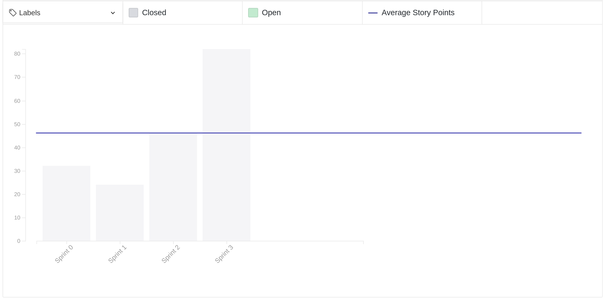

# Review da sprint 3

## Histórico de revisão

| Data       | Autor                                        | Modificações                                 | Versão |
| ---------- | -------------------------------------------- | -------------------------------------------- | ------ |
| 08/03/2021 | [Welison Regis](https://github.com/WelisonR) | Adiciona revisão e retrospectiva da sprint 3 | 1.0    |

## Visão Geral

|        Duração da sprint        | Planejado | Entregue  | Divida técnica | Membros ausentes |
| :-----------------------------: | :-------: | :-------: | :------------: | :--------------: |
| **28/02/2021** a **06/03/2021** | 98 pontos | 82 pontos |   16 pontos    |      Nenhum      |

## Tarefas finalizadas

| Tarefa                                                                                                                         | Pontos | Responsáveis                                               |
| ------------------------------------------------------------------------------------------------------------------------------ | :----: | ---------------------------------------------------------- |
| [Documentar roadmap de papéis](https://github.com/fga-eps-mds/2020.2-Projeto-Kokama-Wiki/issues/30)                            |   3    | André Pinto e Lieverton Silva                              |
| [Aplicar identidade visual na wiki](https://github.com/fga-eps-mds/2020.2-projeto-kokama-wiki/issues/50)                       |   3    | Lucas Monteiro e Luiz Gustavo                              |
| [Realizar Lean Inception com a equipe](https://github.com/fga-eps-mds/2020.2-Projeto-Kokama-Wiki/issues/32)                    |   13   | Welison Regis                                              |
| [Criar primeira versão do documento de identidade visual](https://github.com/fga-eps-mds/2020.2-Projeto-Kokama-Wiki/issues/36) |   5    | Lais Portela e Fernando Vargas                             |
| [Criar primeira versão do backlog do produto](https://github.com/fga-eps-mds/2020.2-Projeto-Kokama-Wiki/issues/48)             |   5    | Welison Regis, Luís Guilherme e Lais Portela               |
| [Realizar teste de usabilidade](https://github.com/fga-eps-mds/2020.2-Projeto-Kokama-Wiki/issues/51)                           |   5    | Leonardo Medeiros                                          |
| [Criar documento de planejamento da sprint 2](https://github.com/fga-eps-mds/2020.2-Projeto-Kokama-Wiki/issues/52)             |   3    | Leonardo Medeiros                                          |
| [Documentar revisão e retrospectiva da sprint 2](https://github.com/fga-eps-mds/2020.2-Projeto-Kokama-Wiki/issues/53)          |   5    | Welison Regis                                              |
| [Criar protótipo de alta fidelidade](https://github.com/fga-eps-mds/2020.2-Projeto-Kokama-Wiki/issues/54)                      |   21   | Lieverton Santos, André Pinto, Fernando Vargas e Ana Lúisa |
| [Desenvolver primeira versão do Documento de Arquitetura](https://github.com/fga-eps-mds/2020.2-Projeto-Kokama-Wiki/issues/55) |   13   | Lieverton Santos, Luís Guilherme e Lais Portela            |
| [Documentar reunião com PO (26/02/2021)](https://github.com/fga-eps-mds/2020.2-Projeto-Kokama-Wiki/issues/58)                  |   3    | Leonardo Medeiros                                          |
| [Criar documento de planejamento da sprint 3](https://github.com/fga-eps-mds/2020.2-Projeto-Kokama-Wiki/issues/60)             |   3    | Leonardo Medeiros                                          |

## Dívidas técnicas

| Tarefa                                                                                                   | Pontos | Responsáveis                     | Justificativa                                                                                                                                                                                                                                           |
| -------------------------------------------------------------------------------------------------------- | :----: | -------------------------------- | ------------------------------------------------------------------------------------------------------------------------------------------------------------------------------------------------------------------------------------------------------- |
| [Realizar dojo de react native](https://github.com/fga-eps-mds/2020.2-Projeto-Kokama-Wiki/issues/56)     |   8    | Welison Regis e Lieverton Santos | Issue transformada em estudo, visto que a escassez de tempo dificulta realizar o dojo com toda a equipe. Dessa maneira, a issue passa a elencar tóppicos que deverão ser estudados e haverá o acompanhamento desse estudo através da daily com a equipe |
| [Realizar dojo de backend (django)](https://github.com/fga-eps-mds/2020.2-Projeto-Kokama-Wiki/issues/57) |   8    | Leonardo Medeiros e André Pinto  | Issue transformada em estudo, visto que a escassez de tempo dificulta realizar o dojo com toda a equipe. Dessa maneira, a issue passa a elencar tóppicos que deverão ser estudados e haverá o acompanhamento desse estudo através da daily com a equipe |

## Cumulative Flow

## Burndown

## Velocity

## Quadro de Conhecimentos

### Antes

### Depois

### Depois por assunto

## Tempo gasto na sprint

### MDS e EPS

### Geral

## Retrospectiva

### Pontos positivos

- Projeto começando a andar finalmente
- Andamento foi muito legal nessa semana
- O Hilmer elogiou o nosso grupo
- Laís tá de parabéns
- Mesmo com outras matérias o projeto está progredindo
- As duplas estão sendo bem produtivas.
- Divisão em sprints
- Validação com o prototipo de alta fidelidade em geral foi boa, da pra começar a entrar mais um pouco na parte do codigo
- O protótipo de alta fidelidade e altíssima qualidade
- Equipe se mostra comprometida com o trabalho
- EPS e MDS interagem bem
- Conseguimos o contato do técnico que ficará responsável por fornecer a infraestrutura do projeto
- A logo ficou muito boa
- Andre conseguiu se mudar: e está com internet boa, guardou as caixas, pode ~~jogar~~ ~~minecraft~~ ~~tibia~~ ~~CS~~ trabalhar melhor.

### Pontos a melhorar e sugestões de melhoria

- Reuiniões em hórario de almoço entre 12:00 - 13:00 com o professor -> Parar de Marcar reuniões meio dia pois são muito demoradas, pois a reunião acaba quase na hora da aula e não temos tempo de almoçar direito.
- Pareamento em mais de 2 pessoas não pareceu produtivo. Pareamento=par=2
- Reuniões podiam ser mais curtas, as de sábado
- Reclamações do meu teclado >:( - Me da um novo
- Redefinições em alguns aspectos (protipo, arquitetura, tem mais algo ...) - melhorar discussao na hora dos pontos
- mds não está seguindo totalmente o plano de estudo => seguir o plano de estudo
- Plano de estudo demorando, alguns pontos já eram pra ter terminado
- Daily precisa ser por call? Não - sim
- Problemas de conexão- internet ????? ??
- Parar de expulsar as pessoas da call
- Certeza do que é para fazer, para que o Hilmer não inutilize
- Os eventos anonimos nao estao sendo anonimos >:( - para de seguir o amiguinho

### Medidas a serem tomadas

- Procurar manter o foco das reuniões de forma a pautar mais assuntos em menos tempo e resguardar a qualidade da conversa e da geração de resultados;
- Esclarecer melhor que issues que tenham mais de duas pessoas ocorrem por se tratar de atividades muito difíceis ou grandes. Nesse caso, mesmo que haja mais de duas pessoas, preserva-se o pareamento no contexto do grupo;
- Pedir a colaboração de todos os membros da equipe durante dúvidas e divergências nas reuniões;
- Transformar issues de estudo em atividades contínuas, isto é, elencar os tópicos que deverão ser estudados e fazer o acompanhamento dos estudos com os membros da equipe durante as dailys;
- Colocar MDS para começar a codificar alguns pontos do aplicativo, pois será uma maneira de incentivá-los a estudar as tecnologias e impulsionar o desenvolvimento do produto.

## Avaliação do Scrum Master

No gráfico **cumulative flow**, observa-se que o fluxo de fechamento das issues ocorreu de maneira mais controlada e gradual durante a sprint, com novas issues já disponíveis para serem trabalhadas no domingo. Indo além, observa-se no **burndown** um ótimo resultado da sprint, que completou 82 pontos e ficou somente com dívidas técnicas relacionadas a dojos de tecnologias (transformadas em atividade de ensino contínuo). Já no **velocity**, pode-se perceber que houve um grande salto na produtividade e produção do time durante a *sprint*, fato esse proporcionado pela colaboração, esforço e integração das equipes de MDS e EPS.

No **quadro de conhecimento**, observa-se melhorias em áreas relacionadas ao estudo de linguagens, fator muito importante para os próximos passos da equipe relacionados ao início do desenvolvimento do aplicativo. Nesse sentido, mostra-se importante realizar o monitoramento contínuo de MDS em relação aos estudos das tecnologias do projeto.

No **tempo gasto na sprint** é notório que, relacionado a *sprint* 2, a equipe de EPS manteve maior consistência no tempo investido na disciplina ao longo da semana e MDS manteve o bom ritmo já registrado na *sprint passada*, o que culminou em uma ótima alocação de tempo na *sprint*. Cabe ressaltar que sábado possui um alto número de horas devido à revisão, à retrospectiva e ao planejamento das sprints.

Por fim, como medidas de melhoria, cabe adotar ações em relação aos pontos acima e e aos tópicos elencados em "Medidas a serem tomadas".
