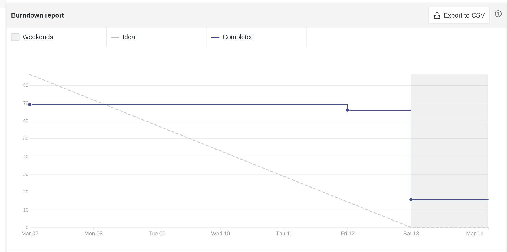
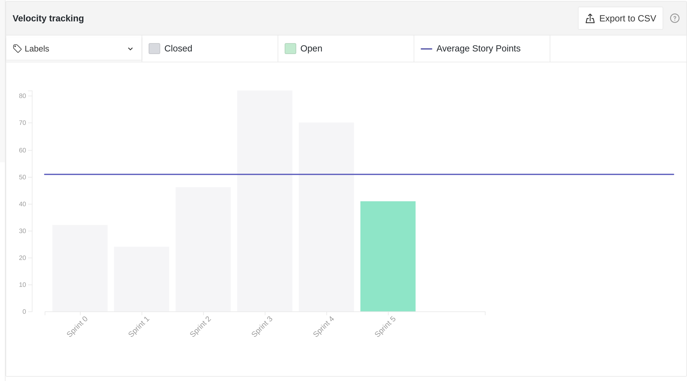
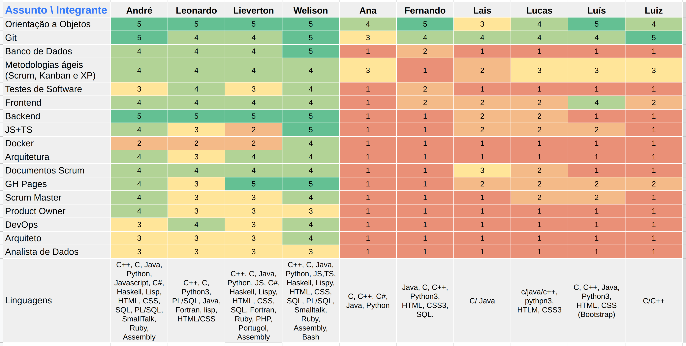
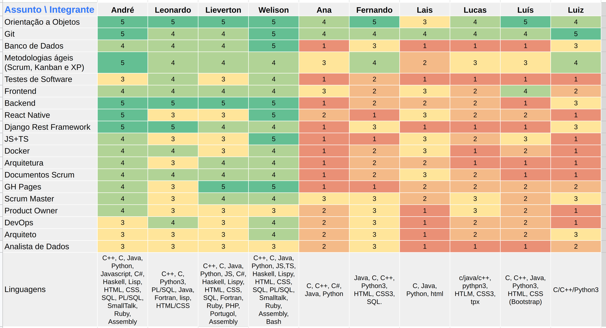
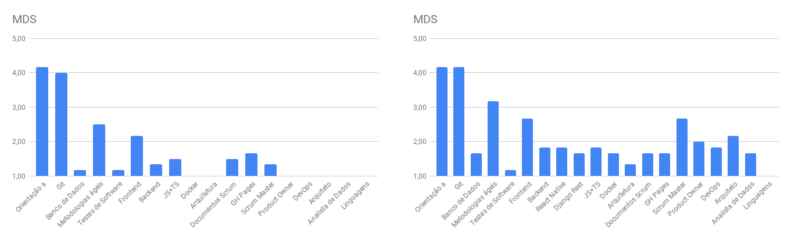
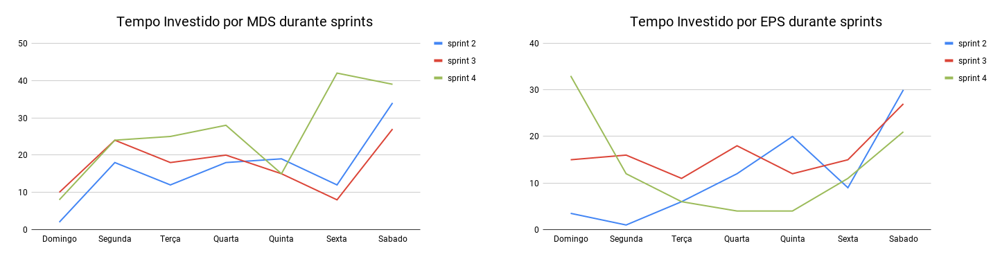
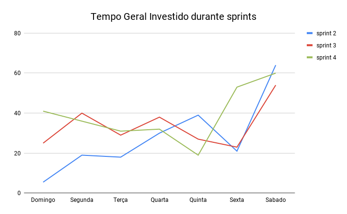

# Review da sprint 4

## Histórico de revisão

| Data       | Autor                                        | Modificações                                 | Versão |
| ---------- | -------------------------------------------- | -------------------------------------------- | ------ |
| 19/03/2021 | [Welison Regis](https://github.com/WelisonR) | Adiciona revisão e retrospectiva da sprint 4 | 1.0    |

## Visão Geral

|        Duração da sprint        | Planejado |  Entregue   | Divida técnica | Membros ausentes |
| :-----------------------------: | :-------: | :---------: | :------------: | :--------------: |
| **07/03/2021** a **13/03/2021** | 83 pontos | 67+3 pontos |   16 pontos    |      Nenhum      |

## Tarefas finalizadas

| Issue                                                                                                                                              | Pontos | Responsáveis                                                                                                                                                                                       |
| -------------------------------------------------------------------------------------------------------------------------------------------------- | :----: | -------------------------------------------------------------------------------------------------------------------------------------------------------------------------------------------------- |
| [[US03] Cadastro de novas traduções de palavras kokama](https://github.com//fga-eps-mds/2020.2-Projeto-Kokama-Wiki/issues/84)                      |   8    | [Fernando Vargas](https://github.com/SFernandoS) e [Luiz Gustavo](https://github.com/LightZX)                                                                                                      |
| [[US01] Visualizar tradução de palavras português-kokama (offline)](https://github.com//fga-eps-mds/2020.2-Projeto-Kokama-Wiki/issues/82)          |   13   | [Ana Júlia](https://github.com/aluzianobriceno) e [Luís Guilherme](https://github.com/luisgaboardi)                                                                                                |
| [Realizar automatizações no processo de geração de documentos da disciplina](https://github.com//fga-eps-mds/2020.2-Projeto-Kokama-Wiki/issues/81) |   8    | [Welison Regis](https://github.com/WelisonR)                                                                                                                                                       |
| [Documentar revisão e retrospectiva da sprint 3](https://github.com//fga-eps-mds/2020.2-Projeto-Kokama-Wiki/issues/80)                             |   5    | [Welison Regis](https://github.com/WelisonR)                                                                                                                                                       |
| [Criar Análise de Valor Agregado (EVM)](https://github.com//fga-eps-mds/2020.2-Projeto-Kokama-Wiki/issues/79)                                      |   8    | [André Lucas](https://github.com/andrelucax)                                                                                                                                                       |
| [Criar roadmap do produto](https://github.com//fga-eps-mds/2020.2-Projeto-Kokama-Wiki/issues/78)                                                   |   5    | [Welison Regis](https://github.com/WelisonR)                                                                                                                                                       |
| [Criar documento de planejamento da sprint 4](https://github.com//fga-eps-mds/2020.2-Projeto-Kokama-Wiki/issues/69)                                |   3    | [Welison Regis](https://github.com/WelisonR)                                                                                                                                                       |
| [Adicionar regra de proteção de branch](https://github.com//fga-eps-mds/2020.2-Projeto-Kokama-Wiki/issues/87)                                      |   2    | [Leonardo Medeiros](https://github.com/leomedeiros1) e [Lieverton Silva](https://github.com/lievertom)                                                                                             |
| [Configurar repositório do frontend](https://github.com//fga-eps-mds/2020.2-Projeto-Kokama-Wiki/issues/75)                                         |   8    | [André Lucas](https://github.com/andrelucax), [Leonardo Medeiros](https://github.com/leomedeiros1), [Lieverton Silva](https://github.com/lievertom) e [Welison Regis](https://github.com/WelisonR) |
| [Configurar repositórios do backend](https://github.com//fga-eps-mds/2020.2-Projeto-Kokama-Wiki/issues/74)                                         |   5    | [André Lucas](https://github.com/andrelucax), [Leonardo Medeiros](https://github.com/leomedeiros1), [Lieverton Silva](https://github.com/lievertom) e [Welison Regis](https://github.com/WelisonR) |
| [Criar repositórios do projeto na organização da disciplina](https://github.com//fga-eps-mds/2020.2-Projeto-Kokama-Wiki/issues/73)                 |   1    | [Lieverton Silva](https://github.com/lievertom)                                                                                                                                                    |
| [Alterar o nome do repositório de documentação](https://github.com//fga-eps-mds/2020.2-Projeto-Kokama-Wiki/issues/72)                              |   1    | [André Lucas](https://github.com/andrelucax)                                                                                                                                                       |
| [Estudo sobre metodologias ágeis](https://github.com//fga-eps-mds/2020.2-Projeto-Kokama-Wiki/issues/25)                                            |   3    | Todos                                                                                                                                                                                              |

## Dívidas técnicas

| Tarefa                                                                                                            | Pontos | Responsáveis                                                                              | Justificativa |
| ----------------------------------------------------------------------------------------------------------------- | :----: | ----------------------------------------------------------------------------------------- | ------------- |
| [[US02] Navegação entre menus da aplicação](https://github.com//fga-eps-mds/2020.2-Projeto-Kokama-Wiki/issues/83) |   8    | [Lucas Rodrigues](https://github.com/nickby2) e [Lais Portela](https://github.com/laispa) | Dupla teve dificuldades no início do desenvolvimento com *react native*, não conseguindo atingir os critérios de aceitação da issue no prazo estimado. Issue será desenvolvida futuramente, momento em que os demais módulos do aplicativo começarem a funcionar. |
| [Adicionar configurações de lint locais](https://github.com//fga-eps-mds/2020.2-Projeto-Kokama-Wiki/issues/77)    |   8    | [Leonardo Medeiros](https://github.com/leomedeiros1)                                      | Issue não terminada no prazo estimado. |

## Burndown

## Velocity

## Quadro de Conhecimentos

### Antes

### Depois

### Antes e depois por assunto

## Tempo gasto na sprint

### MDS e EPS

### Geral

## Retrospectiva

Os textos abaixo são opiniões e visões relatadas anonimamente por parte da equipe e, portanto, utiliza um formato mais livre na escrita com a finalidade de captar todos os elogios, ideias, sugestões e reclamações da *sprint*.

### Pontos positivos

1. Reuniões estão ficando pontuais
2. Estamos conseguindo fazer as tarefas mesmo apanhando muito no começo
3. EPS tem prestado suporte para os integrantes de MDS começarem a desenvolverem e evoluirem sozinhos
4. Professora Altaci aparentemente está gostando do nosso progresso
5. EPS se ajudando e fechando tudo muito rápido, foi mto produtivo
6. MDS mesmo com dificuldade tá tentando se ajudar
7. Trabalho da Ana e do S ficou bom, parabens! <3
8. Não tivemos reuinião em horário de almoço
9. MDS está se ajudando
10. Estrelinha da semana: Vargas , S ? >S<
11. Não teremos problemas com o servidor! (esperançosamente)
12. EPS se reuniu com o cara da infraestrutura.
13. MDS mesmo apanhando bastante não parece estar desanimando, isso aí!

### Pontos a melhorar e sugestões de melhoria

1. MDS mais de uma vez fez perguntas no grupo que seriam encontradas fácilmente no google. Sol: pesquisar mais antes de pedir ajuda
2. O Desenvolvimento das issues e as chamadas pareadas estão demorando muito (Definir horário de início e fim, ao invés de só ficar até resolver. Isso ajuda na produtividade/rendimento)
3. MDS muito dependente, usem o stackoverflow e google a seu favor. nao pedir ajuda a cada erro, tentar arrumar antes.
4. mds com muita dificuldade em configurações.
5. MDS ta com dificuldade de pegar as tecnologias novas. Dar mais atenção aos tutorial e entender o que ta fazendo invés de só copiar e falar "ta ok"
6. Faltas nas dailys
7. Dificuldade no trabalho principalmente por causa de coisas a baixar que nao baixam
8. Configuração de ambiente dando errado em alguns PCs de MDS (Talvez prestar mais atenção nos pré-requisitos e especialmente na hora de instalar qualquer coisa a mais, ao invés de sair copiando e colando o código do stackOverflow)
9. Internet dificultando pareameto
10. Calma ao comunicar e resolver problemas

### Medidas a serem tomadas

1. Aconselhar MDS como realizar buscas efetivas na internet, além de mostrar o caminho ao invés do resultado quando as dúvidas surgirem;
2. Revisar os ambientes do docker para averiguar se é o caso de melhorar ou arrumar alguma configuração;
3. Acompanhamento contínuo nas dailys através de presença;
4. Melhoria de averiguação de qualidade de código através do SonarCloud.

## Avaliação do Scrum Master

Observa-se no **burndown** um ótimo desempenho na sprint, que completou 70 pontos e ficou apenas com duas dívidas técnicas, uma história de usuário e uma configuração de folha de estilo nos repositórios. Já no **velocity**, pode-se notar que o desempenho representa aproximadamente a média das duas sprints anteriores, o que mostra um maior equilíbrio nas entregas da sprint.

Por se tratar da primeira *sprint* de desenvolvimento, pode-se notar no **quadro de conhecimento** que os conhecimentos da equipe de MDS sobre tecnologias e metodologias em desenvolvimento de *software* cresceram bastante de modo a indicar que o início da codificação tem ajudado na assimilação daquilo que os integrantes já vinham estudando.

No **tempo gasto na sprint** pode-se notar que, embora a *sprint* tenha ocorrido bem, há um excesso de horas trabalhadas na sexta-feira para a equipe de MDS e no domingo para a equipe de EPS. Desse modo, deve-se procurar maior homogeneidade de distribuição de horas ao longo da semana.

Por fim, como medidas de melhoria, cabe adotar ações em relação aos pontos acima e e aos tópicos elencados em "Medidas a serem tomadas".
