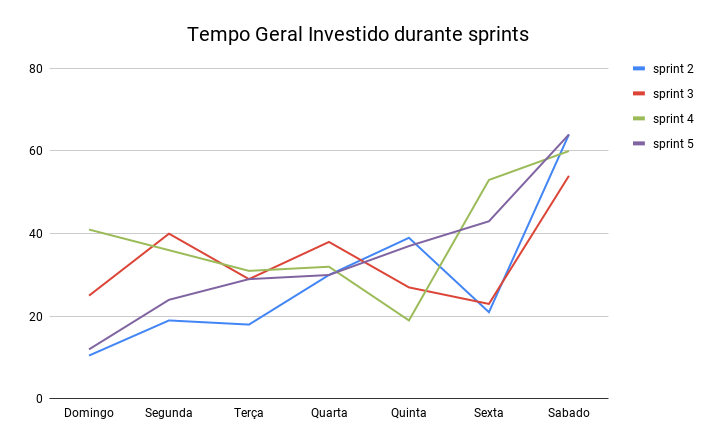

# Review da sprint 5

## Histórico de revisão

| Data       | Autor                                        | Modificações                                 | Versão |
| ---------- | -------------------------------------------- | -------------------------------------------- | ------ |
| 26/03/2021 | [Welison Regis](https://github.com/WelisonR) | Adiciona revisão e retrospectiva da sprint 5 | 1.0    |

## Visão Geral

|        Duração da sprint        | Planejado | Entregue  | Divida técnica | Membros ausentes |
| :-----------------------------: | :-------: | :-------: | :------------: | :--------------: |
| **14/03/2021** a **20/03/2021** | 54 pontos | 36 pontos |   18 pontos    |      Nenhum      |

## Tarefas finalizadas

| Issue                                                                                                                    | Pontos | Responsáveis                                                                                   |
| ------------------------------------------------------------------------------------------------------------------------ | :----: | ---------------------------------------------------------------------------------------------- |
| [Adicionar configurações de lint locais](https://github.com//fga-eps-mds/2020.2-Projeto-Kokama-Wiki/issues/77)           |   8    | [Leonardo Medeiros](https://github.com/leomedeiros1)                                           |
| [Criar documento de planejamento da sprint 5](https://github.com//fga-eps-mds/2020.2-Projeto-Kokama-Wiki/issues/97)      |   2    | [Welison Regis](https://github.com/WelisonR)                                                   |
| [Documentar revisão e retrospectiva da sprint 4](https://github.com//fga-eps-mds/2020.2-Projeto-Kokama-Wiki/issues/98)   |   5    | [Welison Regis](https://github.com/WelisonR)                                                   |
| [Criar diagrama de pacotes da aplicação](https://github.com//fga-eps-mds/2020.2-Projeto-Kokama-Wiki/issues/99)           |   3    | [Lieverton Silva](https://github.com/lievertom)                                                |
| [Configurar ferramenta SonarQube nos repositórios](https://github.com//fga-eps-mds/2020.2-Projeto-Kokama-Wiki/issues/92) |   5    | [André Lucas](https://github.com/andrelucax) e [Lieverton Silva](https://github.com/lievertom) |
| [[TS01] Melhorias na página de tradução](https://github.com//fga-eps-mds/2020.2-Projeto-Kokama-Wiki/issues/96)           |   8    | [Luís Guilherme](https://github.com/luisgaboardi) e [Luiz Gustavo](https://github.com/LightZX) |
| [[US04] Inserção de caracter especial](https://github.com//fga-eps-mds/2020.2-Projeto-Kokama-Wiki/issues/93)             |   5    | [Luís Guilherme](https://github.com/luisgaboardi) e [Luiz Gustavo](https://github.com/LightZX) |

## Dívidas técnicas

| Tarefa                                                                                                           | Pontos | Responsáveis                                                                                             | Justificativa                                                                                                           |
| ---------------------------------------------------------------------------------------------------------------- | :----: | -------------------------------------------------------------------------------------------------------- | ----------------------------------------------------------------------------------------------------------------------- |
| [Criar seed das bases de dados do backend](https://github.com//fga-eps-mds/2020.2-Projeto-Kokama-Wiki/issues/76) |   5    | [Lieverton Silva](https://github.com/lievertom)                                                          | Foco durante a sprint foi na diagramação das soluções arquiteturais do projeto, mais importante no contexto da _sprint_ |
| [[US05] Histórico de palavras pesquisadas](https://github.com/fga-eps-mds/2020.2-Projeto-Kokama-Wiki/issues/95)  |   5    | [Fernando Vargas](https://www.github.com/SFernandoS) e [Lucas Rodrigues](https://www.github.com/nickby2) | Funcionalidade não entregue por completo, faltou a persistência dos dados e trabalhar a interface de usuário            |
| [[US06] Atualizar dicionário de palavras](https://github.com/fga-eps-mds/2020.2-Projeto-Kokama-Wiki/issues/94)   |   8    | [Ana Júlia](https://www.github.com/aluzianobriceno) e [Lais Portela](https://www.github.com/laispa)      | Funcionalidade não entregue por completo, faltou a persistência dos dados e a sistemática de atualização do dicionário  |

## Burndown

## Velocity

## Quadro de Conhecimentos

### Antes

### Depois

### Antes e depois por assunto

## Tempo gasto na sprint

### MDS e EPS

### Geral

## Presença em daily

| Integrante / Dia |      Segunda       |       Terça        |       Quarta       |       Quinta       |       Sexta        |       Sábado       |
| :--------------: | :----------------: | :----------------: | :----------------: | :----------------: | :----------------: | :----------------: |
|       Ana        | :heavy_check_mark: | :heavy_check_mark: | :heavy_check_mark: | :heavy_check_mark: | :heavy_check_mark: | :heavy_check_mark: |
|      André       | :heavy_check_mark: | :heavy_check_mark: | :heavy_check_mark: | :heavy_check_mark: | :heavy_check_mark: | :heavy_check_mark: |
|     Fernando     | :heavy_check_mark: | :heavy_check_mark: | :heavy_check_mark: | :heavy_check_mark: | :heavy_check_mark: | :heavy_check_mark: |
|    Lieverton     | :heavy_check_mark: | :heavy_check_mark: | :heavy_check_mark: | :heavy_check_mark: | :heavy_check_mark: | :heavy_check_mark: |
|       Lais       | :heavy_check_mark: | :heavy_check_mark: | :heavy_check_mark: | :heavy_check_mark: | :heavy_check_mark: | :heavy_check_mark: |
|     Leonardo     | :heavy_check_mark: | :heavy_check_mark: | :heavy_check_mark: | :heavy_check_mark: | :heavy_check_mark: | :heavy_check_mark: |
|      Lucas       | :heavy_check_mark: | :heavy_check_mark: | :heavy_check_mark: | :heavy_check_mark: | :heavy_check_mark: | :heavy_check_mark: |
|       Luís       | :heavy_check_mark: | :heavy_check_mark: | :heavy_check_mark: | :heavy_check_mark: | :heavy_check_mark: | :heavy_check_mark: |
|       Luiz       | :heavy_check_mark: | :heavy_check_mark: | :heavy_check_mark: | :heavy_check_mark: | :heavy_check_mark: | :heavy_check_mark: |
|     Welison      | :heavy_check_mark: | :heavy_check_mark: | :heavy_check_mark: | :heavy_check_mark: | :heavy_check_mark: | :heavy_check_mark: |

## Retrospectiva

Os textos abaixo são opiniões e visões relatadas anonimamente por parte da equipe e, portanto, utiliza um formato mais livre na escrita com a finalidade de captar todos os elogios, ideias, sugestões e reclamações da _sprint_.

### Pontos positivos

1. A professora está gostando do nosso trabalho e consequentemente o Hilmer parece estar também
2. EPS tem dado suporte e orientação a MDS no uso das tecnologias do projeto
3. As issues estavam bem dividas e explicadas. O trabalho da sprint estava claro
4. Nessa semana as reuniões foram bem sucintas e de grande ajuda com algumas duvidas gerais do código
5. O término da tela de tradução até terça (apresentação) parece viável
6. Envolvimento de MDS na criação de issues
7. O "S" foi brabissimo
8. Dupla SZ
9. Sonar Cloud (claudinho) ta on, ajudando a indicar erros de código podendo ser corrigidos antes da revisão

### Pontos a melhorar e sugestões de melhoria

1. Atrasos que podem virar dívida técnica. Começar o trabalho o quanto antes
2. Faltas nas reuniões com a professora Altaci. A gente marcou esse horário porque estávamos disponíveis
3. MDS não consegue pesquisar coisas simples. Entender o problema para encontrar quais são as palavras chaves para busca
4. Poucas entregas conseguiram ser finalizadas. Dividas tecnicas machucam o nenem
5. Dificuldade de MDS no aprendizado/pesquisa
6. Muito dívida, poucas entregas
7. Falta de assertividade de MDS na resolução dos problemas através de pesquisas

### Medidas a serem tomadas

1. Acompanhamento e suporte mais assíduo por parte de EPS nas entregas de software da equipe de MDS durante a _sprint_;
2. Criação do programa "adote o seu EPS";
3. Acompanhamento de _pull requests_ por parte de EPS através do incentivo do uso do _working in progress_ (WIP).

## Avaliação do Scrum Master

De acordo com o **burndown** e com o **velocity**, percebe-se que a _sprint_ em questão teve um resultado aquém em relação às _sprints_ passadas. Nesse cenário, percebe-se que a equipe acumulou três dívidas, o que acabou por culminar em um resultado abaixo do esperado para a _sprint_.

No **quadro de conhecimentos**, observa-se um avanço especialmente no entendimento das tecnologias trabalhadas no projeto, o que representa que a equipe ainda está em um processo de maturação em relação aos ferramentais utilizados no projeto.

A distribuição do **tempo gasto na sprint** indica que a equipe teve dificuldades no gerenciamento de tempo durante a _sprint_ de modo que isso tenha gerado problemas de entrega de resultados na semana.

### Adote o seu EPS

Devido ao resultado da presente _sprint_ em relação às entregas das histórias de usuário, pode-se perceber que a equipe de MDS está com muitas dificuldades nessa etapa inicial de desenvolvimento de software, especialmente em realizar boas pesquisas na _internet_. Nesse sentido, o time decidiu criar o projeto "adote o seu EPS". Nessa nova dinâmica as duplas de MDS vão ter um membro de EPS durante os pareamentos de modo que o integrante de EPS possa sugerir caminhos para solucionar problemas, dar dicas e auxiliar de modo geral no pareamento. Cabe ressaltar que EPS não irá desenvolver as soluções, mas sim orientar e acompanhar com mais assiduidade as duplas de MDS para que o time alcance melhores resultados.
