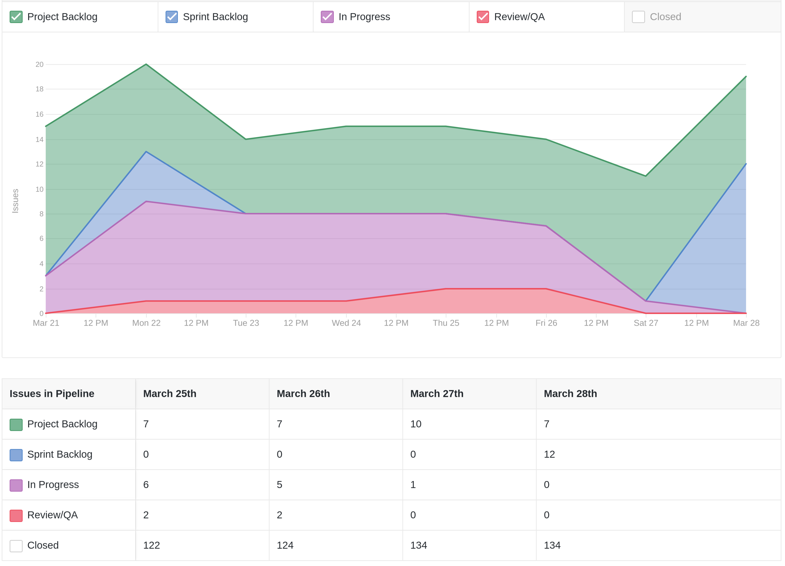
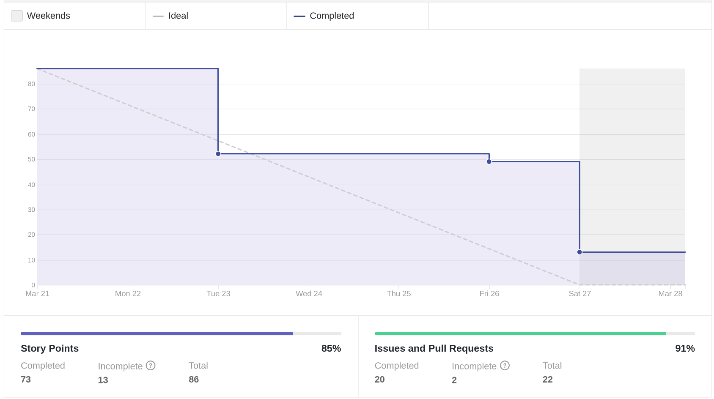
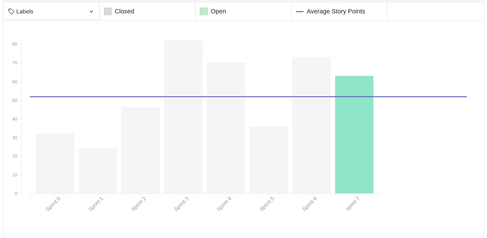
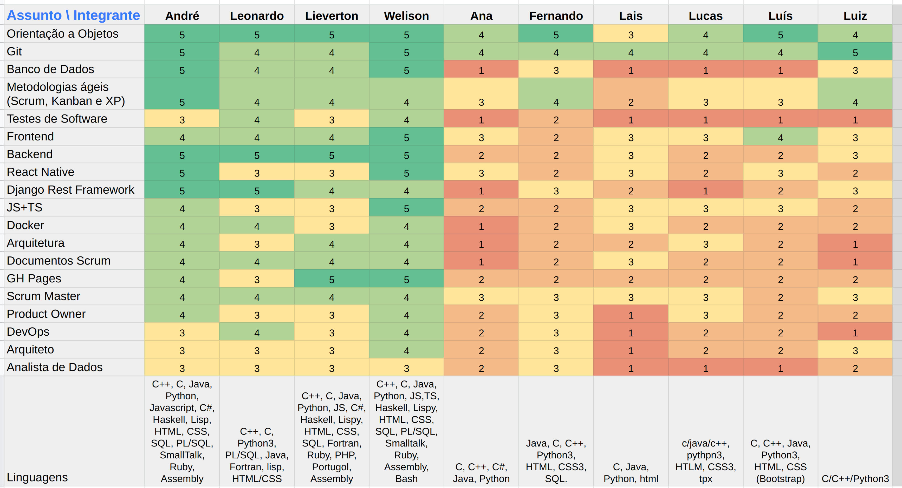
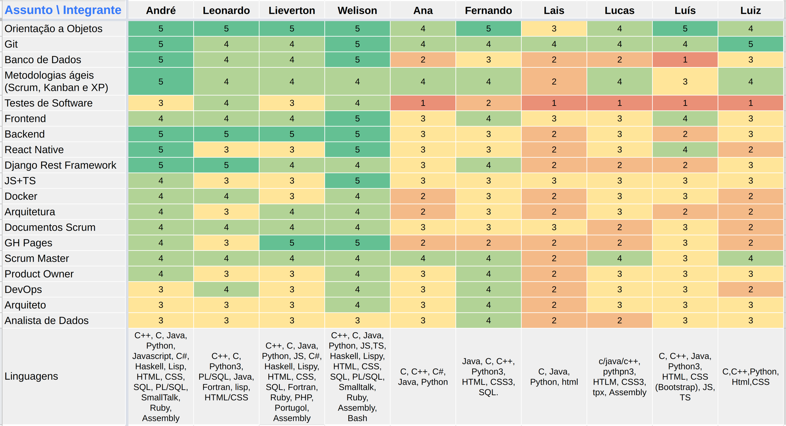
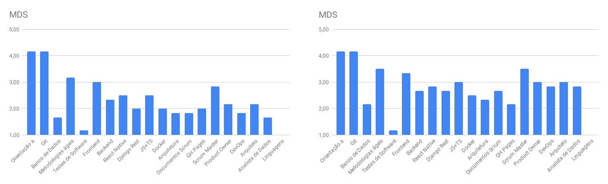
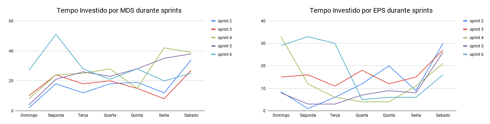
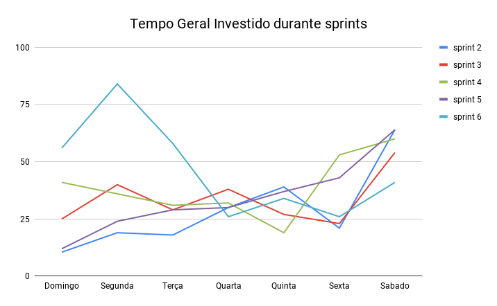

# Review da sprint 6

## Histórico de revisão

| Data       | Autor                                        | Modificações                                 | Versão |
| ---------- | -------------------------------------------- | -------------------------------------------- | ------ |
| 02/04/2021 | [Welison Regis](https://github.com/WelisonR) | Adiciona revisão e retrospectiva da sprint 6 | 1.0    |

## Visão Geral

|        Duração da sprint        | Planejado | Entregue  | Divida técnica | Membros ausentes |
| :-----------------------------: | :-------: | :-------: | :------------: | :--------------: |
| **21/03/2021** a **27/03/2021** | 81 pontos | 68 pontos |   13 pontos    |      Nenhum      |

## Tarefas finalizadas

| Issue                                                                                                                               | Pontos | Responsáveis                                                                                                                                                                                                                                                                                                                                                                                                                                                                                   |
| ----------------------------------------------------------------------------------------------------------------------------------- | :----: | ---------------------------------------------------------------------------------------------------------------------------------------------------------------------------------------------------------------------------------------------------------------------------------------------------------------------------------------------------------------------------------------------------------------------------------------------------------------------------------------------- |
| [Criar template de bug](https://github.com//fga-eps-mds/2020.2-Projeto-Kokama-Wiki/issues/115)                                      |   1    | [André Lucas](https://github.com/andrelucax)                                                                                                                                                                                                                                                                                                                                                                                                                                                   |
| [Documentar revisão e retrospectiva da sprint 5](https://github.com//fga-eps-mds/2020.2-Projeto-Kokama-Wiki/issues/112)             |   5    | [Welison Regis](https://github.com/WelisonR)                                                                                                                                                                                                                                                                                                                                                                                                                                                   |
| [Criar documento de planejamento da sprint 6](https://github.com//fga-eps-mds/2020.2-Projeto-Kokama-Wiki/issues/111)                |   2    | [Welison Regis](https://github.com/WelisonR)                                                                                                                                                                                                                                                                                                                                                                                                                                                   |
| [Criar vídeo para release 1](https://github.com//fga-eps-mds/2020.2-Projeto-Kokama-Wiki/issues/110)                                 |   3    | [Ana Júlia](https://github.com/aluzianobriceno), [Lucas Rodrigues](https://github.com/nickby2), [Fernando Vargas](https://github.com/SFernandoS), [Lais Portela](https://github.com/laispa), [Luís Guilherme](https://github.com/luisgaboardi), [Luiz Gustavo](https://github.com/LightZX), [André Lucas](https://github.com/andrelucax), [Leonardo Medeiros](https://github.com/leomedeiros1), [Lieverton Silva](https://github.com/lievertom) e [Welison Regis](https://github.com/WelisonR) |
| [Criar ambiente de homologação do microsserviço de tradução](https://github.com//fga-eps-mds/2020.2-Projeto-Kokama-Wiki/issues/109) |   8    | [Leonardo Medeiros](https://github.com/leomedeiros1)                                                                                                                                                                                                                                                                                                                                                                                                                                           |
| [Melhorias nas configurações dos repositórios](https://github.com//fga-eps-mds/2020.2-Projeto-Kokama-Wiki/issues/108)               |   3    | [Ana Júlia](https://github.com/aluzianobriceno) e [Lucas Rodrigues](https://github.com/nickby2)                                                                                                                                                                                                                                                                                                                                                                                                |
| [Revisão de documentação do projeto](https://github.com//fga-eps-mds/2020.2-Projeto-Kokama-Wiki/issues/107)                         |   5    | [André Lucas](https://www.github.com/andrelucax), [Leonardo Medeiros](https://www.github.com/leomedeiros1), [Lieverton Silva](https://www.github.com/lievertom) e [Welison Regis](https://github.com/WelisonR)                                                                                                                                                                                                                                                                                 |
| [Colocar um fundo branco na logo do projeto](https://github.com//fga-eps-mds/2020.2-Projeto-Kokama-Wiki/issues/101)                 |   2    | [Lais Portela](https://github.com/laispa) e [Luiz Gustavo](https://github.com/LightZX)                                                                                                                                                                                                                                                                                                                                                                                                         |
| [Criar seed das bases de dados do backend](https://github.com//fga-eps-mds/2020.2-Projeto-Kokama-Wiki/issues/76)                    |   5    | [Lieverton Silva](https://github.com/lievertom)                                                                                                                                                                                                                                                                                                                                                                                                                                                |
| [[TS02] Ajustes na organização do projeto](https://github.com//fga-eps-mds/2020.2-Projeto-Kokama-Wiki/issues/102)                   |   13   | [Fernando Vargas](https://github.com/SFernandoS), [Luís Guilherme](https://github.com/luisgaboardi) e [Welison Regis](https://github.com/WelisonR)                                                                                                                                                                                                                                                                                                                                             |
| [[US05] Histórico de palavras pesquisadas](https://github.com//fga-eps-mds/2020.2-Projeto-Kokama-Wiki/issues/95)                    |   5    | [Fernando Vargas](https://github.com/SFernandoS), [Luís Guilherme](https://github.com/luisgaboardi) e [Lieverton Silva](https://github.com/lievertom)                                                                                                                                                                                                                                                                                                                                          |
| [[US06] Atualizar dicionário de palavras](https://github.com//fga-eps-mds/2020.2-Projeto-Kokama-Wiki/issues/94)                     |   8    | [Fernando Vargas](https://github.com/SFernandoS), [Luís Guilherme](https://github.com/luisgaboardi) e [Lieverton Silva](https://github.com/lievertom)                                                                                                                                                                                                                                                                                                                                          |
| [[US09] Cadastro e Login de Administrador](https://github.com//fga-eps-mds/2020.2-Projeto-Kokama-Wiki/issues/103)                   |   8    | [Ana Júlia](https://github.com/aluzianobriceno), [Lucas Rodrigues](https://github.com/nickby2) e [Leonardo Medeiros](https://github.com/leomedeiros1)                                                                                                                                                                                                                                                                                                                                          |

## Dívidas técnicas

| Tarefa                                                                                                                                                   | Pontos | Responsáveis                                                                                                                         | Justificativa                                                                |
| -------------------------------------------------------------------------------------------------------------------------------------------------------- | :----: | ------------------------------------------------------------------------------------------------------------------------------------ | ---------------------------------------------------------------------------- |
| [[TS03] Melhorar usabilidade das paginas de cadastro, edição e lista de tradução](https://github.com//fga-eps-mds/2020.2-Projeto-Kokama-Wiki/issues/104) |   13   | [Lais Portela](https://github.com/laispa), [Luiz Gustavo](https://github.com/LightZX) e [André Lucas](https://github.com/andrelucax) | Equipe não conseguiu realizar todos os ajustes propostos na história técnica |

## Cumulative Flow

## Burndown

## Velocity

## Quadro de Conhecimentos

### Antes

### Depois

### Antes e depois por assunto

## Tempo gasto na sprint

### MDS e EPS

### Geral

## Presença em daily

| Integrante / Dia |      Segunda       |       Terça        |       Quarta       |       Quinta       |       Sexta        |       Sábado       |
| :--------------: | :----------------: | :----------------: | :----------------: | :----------------: | :----------------: | :----------------: |
|       Ana        | :heavy_check_mark: | :heavy_check_mark: | :heavy_check_mark: | :heavy_check_mark: | :heavy_check_mark: | :heavy_check_mark: |
|      André       | :heavy_check_mark: | :heavy_check_mark: | :heavy_check_mark: | :heavy_check_mark: | :heavy_check_mark: | :heavy_check_mark: |
|     Fernando     | :heavy_check_mark: | :heavy_check_mark: | :heavy_check_mark: | :heavy_check_mark: | :heavy_check_mark: | :heavy_check_mark: |
|    Lieverton     | :heavy_check_mark: | :heavy_check_mark: | :heavy_check_mark: | :heavy_check_mark: | :heavy_check_mark: | :heavy_check_mark: |
|       Lais       | :heavy_check_mark: | :heavy_check_mark: | :heavy_check_mark: | :heavy_check_mark: | :heavy_check_mark: | :heavy_check_mark: |
|     Leonardo     | :heavy_check_mark: | :heavy_check_mark: | :heavy_check_mark: | :heavy_check_mark: | :heavy_check_mark: | :heavy_check_mark: |
|      Lucas       | :heavy_check_mark: | :heavy_check_mark: | :heavy_check_mark: | :heavy_check_mark: | :heavy_check_mark: | :heavy_check_mark: |
|       Luís       | :heavy_check_mark: | :heavy_check_mark: | :heavy_check_mark: | :heavy_check_mark: | :heavy_check_mark: | :heavy_check_mark: |
|       Luiz       | :heavy_check_mark: | :heavy_check_mark: | :heavy_check_mark: | :heavy_check_mark: | :heavy_check_mark: | :heavy_check_mark: |
|     Welison      | :heavy_check_mark: | :heavy_check_mark: | :heavy_check_mark: | :heavy_check_mark: | :heavy_check_mark: | :heavy_check_mark: |

## Retrospectiva

Os textos abaixo são opiniões e visões relatadas anonimamente por parte da equipe e, portanto, utiliza um formato mais livre na escrita com a finalidade de captar todos os elogios, ideias, sugestões e reclamações da _sprint_.

### Pontos positivos

1. Parabens pela entrega da R1, conseguimos evoluir bastante
2. Lais e Z tiveram um evolução legal
3. André o mago é implacavél, bruxaria de software <3
4. Hilmer parece satisfeito com o nosso desenvolvimento
5. Programa adote seu MDS deu bom pra release 1 e aprendemos bastante com os brabos de EPS nesse meio tempo
6. Deploy deu certo
7. Ana teve uma grande evolução durante a semana
8. MDS está evoluindo
9. Front-End tá ficando topzera
10. Deploy no Heroku, parabens leleleleleleleleleleo
11. Evolução muito expressiva no front-end
12. O grupo em geral se esforçou bastante nessa R1, muitas horas trabalhadas, parabens a todos! A meta agora é "drobar" a meta
13. S e Vargas muito esforçados, dupla topíssima
14. As reuniões estão sendo mais pontuais
15. Tivemos uma boa conversa com o Hilmer
16. o SM e o PO estão de parabens
17. Resolução de dívidas técnicas
18. Vídeo ficou muito bom
19. Backend tá ficando bom
20. Começamos a ter um app quase apresentavel, falta pouco pro MVP
21. EPS mandou um DALE essa semana, top!
22. Todo mundo pareou com todo mundo, deu bom
23. Walle ta de parabens, depois me ensina o jutsu pra dobrar as horas do dia
24. Tomtom ta de parabens, GOD d+

### Pontos a melhorar e sugestões de melhoria

1. MDS ficou mais independente, mas ainda precisa melhorar! Alcançamos a metade da meta, agora bora dobrar
2. Correria essa semana, mas inevitável, é a vida
3. Apresentação em video é igual andar de bicicleta, nunca aprendi. Foram muitas horas tentando gravar pra sair algo mais ou menos :( @Hilmer manda apresentar presencial
4. .env foi implementado de ultima hora, falta mostrar mais ou menos pra rapaziada o porque (dados sensiveis etc).
5. Outras matérias estão sendo deixadas por falta de tempo
6. Vozes muito baixas e muito altas na gravação, dar uma olhada após a gravação e checar o volume da própria voz e mudar a entonação ou a altura
7. Ainda falta um pouco de independência em MDS, google ajuda
8. Testes? Medo do Hilmer reclamar

### Medidas a serem tomadas

1. No futuro vídeo da release 2, verificar melhor a qualidade do conteúdo, do vídeo e do aúdio antes de publicar o resultado. Se necessário, trabalhar mais na edição de aúdio e de vídeo;
2. Com o avanço na parte de desenvolvimento, é importante nesse momento configurar o ambiente para começar a planejar os testes de software;
3. Diminuir o fluxo de trabalho da próxima sprint;
4. Criação de CI/CD para o ambiente de homologação do front-end para facilitar o acesso à aplicação.

## Avaliação do Scrum Master

A _sprint_ 6 ocorreu durante o andamento da _release 1_ do projeto. Através da análise das métricas, pode-se perceber que a equipe alcançou uma produtividade excepcional ao longo da semana. Além disso, a adoção do programa "Adote o seu EPS" culminou em ótimos resultados para a _sprint_, conforme apresentado acima. Portanto, pode-se notar as seguintes questões:

- **Cumulative flow**: pode-se observar que o fluxo de tarefas em cada etapa do _pipeline_ variou bastante ao longo da semana com revisões de _pull requests_ praticamente instantâneas, chegando ao final da sprint com todos os incrementos revisados e integrados ao produto;
- **Burndown**: observa-se um fluxo contínuo de trabalho ao longo da semana com grandes entregas na data da release 1 do projeto (terça-feira) e no final da _sprint_ (sábado). A equipe conseguiu um excelente resultado e deixou apenas uma história técnica como dívida da _sprint_;
- **Velocity**: contata-se que a equipe melhorou muito o desempenho em relação a _sprint_ anterior, foi possível entregar 32 pontos a mais em relação a _sprint 5_;
- **Quadro de conhecimentos**: nota-se um salto notável em relação à aprendizagem dos papeis desempenhados por EPS, provavelmente impulsionado pelo maior entrosamento do time em relação a todos os artefatos desenvolvidos e entregues na _release 1_;
- **Tempo gasto**: é possível notar uma semana anormal e atípica, com grandes picos antes das entregas da release. Nesse sentido, nas próximas semanas e nas próximas sprints, deve-se procurar dosar melhor a distribuição de tempo de desenvolvimento do projeto por parte da equipe.

Nesse sentido, deve-se levar em consideração os comentários pontuados nesse tópico e aqueles citados no tópico "medidas a serem tomadas" para manter um bom desempenho na próxima _sprint_.
