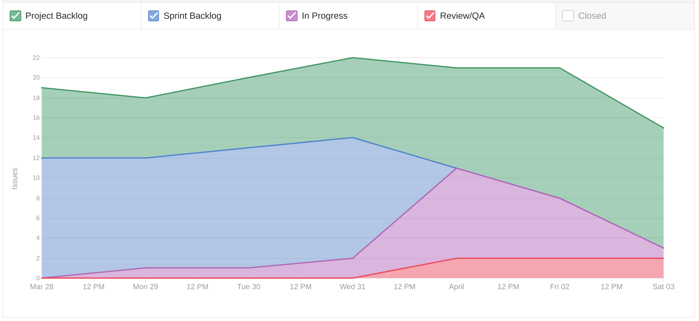
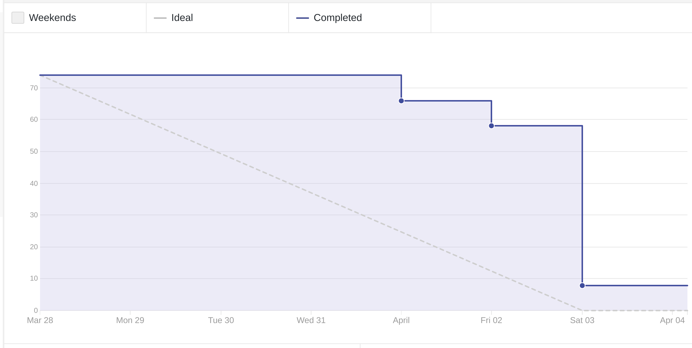
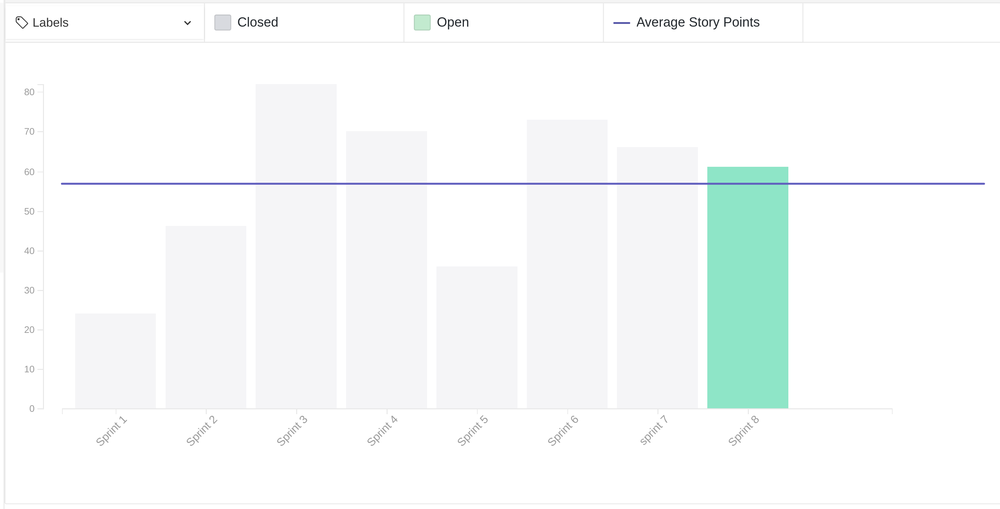
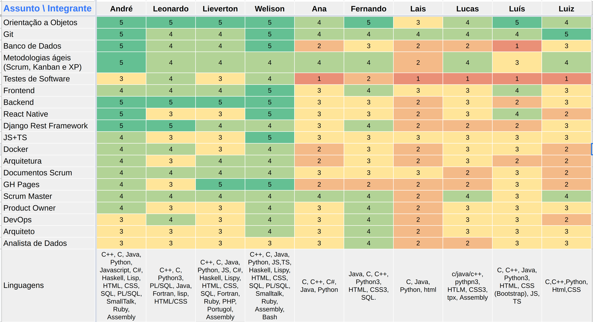
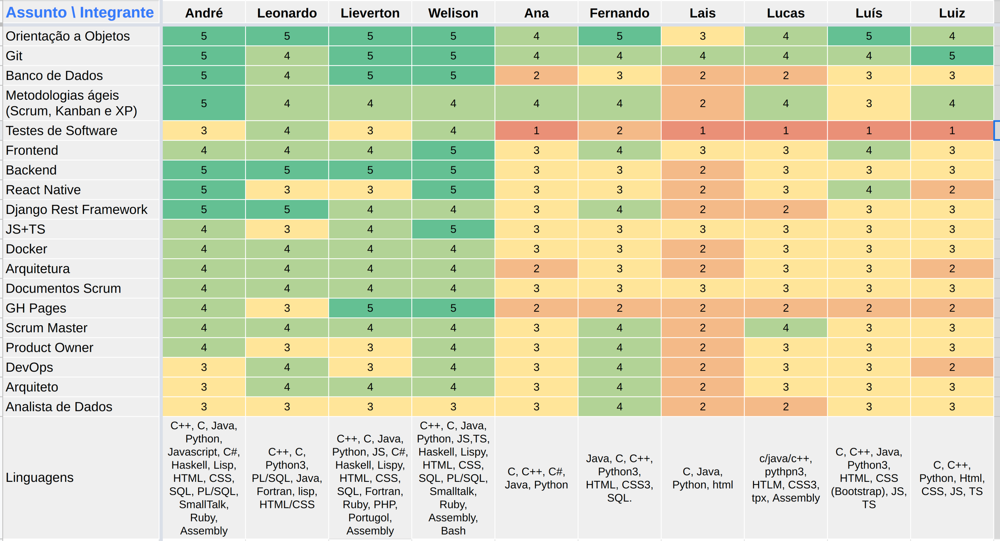
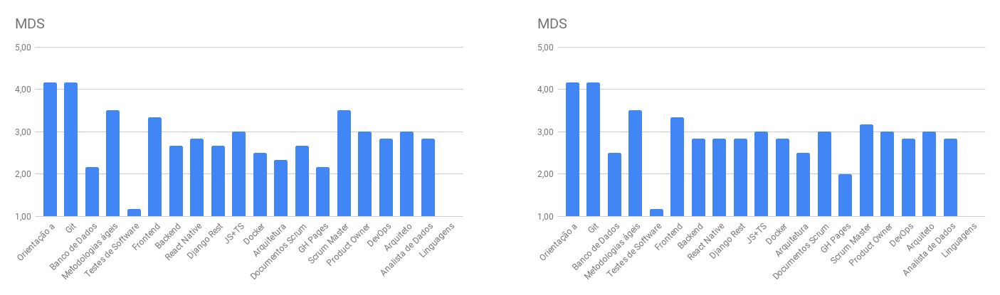
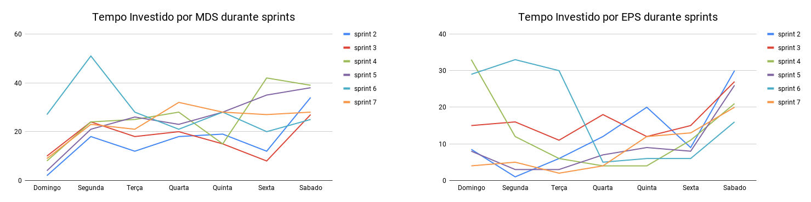
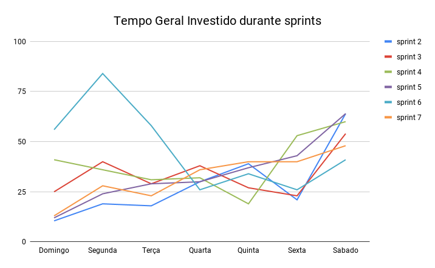

# Review da sprint 7

## Histórico de revisão

| Data       | Autor                                        | Modificações                                 | Versão |
| ---------- | -------------------------------------------- | -------------------------------------------- | ------ |
| 02/04/2021 | [Welison Regis](https://github.com/WelisonR) | Adiciona revisão e retrospectiva da sprint 7 | 1.0    |

## Visão Geral

|        Duração da sprint        | Planejado |  Entregue   | Divida técnica | Membros ausentes |
| :-----------------------------: | :-------: | :---------: | :------------: | :--------------: |
| **28/03/2021** a **03/04/2021** | 76 pontos | 63+3 pontos |   13 pontos    |      Nenhum      |

## Tarefas finalizadas

| Issue                                                                                                                                                    | Pontos | Responsáveis                                                                                        |
| -------------------------------------------------------------------------------------------------------------------------------------------------------- | :----: | --------------------------------------------------------------------------------------------------- |
| [Automatizar processo de release do projeto](https://github.com//fga-eps-mds/2020.2-Projeto-Kokama-Wiki/issues/125)                                      |   5    | [André Lucas](https://github.com/andrelucax) e [Leonardo Medeiros](https://github.com/leomedeiros1) |
| [Documentar revisão e retrospectiva da sprint 6](https://github.com//fga-eps-mds/2020.2-Projeto-Kokama-Wiki/issues/132)                                  |   5    | [Welison Regis](https://github.com/WelisonR)                                                        |
| [Criar documento de planejamento da sprint 7](https://github.com//fga-eps-mds/2020.2-Projeto-Kokama-Wiki/issues/131)                                     |   2    | [Welison Regis](https://github.com/WelisonR)                                                        |
| [Documentar reunião com a PO (05/03)](https://github.com//fga-eps-mds/2020.2-Projeto-Kokama-Wiki/issues/130)                                             |   3    | [Welison Regis](https://github.com/WelisonR)                                                        |
| [Documentar reunião com a PO (12/03)](https://github.com//fga-eps-mds/2020.2-Projeto-Kokama-Wiki/issues/129)                                             |   3    | [Lieverton Silva](https://github.com/lievertom)                                                     |
| [Documentar reunião com a PO (19/03)](https://github.com//fga-eps-mds/2020.2-Projeto-Kokama-Wiki/issues/137)                                             |   3    | [Lieverton Silva](https://github.com/lievertom)                                                     |
| [Criar seed para popular as tabelas de história do povo kokama](https://github.com//fga-eps-mds/2020.2-Projeto-Kokama-Wiki/issues/128)                   |   3    | [Lieverton Silva](https://github.com/lievertom)                                                     |
| [Criar ambiente de homologação para o front-end](https://github.com//fga-eps-mds/2020.2-Projeto-Kokama-Wiki/issues/126)                                  |   5    | [Leonardo Medeiros](https://github.com/leomedeiros1)                                                |
| [[US02] Navegação entre menus da aplicação](https://github.com//fga-eps-mds/2020.2-Projeto-Kokama-Wiki/issues/83)                                        |   8    | [Ana Júlia](https://github.com/aluzianobriceno) e [Luiz Gustavo](https://github.com/LightZX)        |
| [[US11] Cadastrar, editar e remover história do povo kokama](https://github.com//fga-eps-mds/2020.2-Projeto-Kokama-Wiki/issues/122)                      |   8    | [Lucas Rodrigues](https://github.com/nickby2) e [Fernando Vargas](https://github.com/SFernandoS)    |
| [[US12] Página com história do povo Kokama](https://github.com//fga-eps-mds/2020.2-Projeto-Kokama-Wiki/issues/123)                                       |   13   | [Ana Júlia](https://github.com/aluzianobriceno) e [Luiz Gustavo](https://github.com/LightZX)        |
| [[TS03] Melhorar usabilidade das paginas de cadastro, edição e lista de tradução](https://github.com//fga-eps-mds/2020.2-Projeto-Kokama-Wiki/issues/104) |   8    | [Lais Portela](https://github.com/laispa) e [Luís Guilherme](https://github.com/luisgaboardi)       |

## Dívidas técnicas

| Tarefa                                                                                                                 | Pontos | Responsáveis                                                                                                                                                                                       | Justificativa                                                       |
| ---------------------------------------------------------------------------------------------------------------------- | :----: | -------------------------------------------------------------------------------------------------------------------------------------------------------------------------------------------------- | ------------------------------------------------------------------- |
| [Configurar testes nos repositórios do projeto](https://github.com//fga-eps-mds/2020.2-Projeto-Kokama-Wiki/issues/127) |   8    | [André Lucas](https://github.com/andrelucax), [Leonardo Medeiros](https://github.com/leomedeiros1), [Lieverton Silva](https://github.com/lievertom) e [Welison Regis](https://github.com/WelisonR) | Todos os repositórios não foram configurados com pipeline de testes |

No final dessa sprint, decidiu-se fragmentar alguns detalhes da TS03, que se mostrou complexa o necessário para tal decisão.

## Cumulative Flow

## Burndown

## Velocity

## Quadro de Conhecimentos

### Antes

### Depois

### Antes e depois por assunto

## Tempo gasto na sprint

### MDS e EPS

### Geral

## Presença em daily

| Integrante / Dia |      Segunda       |       Terça        |       Quarta       |       Quinta       |       Sexta        |       Sábado       |
| :--------------: | :----------------: | :----------------: | :----------------: | :----------------: | :----------------: | :----------------: |
|       Ana        | :heavy_check_mark: | :heavy_check_mark: | :heavy_check_mark: | :heavy_check_mark: | :heavy_check_mark: | :heavy_check_mark: |
|      André       | :heavy_check_mark: | :heavy_check_mark: | :heavy_check_mark: | :heavy_check_mark: | :heavy_check_mark: | :heavy_check_mark: |
|     Fernando     | :heavy_check_mark: | :heavy_check_mark: | :heavy_check_mark: | :heavy_check_mark: | :heavy_check_mark: | :heavy_check_mark: |
|    Lieverton     | :heavy_check_mark: | :heavy_check_mark: | :heavy_check_mark: | :heavy_check_mark: | :heavy_check_mark: | :heavy_check_mark: |
|       Lais       | :heavy_check_mark: | :heavy_check_mark: | :heavy_check_mark: | :heavy_check_mark: | :heavy_check_mark: | :heavy_check_mark: |
|     Leonardo     | :heavy_check_mark: | :heavy_check_mark: | :heavy_check_mark: | :heavy_check_mark: | :heavy_check_mark: | :heavy_check_mark: |
|      Lucas       | :heavy_check_mark: | :heavy_check_mark: | :heavy_check_mark: | :heavy_check_mark: | :heavy_check_mark: | :heavy_check_mark: |
|       Luís       | :heavy_check_mark: | :heavy_check_mark: | :heavy_check_mark: | :heavy_check_mark: | :heavy_check_mark: | :heavy_check_mark: |
|       Luiz       | :heavy_check_mark: | :heavy_check_mark: | :heavy_check_mark: | :heavy_check_mark: | :heavy_check_mark: | :heavy_check_mark: |
|     Welison      | :heavy_check_mark: | :heavy_check_mark: | :heavy_check_mark: | :heavy_check_mark: | :heavy_check_mark: | :heavy_check_mark: |

## Retrospectiva

Os textos abaixo são opiniões e visões relatadas anonimamente por parte da equipe e, portanto, utiliza um formato mais livre na escrita com a finalidade de captar todos os elogios, ideias, sugestões e reclamações da _sprint_.

### Pontos positivos

1. Ambiente de homologação do frontend.
2. EPS tem conseguido entregar com constância as atividades propostas.
3. S conseguiu bom avanço na divida tecnica, inclusive tinha esquecido de falar, parabens.
4. Tabbar ficou bonita e funcional.
5. MDS se ajudou essa semana.
6. EPS ta de:
7. P
8. A
9. R
10. A
11. B
12. E
13. N
14. S
15. .
16. Ana e Z tão de parabéns <3
17. Reunião de sábado parece estar fluindo melhor.
18. Gustavo ta de parabens

### Pontos a melhorar e sugestões de melhoria

1. Não deu pra terminar issues, por falta de tempo e dificuldades pessoais e intelectuais
2. Dívidas técnicas. Diminuir escopo de algumas atividades
3. Descompromisso do parceiro de trabalho durante a sprint. Não abandonar, é responsabilidade dos dois.
4. Desenvolvimento tá lento, creio que EPS vai ter q meter a mão no codigo
5. Final de março para abril mds tiveram muitas provas.
6. Semana Pós R1 - diminuímos o ritmo.
7. Poucos pontos positivos e poucos pontos negativos. Fazer listinha durante semana
8. Não tive tempo pra fazer coisas além de estudar. Virar a noite pra poder jogar e descansar
9. Membros esquecendo de preencher o quadro de horas trabalhadas durante a semana. Preencher ao longo da semana

### Medidas a serem tomadas

1. Procurar diminuir o escopo das atividades de modo a distribuir melhor e mais granularizado as atividades;
2. Lembretes para preenchimento das horas trabalhadas;
3. Acompanhamento mais individual por parte de EPS da situação de desenvolvimento de cada pareamento.

## Avaliação do Scrum Master

Sobre a sprint 7, com base nas métricas pode-se observar os fatos abaixo:

- **Cumulative flow**: com base no gráfico, pode-se observar que a equipe teve um bom fluxo de trabalho durante a semana, pois é notável que a quantidade de issues em cada etapa do pipeline diversifcou bastante até o fim da _sprint_, momento em que as atividades foram revisadas e integradas ao software;
- **Burndown**: _sprint_ com 66 pontos entregues, o que apresenta um ótimo resultado em relação à média histórica do projeto. Entretanto, a equipe deixou dívida técnica de uma história de usuário e, além disso, surgiu a necessidade de fazer alguns reparos que resultaram em uma história técnica, pontos que devem ser tratados nas próximas _sprints_;
- **Velocity**: o desempenho da _sprint_ está um pouco acima do _velocity_ médio do projeto, o que mostra um melhor alinhamento das entregas e atividades desenvolvidas pelo time;
- **Quadro de conhecimentos**: percebe-se que o conhecimento dos membros está bem mais nivelado, com exceção do tópico testes de software, que deverá ter maior atenção da equipe nas próximas sprints;
- **Tempo gasto**: o gráfico demonstra as diferenças no tempo investido ao longo da semana, ocasionado por provas realizadas pelos membros da equipe. Nesse sentido, manter a recomendação sobre a distribuição de tempo ao longo das semanas para o desenvolvimento regular das atividades da disciplina.

Nesse sentido, deve-se levar em consideração os comentários pontuados nesse tópico e aqueles citados no tópico "medidas a serem tomadas" para manter um bom desempenho nas próximas _sprints_.
