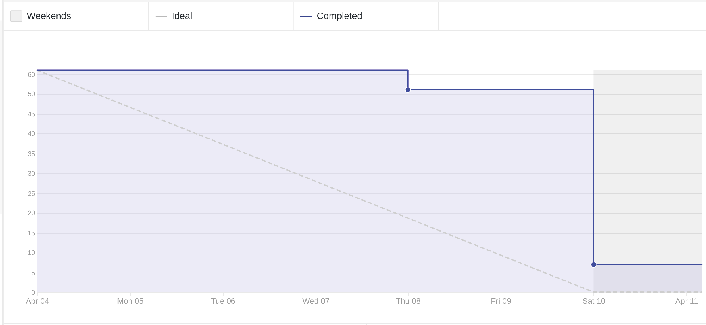
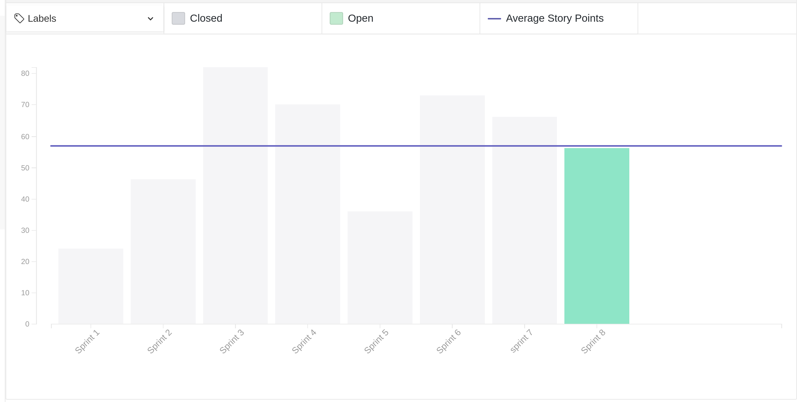
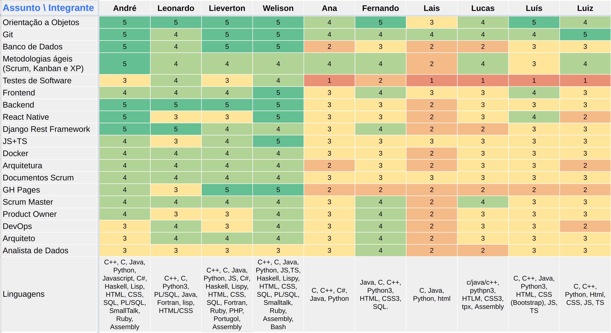
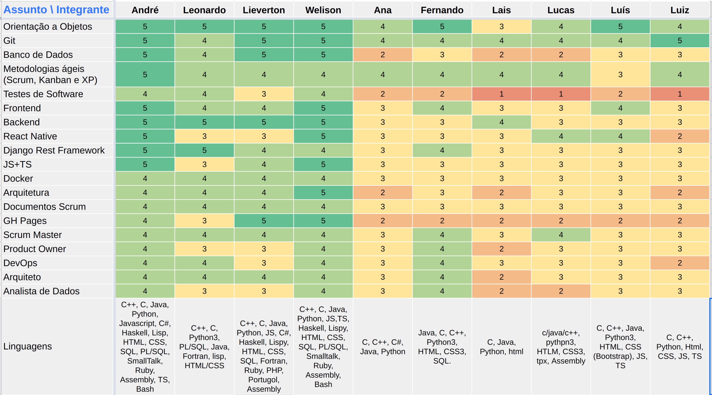
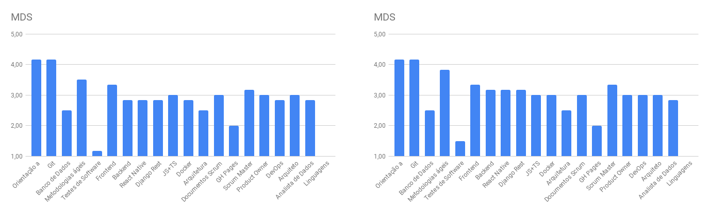
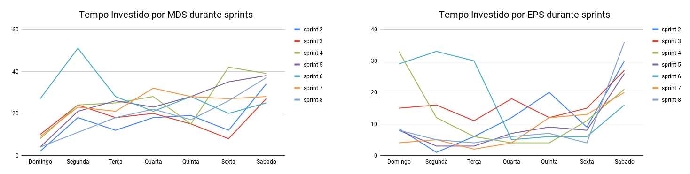
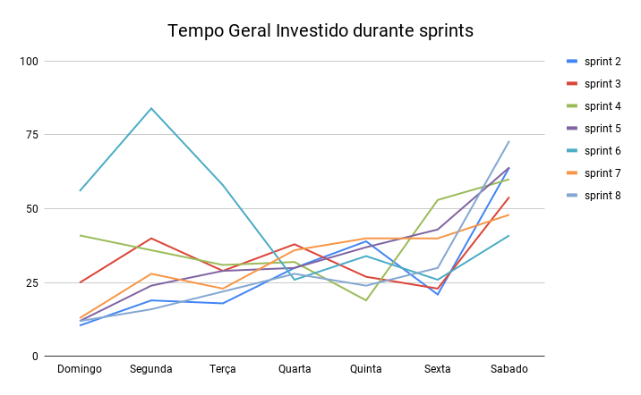

# Review da sprint 8

## Histórico de revisão

| Data       | Autor                                        | Modificações                                 | Versão |
| ---------- | -------------------------------------------- | -------------------------------------------- | ------ |
| 14/04/2021 | [Welison Regis](https://github.com/WelisonR) | Adiciona revisão e retrospectiva da sprint 8 | 1.0    |

## Visão Geral

|        Duração da sprint        | Planejado | Entregue  | Divida técnica | Membros ausentes |
| :-----------------------------: | :-------: | :-------: | :------------: | :--------------: |
| **04/04/2021** a **10/04/2021** | 61 pontos | 56 pontos |    5 pontos    |      Nenhum      |

## Tarefas finalizadas

| Issue                                                                                                                                                      | Pontos | Responsáveis                                                                                                                                                                                     |
| ---------------------------------------------------------------------------------------------------------------------------------------------------------- | :----: | ------------------------------------------------------------------------------------------------------------------------------------------------------------------------------------------------ |
| [Configurar testes nos repositórios do projeto](https://github.com/fga-eps-mds/2020.2-projeto-kokama-wiki/issues/127)                                      |   8    | [Welison Regis](https://www.github.com/WelisonR) e [Leonardo Medeiros](https://github.com/leomedeiros1)                                                                                          |
| [Correção da falha de compilação no frontend](https://github.com//fga-eps-mds/2020.2-Projeto-Kokama-Wiki/issues/149)                                       |   2    | [Luís Guilherme](https://github.com/luisgaboardi)                                                                                                                                                |
| [Documentar revisão e retrospectiva da sprint 7](https://github.com//fga-eps-mds/2020.2-Projeto-Kokama-Wiki/issues/148)                                    |   5    | [Welison Regis](https://github.com/WelisonR)                                                                                                                                                     |
| [Criar documento de planejamento da sprint 8](https://github.com//fga-eps-mds/2020.2-Projeto-Kokama-Wiki/issues/147)                                       |   2    | [Welison Regis](https://github.com/WelisonR)                                                                                                                                                     |
| [Melhorar mapeamento de riscos do projeto](https://github.com//fga-eps-mds/2020.2-Projeto-Kokama-Wiki/issues/144)                                          |   3    | [Welison Regis](https://github.com/WelisonR)                                                                                                                                                     |
| [Configurar integração contínua e deploy contínuo do novo microsserviço de usuário](https://github.com//fga-eps-mds/2020.2-Projeto-Kokama-Wiki/issues/142) |   5    | [André Lucas](https://github.com/andrelucax) e [Leonardo Medeiros](https://github.com/leomedeiros1)                                                                                              |
| [Criar novo microsserviço de usuário](https://github.com//fga-eps-mds/2020.2-Projeto-Kokama-Wiki/issues/140)                                               |   5    | [André Lucas](https://github.com/andrelucax) e [Leonardo Medeiros](https://github.com/leomedeiros1)                                                                                              |
| [[US16] Geração Automática de Exercícios](https://github.com//fga-eps-mds/2020.2-Projeto-Kokama-Wiki/issues/143)                                           |   13   | [Lucas Rodrigues](https://github.com/nickby2), [Luís Guilherme](https://github.com/luisgaboardi), [Lieverton Silva](https://github.com/lievertom) e [Welison Regis](https://github.com/WelisonR) |
| [[TS04] Melhorar usabilidade das paginas de edição de tradução](https://github.com//fga-eps-mds/2020.2-Projeto-Kokama-Wiki/issues/145)                     |   5    | [Luiz Gustavo](https://github.com/LightZX) e [Fernando Vargas](https://github.com/SFernandoS)                                                                                                    |
| [[TS05] Refatorações e melhorias de código no front-end](https://github.com//fga-eps-mds/2020.2-Projeto-Kokama-Wiki/issues/146)                            |   8    | [Ana Júlia](https://github.com/aluzianobriceno), [Lais Portela](https://github.com/laispa) e [Welison Regis](https://github.com/WelisonR)                                                        |

## Dívidas técnicas

| Tarefa                                                                                                               | Pontos | Responsáveis                                                                                | Justificativa                                                                                                                                                         |
| -------------------------------------------------------------------------------------------------------------------- | :----: | ------------------------------------------------------------------------------------------- | --------------------------------------------------------------------------------------------------------------------------------------------------------------------- |
| [[US19] Tela com informações sobre o projeto](https://github.com//fga-eps-mds/2020.2-Projeto-Kokama-Wiki/issues/141) |   5    | [Lais Portela](https://github.com/laispa) e [Ana Júlia](https://github.com/aluzianobriceno) | A dupla teve dificuldades para desenvolver as atividades propostas, pois uma das integrantes fraturou a perna e precisou manter repouso durante alguns dias da *sprint* |
## Burndown

## Velocity

## Quadro de Conhecimentos

### Antes

### Depois

### Antes e depois por assunto

## Tempo gasto na sprint

### MDS e EPS

### Geral

## Presença em daily

| Integrante / Dia |      Segunda       |       Terça        |       Quarta       |       Quinta       |       Sexta        |       Sábado       |
| :--------------: | :----------------: | :----------------: | :----------------: | :----------------: | :----------------: | :----------------: |
|       Ana        | :heavy_check_mark: |                    |                    |                    | :heavy_check_mark: | :heavy_check_mark: |
|      André       | :heavy_check_mark: | :heavy_check_mark: | :heavy_check_mark: | :heavy_check_mark: |                    | :heavy_check_mark: |
|     Fernando     | :heavy_check_mark: | :heavy_check_mark: | :heavy_check_mark: | :heavy_check_mark: | :heavy_check_mark: | :heavy_check_mark: |
|    Lieverton     | :heavy_check_mark: | :heavy_check_mark: | :heavy_check_mark: | :heavy_check_mark: |                    | :heavy_check_mark: |
|       Lais       |                    | :heavy_check_mark: |                    | :heavy_check_mark: | :heavy_check_mark: | :heavy_check_mark: |
|     Leonardo     | :heavy_check_mark: | :heavy_check_mark: |                    | :heavy_check_mark: | :heavy_check_mark: | :heavy_check_mark: |
|      Lucas       | :heavy_check_mark: | :heavy_check_mark: | :heavy_check_mark: | :heavy_check_mark: | :heavy_check_mark: | :heavy_check_mark: |
|       Luís       | :heavy_check_mark: | :heavy_check_mark: | :heavy_check_mark: | :heavy_check_mark: | :heavy_check_mark: | :heavy_check_mark: |
|       Luiz       |                    | :heavy_check_mark: | :heavy_check_mark: | :heavy_check_mark: | :heavy_check_mark: | :heavy_check_mark: |
|     Welison      | :heavy_check_mark: | :heavy_check_mark: | :heavy_check_mark: | :heavy_check_mark: | :heavy_check_mark: | :heavy_check_mark: |

**Observação**: durante essa sprint, a integrante Ana fez uma cirurgia no pé e precisou manter repouso, que justifica as ausências ao longo da semana.
