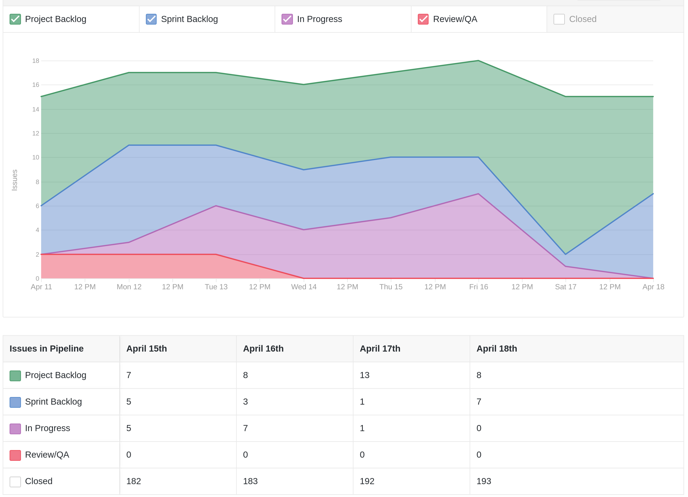
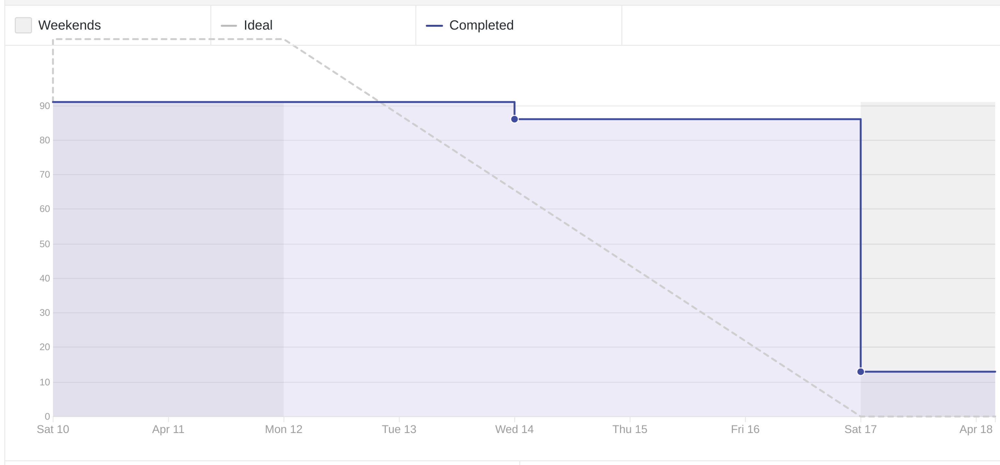
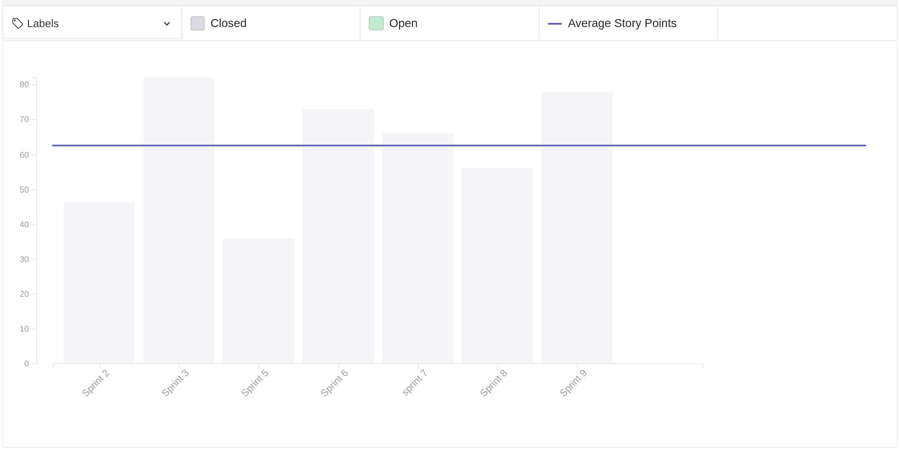
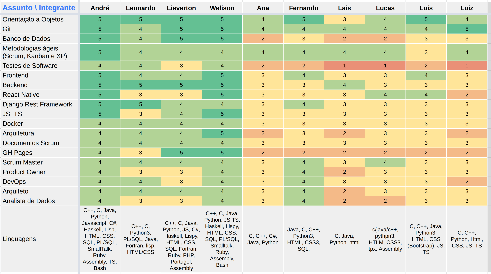
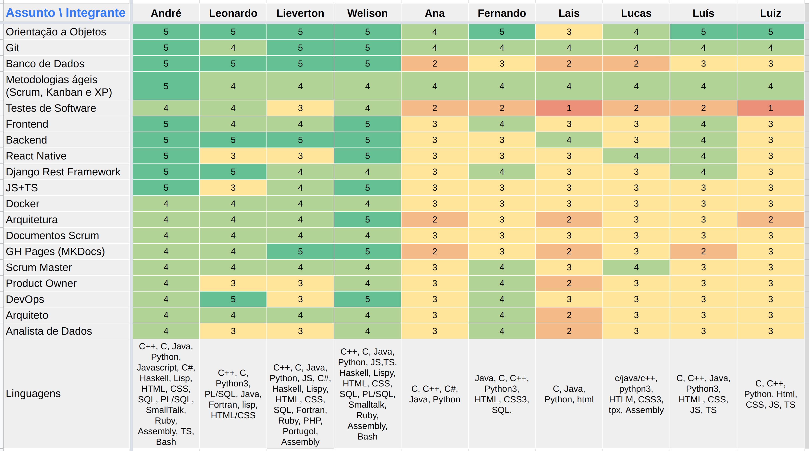
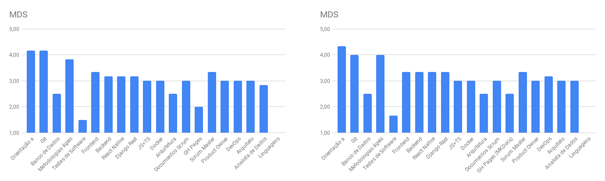
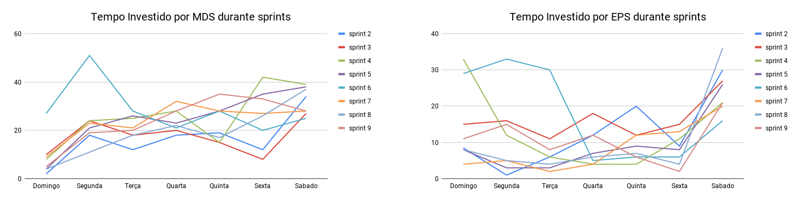
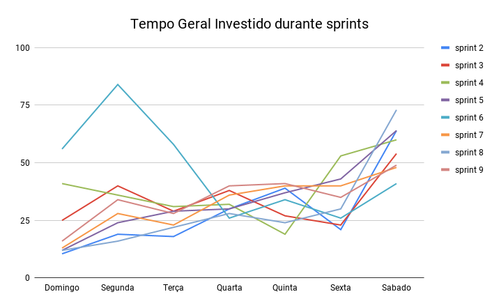

# Review da sprint 9

## Histórico de revisão

| Data       | Autor                                        | Modificações                                 | Versão |
| ---------- | -------------------------------------------- | -------------------------------------------- | ------ |
| 24/04/2021 | [Welison Regis](https://github.com/WelisonR) | Adiciona revisão e retrospectiva da sprint 9 | 1.0    |

## Visão Geral

|        Duração da sprint        | Planejado | Entregue  | Divida técnica | Membros ausentes |
| :-----------------------------: | :-------: | :-------: | :------------: | :--------------: |
| **11/04/2021** a **17/04/2021** | 91 pontos | 78 pontos |   13 pontos    | Laís e Fernando  |

## Tarefas finalizadas

| Issue                                                                                                                                     | Pontos | Responsáveis                                                                                                                                                                                        |
| ----------------------------------------------------------------------------------------------------------------------------------------- | :----: | --------------------------------------------------------------------------------------------------------------------------------------------------------------------------------------------------- |
| [Documentar revisão e retrospectiva da sprint 8](https://github.com//fga-eps-mds/2020.2-Projeto-Kokama-Wiki/issues/158)                   |   5    | [Welison Regis](https://github.com/WelisonR)                                                                                                                                                        |
| [Criar documento de planejamento da sprint 9](https://github.com//fga-eps-mds/2020.2-Projeto-Kokama-Wiki/issues/157)                      |   2    | [Welison Regis](https://github.com/WelisonR)                                                                                                                                                        |
| [Adicionar etapa de lint ao pipeline](https://github.com//fga-eps-mds/2020.2-Projeto-Kokama-Wiki/issues/156)                              |   5    | [Leonardo Medeiros](https://github.com/leomedeiros1)                                                                                                                                                |
| [Interconectar os dockers através de uma network](https://github.com//fga-eps-mds/2020.2-Projeto-Kokama-Wiki/issues/154)                  |   3    | [Leonardo Medeiros](https://github.com/leomedeiros1)                                                                                                                                                |
| [Criar scripts para possibilitar rodar o front-end fora do docker](https://github.com//fga-eps-mds/2020.2-Projeto-Kokama-Wiki/issues/153) |   5    | [Leonardo Medeiros](https://github.com/leomedeiros1) e [Welison Regis](https://github.com/WelisonR)                                                                                                 |
| [[US14] Exercício de Múltipla Escolha no Front-End](https://github.com//fga-eps-mds/2020.2-Projeto-Kokama-Wiki/issues/152)                |   13   | [Fernando Vargas](https://github.com/SFernandoS) e [Luís Guilherme](https://github.com/luisgaboardi)                                                                                                |
| [[US19] Tela com informações sobre o projeto](https://github.com//fga-eps-mds/2020.2-Projeto-Kokama-Wiki/issues/141)                      |   5    | [Lucas Rodrigues](https://github.com/nickby2) e [Luiz Gustavo](https://github.com/LightZX)                                                                                                          |
| [TS06 - Refatoração e uso do repositório de Usuário](https://github.com//fga-eps-mds/2020.2-Projeto-Kokama-Wiki/issues/150)               |   40   | [André Lucas](https://github.com/andrelucax), [Lieverton Silva](https://github.com/lievertom), [Luís Guilherme](https://github.com/luisgaboardi) e [Fernando Vargas](https://github.com/SFernandoS) |

## Dívidas técnicas

| Tarefa                                                                                                                                  | Pontos | Responsáveis                                                                                        | Justificativa                                                                                                                        |
| --------------------------------------------------------------------------------------------------------------------------------------- | :----: | --------------------------------------------------------------------------------------------------- | ------------------------------------------------------------------------------------------------------------------------------------ |
| [US - História do povo Kokama disponíveis em português e Kokama](https://github.com//fga-eps-mds/2020.2-Projeto-Kokama-Wiki/issues/151) |   13   | [Lais Portela](https://www.github.com/laispa) e [Ana Júlia](https://www.github.com/aluzianobriceno) | Dupla não conseguiu completar todos os detalhes da issue no período da sprint, front-end ficou pendente e o back-end pela incompleto |

## Cumulative Flow

## Burndown

## Velocity

## Quadro de Conhecimentos

### Antes

### Depois

### Antes e depois por assunto

## Tempo gasto na sprint

### MDS e EPS

### Geral

## Presença em daily

| Integrante / Dia |      Segunda       |       Terça        |       Quarta       |       Quinta       |       Sexta        |       Sábado       |
| :--------------: | :----------------: | :----------------: | :----------------: | :----------------: | :----------------: | :----------------: |
|       Ana        | :heavy_check_mark: | :heavy_check_mark: | :heavy_check_mark: | :heavy_check_mark: | :heavy_check_mark: | :heavy_check_mark: |
|      André       | :heavy_check_mark: | :heavy_check_mark: | :heavy_check_mark: | :heavy_check_mark: | :heavy_check_mark: | :heavy_check_mark: |
|     Fernando     | :heavy_check_mark: | :heavy_check_mark: | :heavy_check_mark: | :heavy_check_mark: |                    | :heavy_check_mark: |
|    Lieverton     | :heavy_check_mark: | :heavy_check_mark: | :heavy_check_mark: | :heavy_check_mark: | :heavy_check_mark: | :heavy_check_mark: |
|       Lais       | :heavy_check_mark: | :heavy_check_mark: | :heavy_check_mark: | :heavy_check_mark: | :heavy_check_mark: | :heavy_check_mark: |
|     Leonardo     | :heavy_check_mark: | :heavy_check_mark: |                    | :heavy_check_mark: | :heavy_check_mark: | :heavy_check_mark: |
|      Lucas       | :heavy_check_mark: | :heavy_check_mark: | :heavy_check_mark: | :heavy_check_mark: | :heavy_check_mark: | :heavy_check_mark: |
|       Luís       | :heavy_check_mark: | :heavy_check_mark: | :heavy_check_mark: | :heavy_check_mark: | :heavy_check_mark: | :heavy_check_mark: |
|       Luiz       | :heavy_check_mark: | :heavy_check_mark: | :heavy_check_mark: | :heavy_check_mark: | :heavy_check_mark: | :heavy_check_mark: |
|     Welison      | :heavy_check_mark: | :heavy_check_mark: | :heavy_check_mark: | :heavy_check_mark: | :heavy_check_mark: | :heavy_check_mark: |
