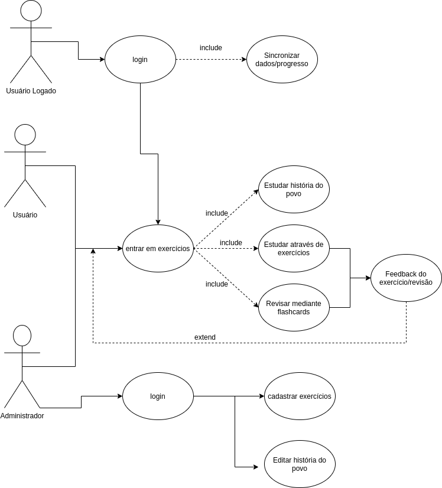
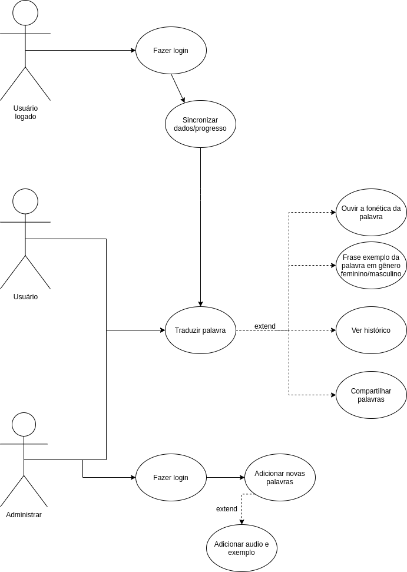

# Documento de Arquitetura

## Sumário
1. Introdução
2. Representação da Arquitetura
3. Metas e Restrições da arquitetura
4. Visão dos casos de uso
5. Visão de lógica
6. Pipelane
7. Referência Bibliográfica

# 1. Introdução

## 1.1 Finalidade
Este documento tem como objetivo apresentar uma visão geral e abrangente da arquitetura de software, especificando decisões arquiteturais pertinentes para o desenvolvimento do aplicativo Projeto Kokama. Além disso, descrever aspectos e funcionalidades do sistema de forma clara e objetiva.

## 1.2 Escopo
O Projrojeto Kokama é um aplicativo para as plataformas Android e IOS projetado para ser um tradutor e auxiliador no ensino da língua e cultura Kokamas. Os desenvolvedores são responsáveis em seguir este documento visando garantir o padrão proposto para a arquitetura.

## 1.3 Definições, acrônimos e abreviações
<!-- Explicitar as siglas utilizadas no texto do doc -->

FGA - Faculdade do gama     
U - Usuário do diagrama de caso de uso  
UL - Usuário com a conta logado do diagrama de caso de uso
Adm - Adminstrador podendo ser ou não o professor de Kokama

<!-- adicionar novas siglas no futuro -->

# 2. Representação da Arquitetura

## 2.1 Diagrama de Relações

<!-- Uma imagem do diagrama e a legenda (explicação rápida) -->

## 2.2 Diagrama de React-Native/Expo/Microsserviços

### 2.2.1 React

<!-- Explicação da tecnologia (imagem optativa) -->

### 2.2.2 Arquitetura de Microsserviços

<!-- Explicação da arquitetura (imagem optativa) -->

<!-- Imagem do diagrama -->

## 2.3 Diagrama Django REST Framework
<!-- Imagem do diagrama  e uma explicação pequena -->

# 3 Metas e Restrições de Arquitetura

Linguagem: Python e Java Script
Framework: Django
Plataforma: Android e IOS
Segurança:O usuário poderá usar senha para proteger os seus dados 
Idioma: Português 

# 4 Visão dos casos de uso

 Descrição dos casos de uso 
 
 ## 4.1 Caso de Uso da Tradução

 Há três possivéis atores: usuário (U), usuário logado(UL) e o administrador(Adm)

UL - 01 : faz o login;  
UL - 02: Sincroniza os seus dados na nuvem;  
U/ UL /Adm - 03: Entra no aplicativo e traduz a palavra;       
U/ UL /Adm - 04: Ouve a fonétiva da palavra traduzida;  
U/ UL /Adm - 05: Frase exemplo da palavra Kokama por gênero;    
U/ UL /Adm - 06: Acessa o histórico das palavras;   
U/ UL /Adm - 07: Compartilha uma palavra;

Adm - 08: Faz o login;   
Adm - 09: Adiciona as palavras;  
Adm - 10: Adiciona aúdio e exemplo de palavras.
\
\

## 4.2 Caso de Uso do Estudo 
UL - 01 : faz o login  
UL - 02: Sincroniza os seus dados na nuvem

U/ UL /Adm - 03: Entra na aba exercícios;       
U/ UL /Adm - 04: Estuda a historia do povo Kokama;  
U/ UL /Adm - 05: Pratica com o exercícios disponíveis;    
U/ UL /Adm - 06: Revisa o estudo com flashcards;   
U/ UL /Adm - 07: Recebe o feedback do estudo.

 Adm - 08: Faz login;   
 Adm - 09: Adiciona novos exércicios ;  
 Adm - 10: Edita a historia do povo.      

\
\
\
\
\

     

# 5 Visão de lógica

# 6 Pipeline

# 7 Referência Bibliográfica

Criação de Diagramas de Caso de Uso: Diagrams. Acesso em: <https://app.diagrams.net/>