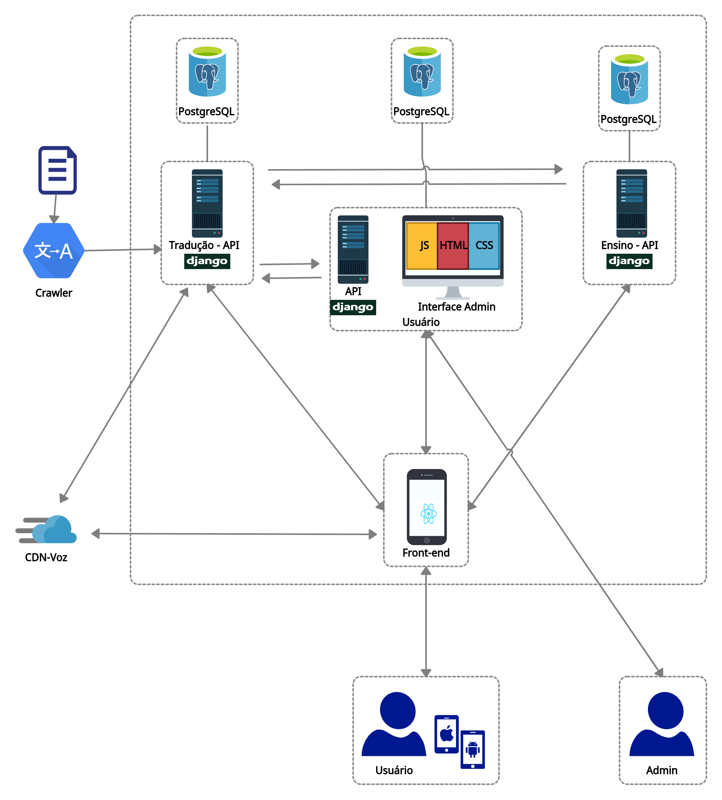

# Documento de Arquitetura

## Histórico de revisão

| Data       | Autor                                        | Modificações                      | Versão |
| ---------- | -------------------------------------------- | --------------------------------- | ------ |
| 01/03/2020 | [Lais Aguiar](https://github.com/laispa) e [Luis Lins](https://github.com/luisgaboardi) | Criação do template do documento | 0.1    |
| 02/03/2020 | [Lais Aguiar](https://github.com/laispa) e [Luis Lins](https://github.com/luisgaboardi) | Adicionado sumário | 0.2    |
| 02/03/2020 | [Lais Aguiar](https://github.com/laispa) e [Luis Lins](https://github.com/luisgaboardi) | Adicionado tópicos 1, 3 e 4| 0.3    |
| 06/03/2020 | [Lieverton Silva](https://github.com/lievertom) | remove casos de uso e sumário | 0.4    |

## 1. Introdução

### 1.1 Finalidade

Este documento tem como objetivo apresentar uma visão geral e abrangente da arquitetura de software, especificando decisões arquiteturais pertinentes para o desenvolvimento do aplicativo Projeto Kokama. Além disso, descrever aspectos e funcionalidades do sistema de forma clara e objetiva.

### 1.2 Escopo

O Projrojeto Kokama é um aplicativo para as plataformas Android e IOS projetado para ser um tradutor e auxiliador no ensino da língua e cultura Kokama. Os desenvolvedores são responsáveis em seguir este documento visando garantir o padrão proposto para a arquitetura.

### 1.3 Definições, acrônimos e abreviações
<!-- Explicitar as siglas utilizadas no texto do doc -->

FGA - Faculdade do gama

<!-- adicionar novas siglas no futuro -->

## 2. Representação Arquitetural

## 3. Metas e Restrições de Arquitetura

Linguagem: Python e Java Script
Framework: Django
Plataforma: Android e IOS
Segurança:O usuário poderá usar senha para proteger os seus dados
Idioma: Português

## 4. Visão de lógica

## 6. Pipeline

## 7. Referência Bibliográfica

Criação de Diagramas de Caso de Uso: Diagrams. Acesso em: <https://app.diagrams.net/>
