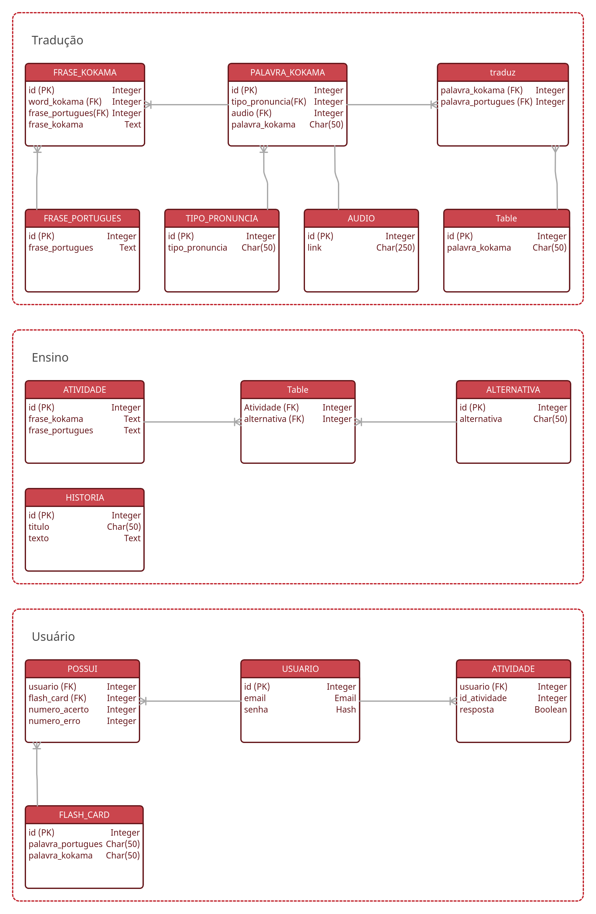

# Documento de Arquitetura

## Histórico de revisão

| Data       | Autor                                        | Modificações                      | Versão |
| ---------- | -------------------------------------------- | --------------------------------- | ------ |
| 01/03/2021 | [Lais Aguiar](https://github.com/laispa) e [Luis Lins](https://github.com/luisgaboardi) | Criação do template do documento | 0.1    |
| 02/03/2021 | [Lais Aguiar](https://github.com/laispa) e [Luis Lins](https://github.com/luisgaboardi) | Adicionado sumário | 0.2    |
| 02/03/2021 | [Lais Aguiar](https://github.com/laispa) e [Luis Lins](https://github.com/luisgaboardi) | Adicionado tópicos 1, 3 e 4| 0.3    |
| 06/03/2021 | [Lieverton Silva](https://github.com/lievertom) | remove casos de uso e sumário | 0.4    |
| 06/03/2021 | [Lieverton Silva](https://github.com/lievertom) | adiciona diagramas macro e lógico | 0.5    |
| 08/03/2021 | [Lieverton Silva](https://github.com/lievertom) | adiciona informações sobre os módulos | 0.6 |
| 08/03/2021 | [Lieverton Silva](https://github.com/lievertom) | adiciona tabela de metas e restrições de arquitetura | 0.7 |
| 23/03/2021 | [Lieverton Silva](https://github.com/lievertom) | adiciona diagramas de pacote | 1.0 |
| 23/05/2021 | [Lieverton Silva](https://github.com/lievertom) | atualiza nome da aplicação | 1.1 |
| 23/05/2021 | [Lieverton Silva](https://github.com/lievertom) | atualiza representação arquitetural | 1.2 |

## 1. Introdução

### 1.1 Finalidade

Este documento tem como objetivo apresentar uma visão geral e abrangente da arquitetura de *software*, especificando decisões arquiteturais pertinentes para o desenvolvimento do aplicativo Kokama Kinkin. Além disso, descrever aspectos e funcionalidades do sistema de forma clara e objetiva.

### 1.2 Escopo

O Kokama Kinkin é um aplicativo para as plataformas Android e iOS projetado para ser um tradutor e auxiliador no ensino da língua e cultura Kokama. Os desenvolvedores são responsáveis em seguir este documento visando garantir o padrão proposto para a arquitetura.

### 1.3 Definições, acrônimos e abreviações

- API: Interface de Programação de Aplicações;
- CDN: Rede de fornecimento, entrega e distribuição de conteúdo;
- iOS: Sistema operacional móvel da Apple Inc;
- Android: Sistema operacional baseado no núcleo Linux.
- Storage: Unidade de armazenamento do aparelho móvel.

### 1.4 Referências

As referências aplicáveis são:

- [Kokama Kinkin](https://fga-eps-mds.github.io/2020.2-Projeto-Kokama-Wiki/)
- [Software Architecture Document](https://sce.uhcl.edu/helm/RationalUnifiedProcess/webtmpl/templates/a_and_d/rup_sad.htm#1.%20%20%20%20%20%20%20%20%20%20%20%20%20%20%20%20%20%20Introduction)

## 2. Representação Arquitetural

A solução arquitetural implementada para aplicação "Kokama Kinkin" pode ser visualizada de forma macro no diagrama abaixo, composto por quatro módulos internos à aplicação e dois módulos externos.

### 2.1 Tradução

Módulo da aplicação responsável por prover os recursos necessários para guardar e disponibilizar as informações que possibilitam a tradução da língua Kokama.

### 2.2 Ensino

Módulo da aplicação responsável por prover os recursos necessários para guardar e disponibilizar as informações sobre os exercícios e a cultura Kokama.

### 2.3 Usuário

Módulo responsável por prover os recursos necessários para guardar e sincronizar as informações do usuário e do seu histórico de uso da aplicação. Também contém uma interface de acesso exclusivo aos administradores do sistema para gerenciar os dados disponíveis nos módulos de Tradução e de Ensino.

### 2.2 Front-end

Módulo de interface que permite a interação do usuário com a aplicação.

### 2.3 Crawler

Módulo responsável por normalizar e extrair as informções necessárias para gerar a base de dados inicial.

### 2.4 CDN-Voz

Módulo responsável por disponibilizar as gravações dos áudios referentes às palavras em kokama de forma rápida e eficiente.

## 3. Metas e Restrições de Arquitetura

| Requisito | Solução |
|:---------:|:-------:|
| **Linguagem** | O front-end será elaborado em TypeScript e o back-end em Python. |
| **Plataforma** | Serão usadas as plataformas React-native para o front-end e Django para o back-end. |
| **Segurança** | É necessário resguardar que haja segurança tanto ao perfil de usuário quanto ao perfil de admistrador na aplicação, não possibilitando a criação de um perfil inválido. Além disso, os dados precisam interagir de uma forma anônima e, para isso, deve-se fazer a utilização de token nas requisições. |
| **Persistência** | Os dados deverão ser persistidos em banco de dados através do banco relacional PostgreSQL. A escolha por um banco relacional deriva de questões como escalabilidade, confiança (atomicididade, consistência, isolamento e durabilidade) e complexidade lógica da aplicação, além disso, leva-se em conta a facilidade de deploy contínuo em serviços de hospedagem web, diferente dos bancos não relacionais. Em relação ao módulo de tradução, também é necessário que os dados sejam guardados no *storage* do aparelho móvel. |
| **Arquitetura** | Devido ao contexto do problema, isto é, a necessidade que ocorra integração contínua, será desenvolvida uma aplicação baseada em uma arquitetura de microserviços. |

## 4. Visão de lógica

### 4.1 Diagrama de pacotes

O diagrama de pacotes mostra a composição da estrutura de pastas do projeto.

#### 4.1.1 APIs

As APIs que formam o back-end compartilham da mesma estrutura de pastas.

#### 4.1.2 Front-end

### 4.2 Diagrama lógico

O diagrama lógico mostra a visão do armazenamento dos dados.

