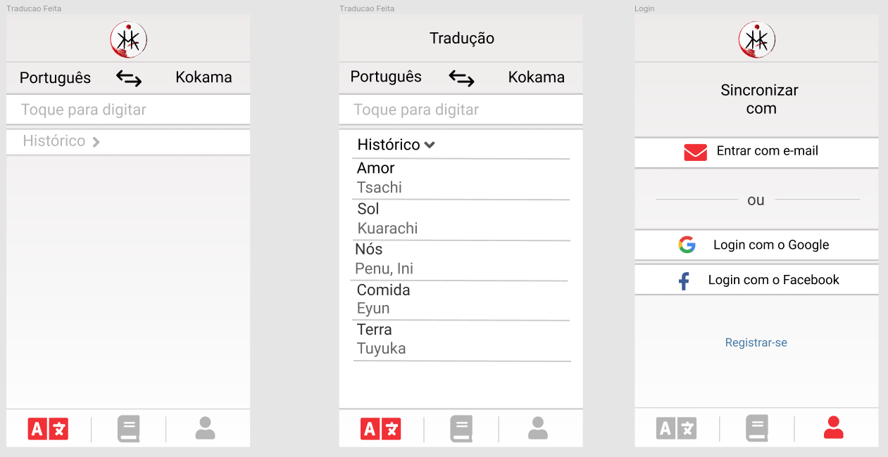
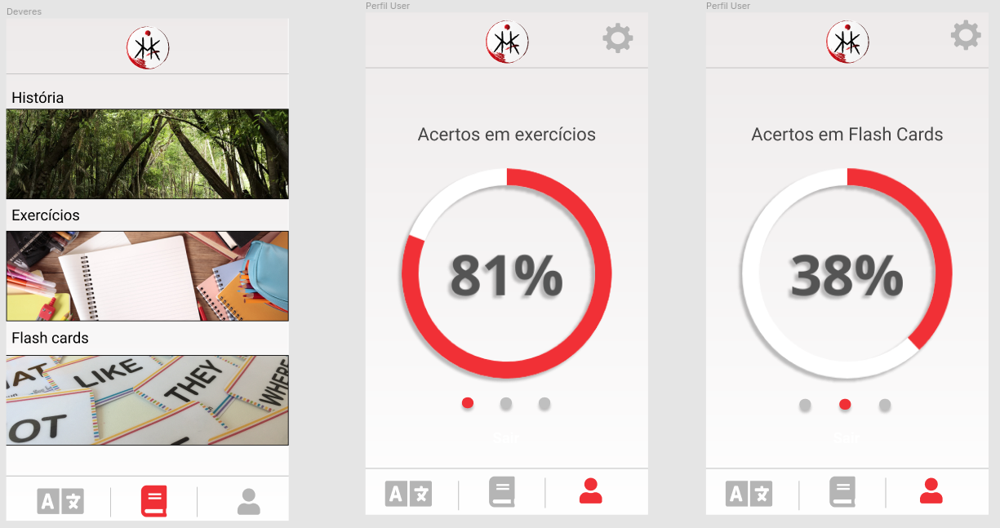
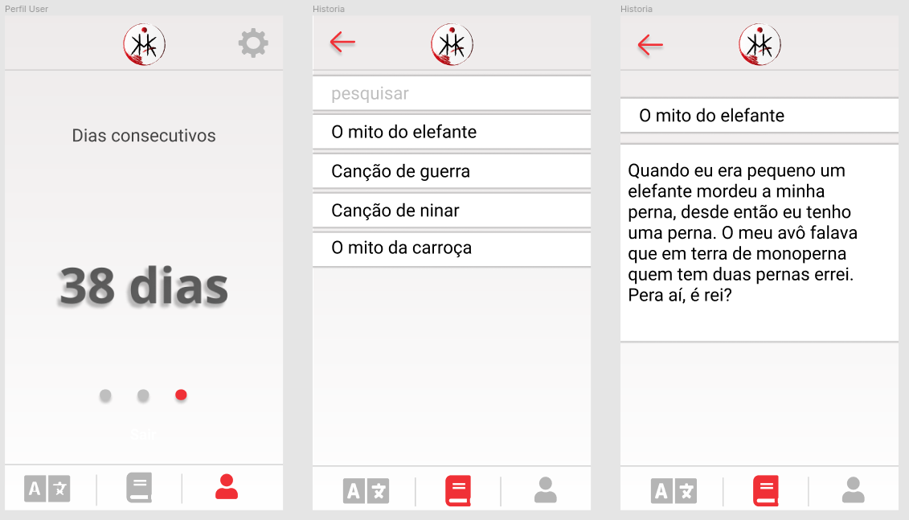
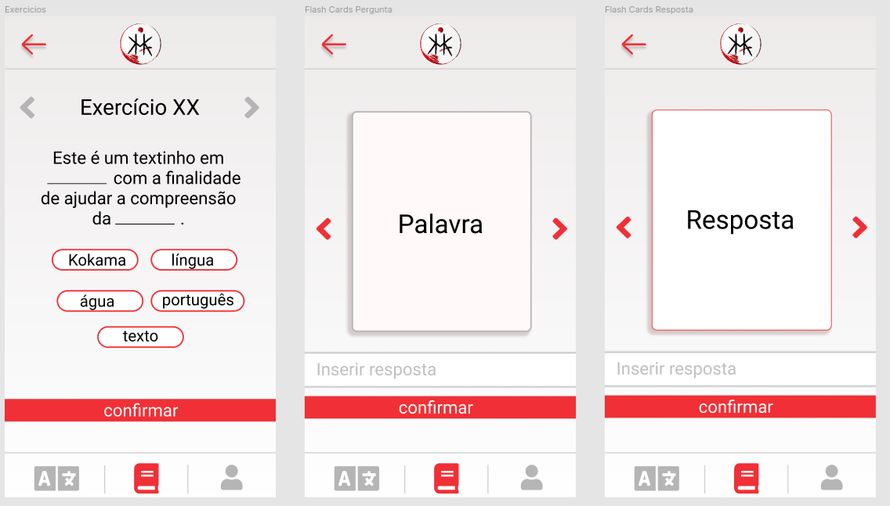
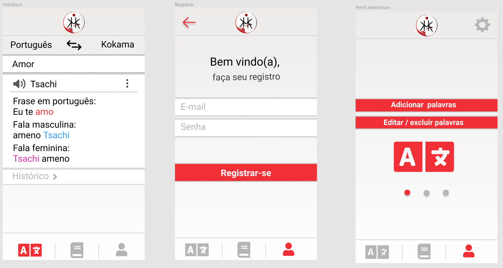
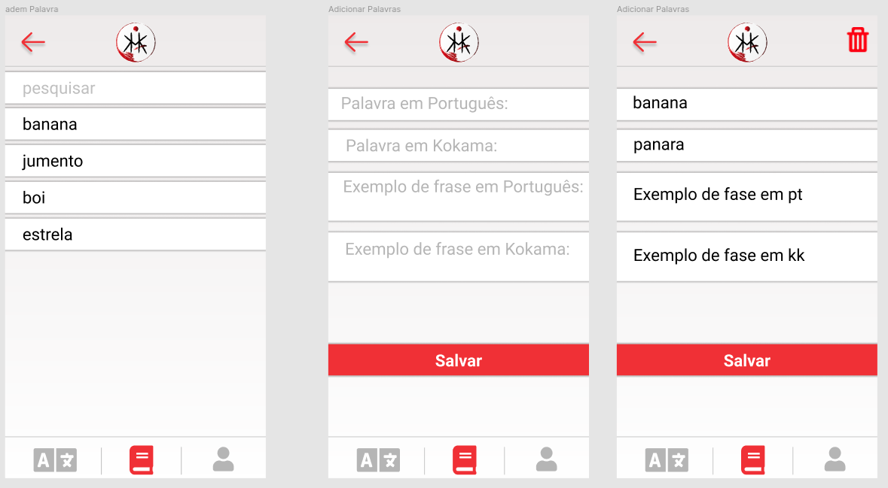
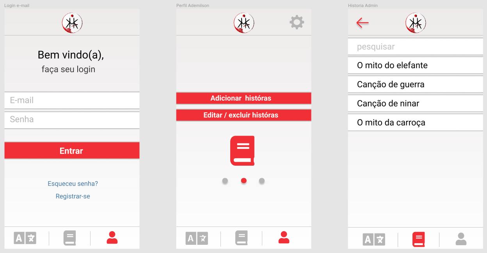
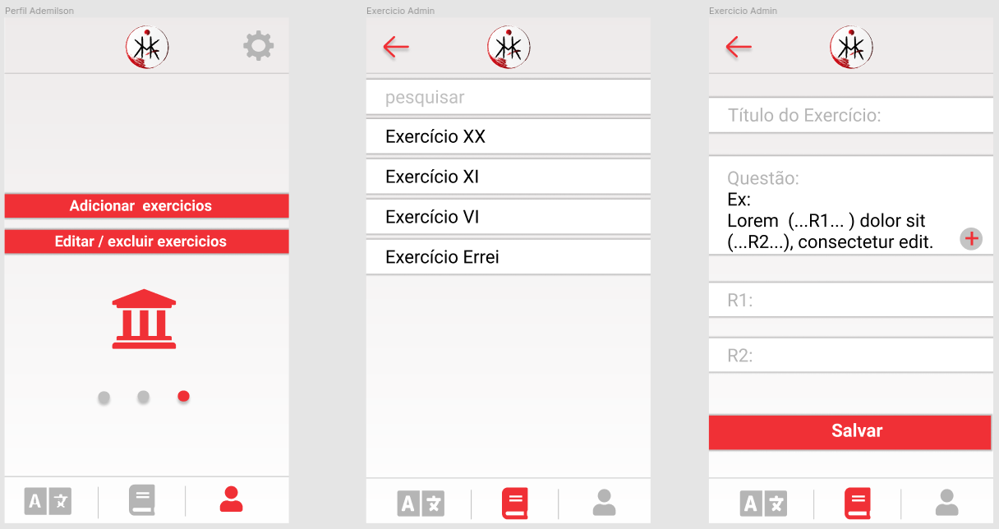
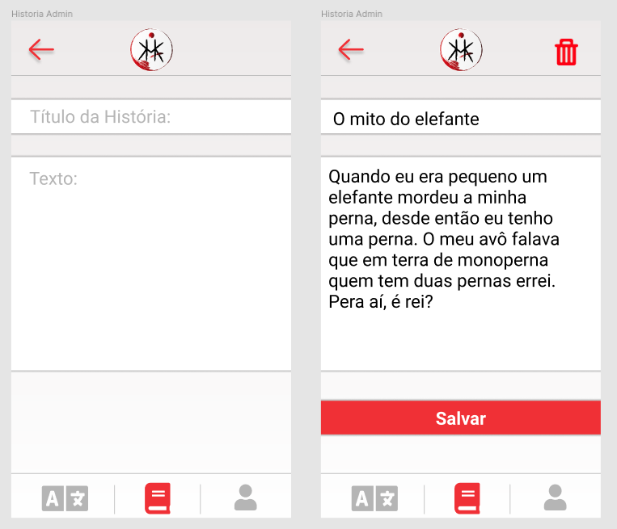

# Protótipo de alta fidelidade

## Histórico de revisão

| Data       | Autor                                        | Modificações                      | Versão |
| ---------- | -------------------------------------------- | --------------------------------- | ------ |
| 23/02/2020 | [André Pinto](https://github.com/andrelucax) | Criação do template do documento | 0.1    |
| 23/02/2020 | [André Pinto](https://github.com/andrelucax) e [Leonardo Medeiros](https://github.com/leomedeiros1) | Adição da documentação do protótipo | 0.2    |

## Introdução

A principal idéia do protótipo era validar a nova identidade visual, que obteve ótima aceitação do PO. A nova proposta foi baseadad na cor branca como principal e no vermelho apenas para destaques, sem deixar de lado a identidade Kokama, diminuindo o impacto visual e subconsciente que a cor vermelha trazia antes.

### Protótipo V1.0

Autores: 

* [André Pinto](https://github.com/andrelucax)

* [Lieverton Silva](https://github.com/lievertom)

* [Ana Júlia](https://github.com/aluzianobriceno)

* [Fernando Vargas](https://github.com/SFernandoS)

Data: 03/06/2021

O protótipo interativo pode ser acessado no [link](https://www.figma.com/proto/DigQ30njp1qckw7LLtgAAL/Projeto-Kokama---Prototipo-de-alta-fidelidade).

Os principais pontos observados pelo cliente foi:

* Icones não estavam intuitivos. Alguns icones acabaram passando a ideia errada de sua funcionalidade em especia, o icone de ensino foi confundido com dicionário;

* Colocar nome nas páginas ajudaria a entender melhor o aplicativo nos primeiros passos;

* O exemplo de exercício faltava a frase em português;

* As histórias eram um ponto legal para guardar algumas informações sobre a cultura.

