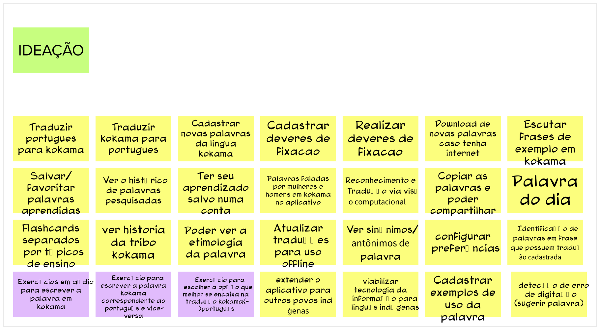

# Lean Inception - Brainstorm de funcionalidades

## Histórico de revisão

| Data       | Autor                                        | Modificações                                                     | Versão |
| ---------- | -------------------------------------------- | ---------------------------------------------------------------- | ------ |
| 28/02/2020 | [Welison Regis](https://github.com/WelisonR) | Adiciona brainstorm de funcionalidades da Lean Inception | 1.0    |

## Introdução

Uma funcionalidade é representada por uma ação ou interação que o usuário viria a ter com a aplicação como, por exemplo: traduzir uma palavra de Kokama para Português, cadastrar uma nova palavra Kokama no sistema etc. Esse tópico visa a realização de um brainstorm, tempestade de ideias, para iniciar o delineamento de funcionalidades.

Nessa etapa, todos os integrantes escreveram todas as ideias de funcionalidades que a aplicação poderia ter. Além disso, discutiu-se todas as sugestões e retirou-se as funcionalidades que estavam duplicadas.

## Brainstorm de funcionalidades

Abaixo, destacou-se em rosa as funcionalidades que tinham um corresponde mais genérico, a fim de não perder a rastreabilidade dos artefatos do brainstorm.

## Referências

[^1]: CAROLI, Paulo. Exemplo de Lean Inception: EasyBola. 2018. Disponível em: https://www.caroli.org/easy-bola/. Acesso em: 28 fev. 2021.
