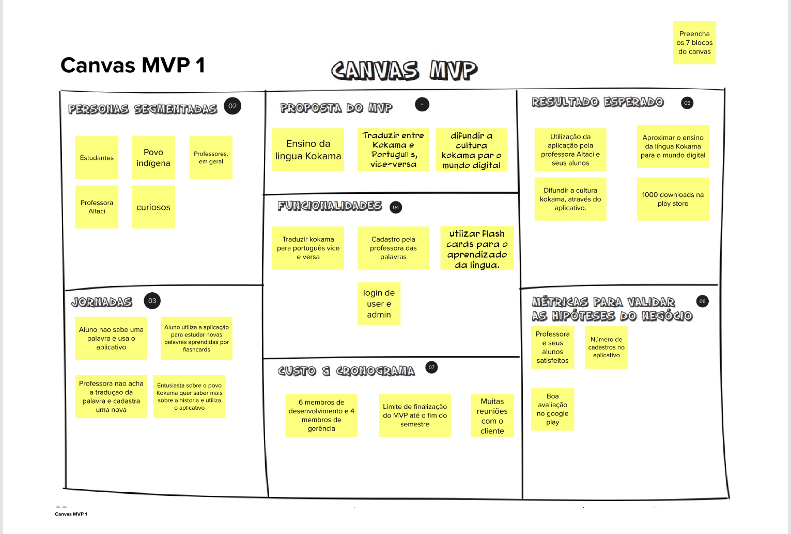
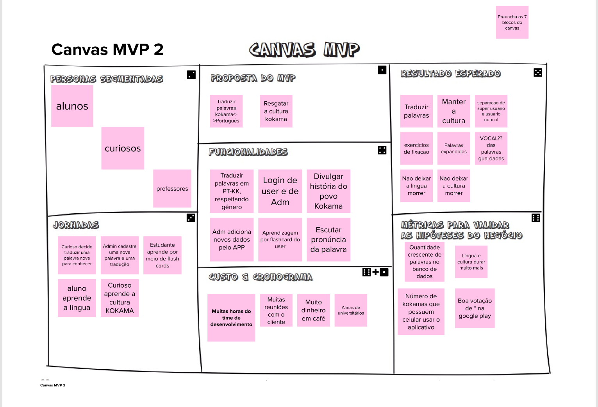

# Lean Inception - Canvas MVP

## Histórico de revisão

| Data       | Autor                                        | Modificações                                                     | Versão |
| ---------- | -------------------------------------------- | ---------------------------------------------------------------- | ------ |
| 28/02/2020 | [Welison Regis](https://github.com/WelisonR) | Adiciona canvas MVP da Lean Inception | 1.0    |

## Introdução

O Canvas MVP é um quadro que auxilia a equipe a alinhar e definir a estratégia do MVP, os objetivos e as metas do produto.

Nessa fase final de concepção do MVP, separou-se a equipe em dois grupos e cada grupo preencheu uma versão do canvas MVP. Após cada grupo definir o MVP, reuniu-se as ideias e levantamentos de forma a gerar um canvas MVP.

## Canvas MVP

A visão geral abaixo foi apresentada e validada com a PO do projeto no dia 26/02/2021.

## Canvas MVP 1

## Canvas MVP 2

## Referências

[^1]: CAROLI, Paulo. Exemplo de Lean Inception: EasyBola. 2018. Disponível em: https://www.caroli.org/easy-bola/. Acesso em: 28 fev. 2021.
