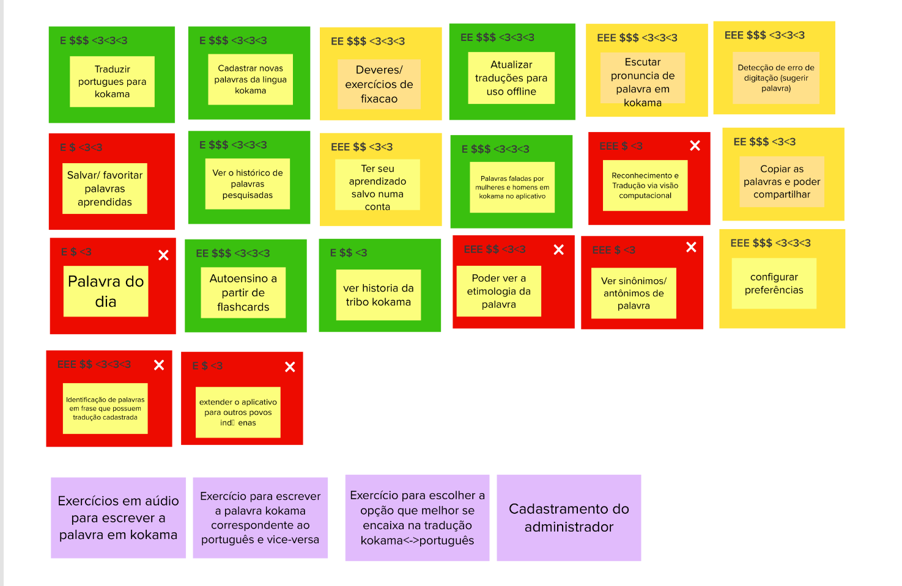

# Lean Inception - Revisão técnica, de negócio e de experiência do usuário (UX)

## Histórico de revisão

| Data       | Autor                                        | Modificações                                          | Versão |
| ---------- | -------------------------------------------- | ----------------------------------------------------- | ------ |
| 28/02/2020 | [Welison Regis](https://github.com/WelisonR) | Adiciona revisão de funcionalidades da Lean Inception | 1.0    |

## Introdução

Nesse tópico da Lean Inception, objetiva-se discutir como a equipe se sente em relação ao entendimento técnico, de negócios e de experiência do usuário (UX) para cada funcionalidade elencada no passo anterior (brainstorm). A partir dessa interação, será possível esclarecer dúvidas e discordâncias, além de realizar uma mensuração inicial de cada funcionalidade.

Para essa etapa, pegou-se individualmente uma funcionalidade e avaliou-se com a equipe a importância e viabilidade de forma a atribuir um dos seguintes grupos: vermelho com "x", vermelho, amarelo, verde. Após essa etapa, o grupo avaliou a funcionalidade quanto ao tempo e esforço necessário (E), valor social ($) e influência na experiência do usuário (❤), cada um em uma escala de 1 a 3 repetições.

## Revisão técnica, de negócio e de experiência do usuário (UX)

## Referências

[^1]: CAROLI, Paulo. Exemplo de Lean Inception: EasyBola. 2018. Disponível em: https://www.caroli.org/easy-bola/. Acesso em: 28 fev. 2021.
