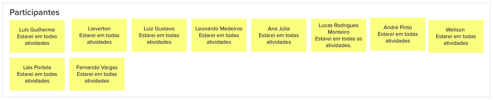

# Lean Inception - Introdução

## Histórico de revisão

| Data       | Autor                                        | Modificações                                                     | Versão |
| ---------- | -------------------------------------------- | ---------------------------------------------------------------- | ------ |
| 28/02/2020 | [Welison Regis](https://github.com/WelisonR) | Adiciona introdução sobre o Lean Inception realizada pela equipe | 1.0    |

## Introdução

Lean Inception é o nome dado a uma oficina colaborativa realizada para alinhar um grupo de pessoas sobre o produto a ser construído. Nesse sentido, a metodologia combina caractetísticas de outros movimentos, como a Lean Startup e o Processo Unificado (RUP), a fim de delinear um produto com foco na comunicação e colaboração daqueles envolvidos ou interessados no projeto.

## Sobre a Lean Inception da equipe

Comumente, as etapas da Lean Inception são realizadas em um espaço de tempo de cinco dias e conta com a colaboração ativa e participativa dos membros envolvidos no projeto. Na situação do presente projeto, realizou-se as atividades da Lean Inception em três dias devido a disponibilidade dos membros da equipe e das partes interessadas, visto que existe essa possibilidade[^1].

A equipe realizou as atividades no período noturno em três dias com a participação de todos os membros da equipe através da plataforma [Mural](https://www.mural.co/):

**Dia 1 - 24/02/2021 - mapeamento de problemáticas e objetivos**:

* Kick-off;
* Visão do produto;
* É, não é, faz, não faz;
* Objetivos do produto;
* Personas;
* Jornada do usuário.

**Dia 2 - 25/02/2021 - mapeamento de funcionalidades e construção de MVP**:

* Brainstorm de funcionalidades;
* Revisão técnica, de negócio e de UX;
* Sequenciador;
* Canvas MVP.

**Dia 3 - 26/02/2021 - apresentações e validações com a professora Altaci (PO)**:

* Showcase (foco na discussão e validação dos itens: visão do produto, sequenciador, canvas MVP).

## Referências

[^1]: CAROLI, Paulo. Exemplo de Lean Inception: EasyBola. 2018. Disponível em: https://www.caroli.org/easy-bola/. Acesso em: 28 fev. 2021.
