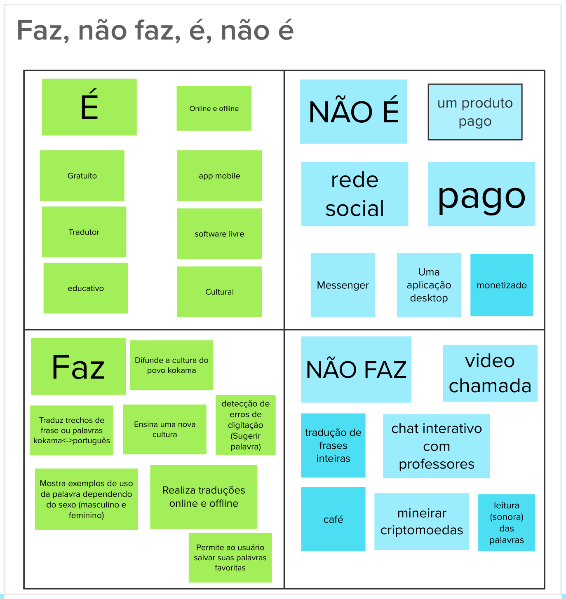

# Lean Inception - Produto é, não é, faz, não faz

## Histórico de revisão

| Data       | Autor                                        | Modificações                                                      | Versão |
| ---------- | -------------------------------------------- | ----------------------------------------------------------------- | ------ |
| 28/02/2020 | [Welison Regis](https://github.com/WelisonR) | Adiciona tópico produto é, não é, faz e não faz da Lean Inception | 1.0    |

## Introdução

Com objetivo de esclarecer melhor o produto e começar a delinear e afunilar as funcionalidades da aplicação Projeto Kokama, realizou-se a etapa de identificação do que o produto faz, não faz, é e não é.

Na dinâmica do time, separou-se os integrantes em dois grupos, sendo que o primeiro grupo ficou responsável por preencher os tópicos "produto é" e "produto faz" e o segundo grupo preencheu os demais tópicos — "produto não é" e "produto não faz".

## Produto é, não é, faz, não faz

## Referências

[^1]: CAROLI, Paulo. Exemplo de Lean Inception: EasyBola. 2018. Disponível em: https://www.caroli.org/easy-bola/. Acesso em: 28 fev. 2021.
