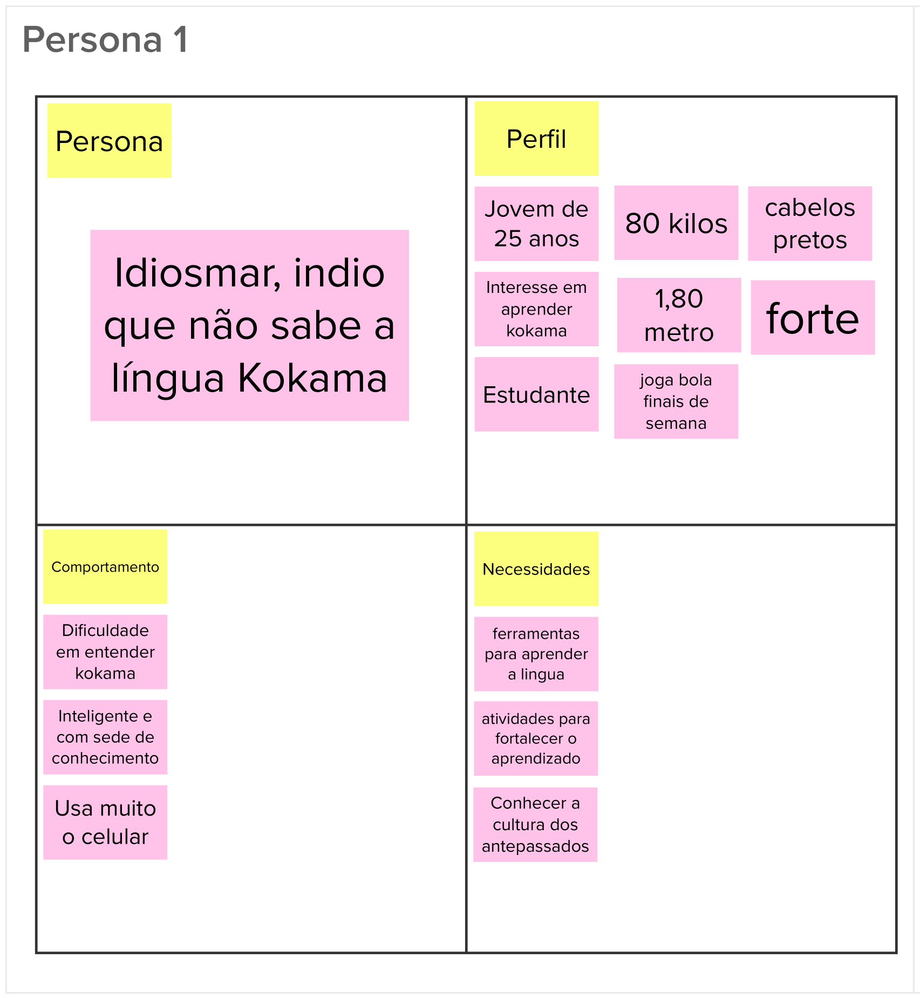
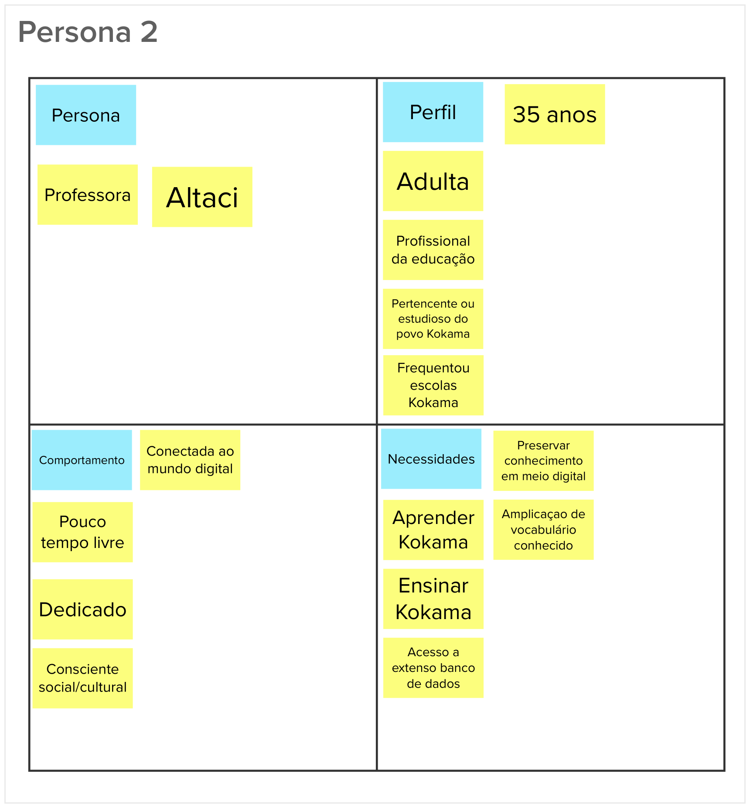
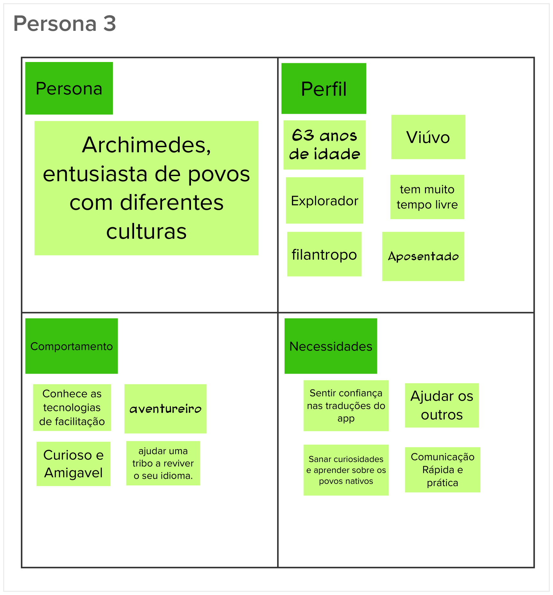

# Lean Inception - Personas

## Histórico de revisão

| Data       | Autor                                        | Modificações                                                     | Versão |
| ---------- | -------------------------------------------- | ---------------------------------------------------------------- | ------ |
| 28/02/2020 | [Welison Regis](https://github.com/WelisonR) | Adiciona personas da Lean Inception | 1.0    |

## Introdução

Uma persona é uma representação de um usuário ideal para um determinado produto. Para entender melhor os objetivos do produto, mapeia-se personas com características de usuários reais, como comportamento, problemas, desafios e objetivos.

Nessa etapa, separou-se o grupo em três subgrupos de forma a gerar três personas que foram apresentadas e debatidas pela equipe.

## Persona 01

## Persona 02

## Persona 03

## Referências

[^1]: CAROLI, Paulo. Exemplo de Lean Inception: EasyBola. 2018. Disponível em: https://www.caroli.org/easy-bola/. Acesso em: 28 fev. 2021.
