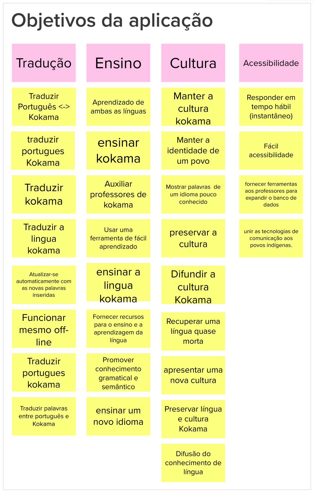

# Lean Inception - Objetivos do produto

## Histórico de revisão

| Data       | Autor                                        | Modificações                                    | Versão |
| ---------- | -------------------------------------------- | ----------------------------------------------- | ------ |
| 28/02/2020 | [Welison Regis](https://github.com/WelisonR) | Adiciona objetivos do produto da Lean Inception | 1.0    |

## Introdução

O presente tópico da Lean Inception procura agrupar os objetivos do produto de acordo com a visão individual de cada participante.

Nesse interação, cada participante escreveu três objetivos que o produto deveria buscar e, em seguida, agrupou-se os objetivos similares em um grande grupo.

## Objetivos do produto

Conforme pode-se ver abaixo, a interação possibilitou a visualização de quadro grandes objetivos: tradução, ensino, cultura e acessibilidade.

## Referências

[^1]: CAROLI, Paulo. Exemplo de Lean Inception: EasyBola. 2018. Disponível em: https://www.caroli.org/easy-bola/. Acesso em: 28 fev. 2021.
