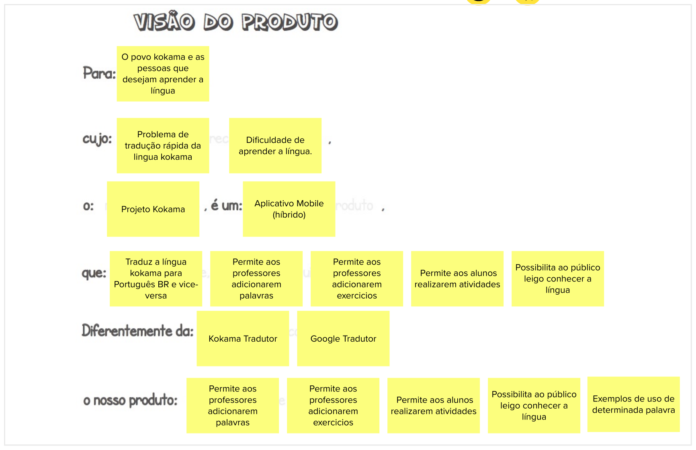
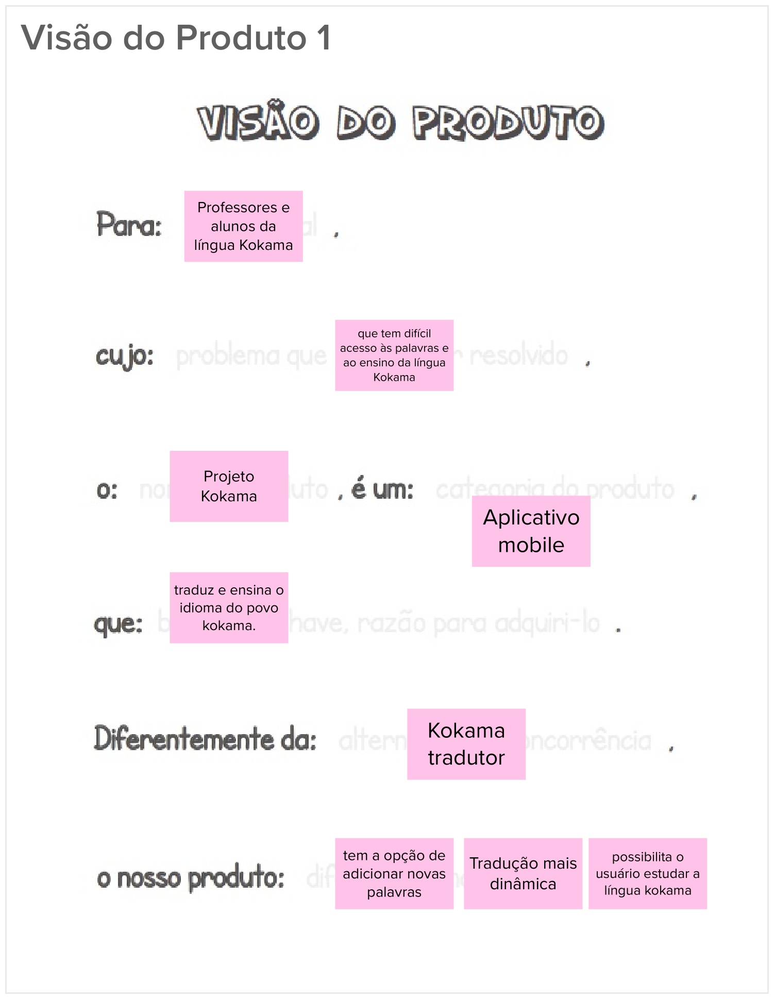
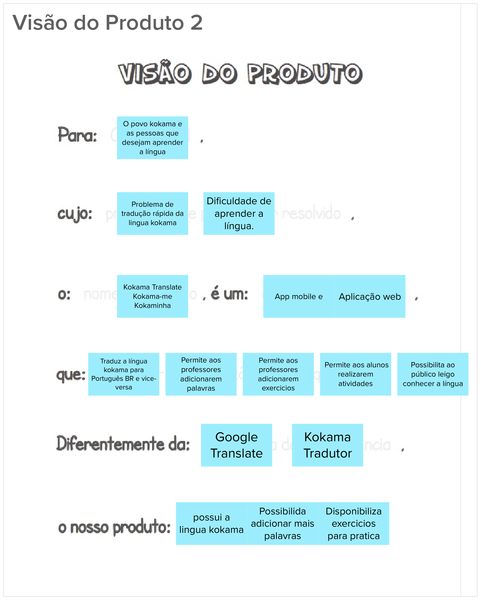
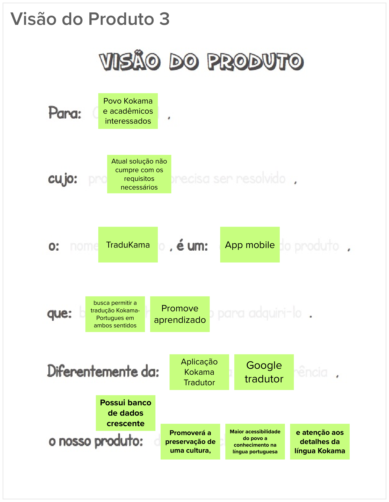

# Lean Inception - Visão de produto

## Histórico de revisão

| Data       | Autor                                        | Modificações                                | Versão |
| ---------- | -------------------------------------------- | ------------------------------------------- | ------ |
| 28/02/2020 | [Welison Regis](https://github.com/WelisonR) | Adiciona visão de produto da Lean Inception | 1.0    |

## Introdução

Nessa etapa da Lean Inception, subdivide-se o grupo a fim de montar diferentes visões de produto através do preenchimento de um modelo que auxilia a identificação da visão geral sobre o projeto. Após obter diferentes visões, unifica-se as propostas.

Nessa etapa, separou-se os integrantes do time em três grupos. A visão geral do produto e as visões individuais dos subgrupos podem ser vistas abaixo.

## Visão geral do produto

A visão geral abaixo foi apresentada e validada com a PO do projeto no dia 26/02/2021.

## Visão do produto 01

## Visão do produto 02

## Visão do produto 03

## Referências

[^1]: CAROLI, Paulo. Exemplo de Lean Inception: EasyBola. 2018. Disponível em: https://www.caroli.org/easy-bola/. Acesso em: 28 fev. 2021.
