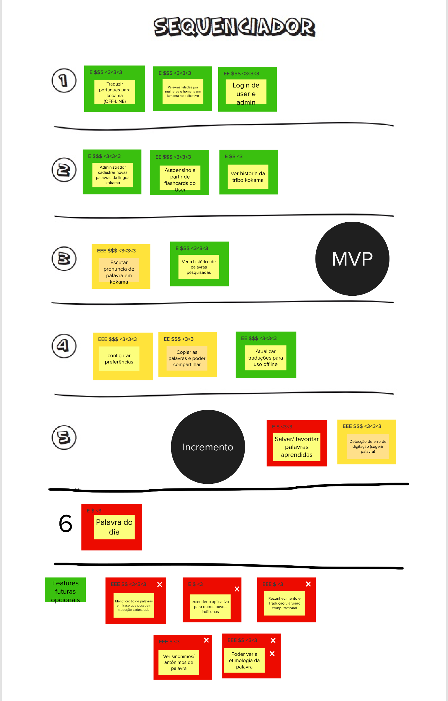

# Lean Inception - Sequenciador

## Histórico de revisão

| Data       | Autor                                        | Modificações                                                     | Versão |
| ---------- | -------------------------------------------- | ---------------------------------------------------------------- | ------ |
| 28/02/2020 | [Welison Regis](https://github.com/WelisonR) | Adiciona sequenciador da Lean Inception | 1.0    |

## Introdução

O sequenciador de funcionalidades auxilia na organização e visualização das funcionalidades e da sequência de validação incremental do produto.

Nessa etapa, discutiu-se inicialmente com a equipe e depois com a PO do projeto sobre a sequência das funcionalidades de forma a definir o produto minímo viável (MVP) e os incrementos.

## Sequenciador

A visão geral abaixo foi apresentada e validada com a PO do projeto no dia 26/02/2021. Houve mudanças na prioridade da funcionalidade "ver o histórico de palavras pesquisadas", que passou a pertencer ao MVP.

## Referências

[^1]: CAROLI, Paulo. Exemplo de Lean Inception: EasyBola. 2018. Disponível em: https://www.caroli.org/easy-bola/. Acesso em: 28 fev. 2021.
