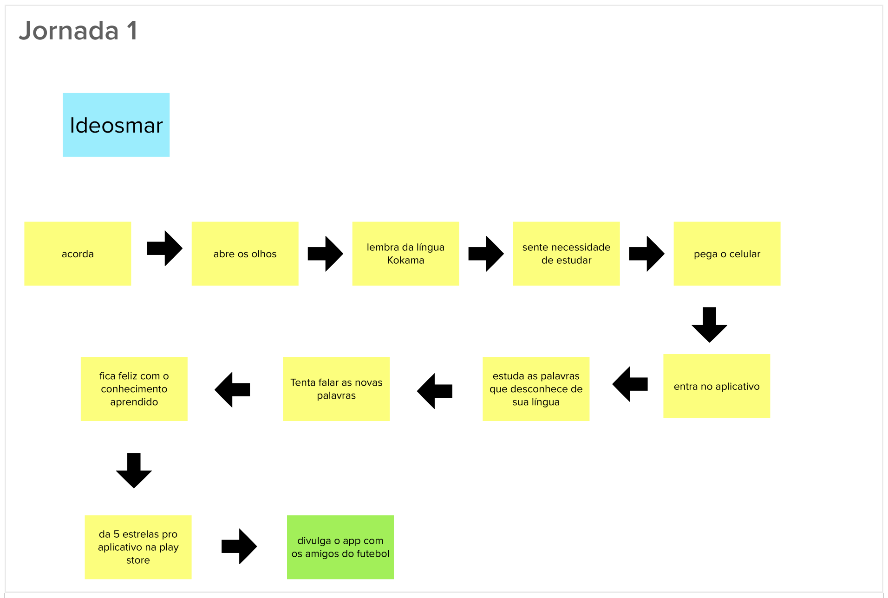
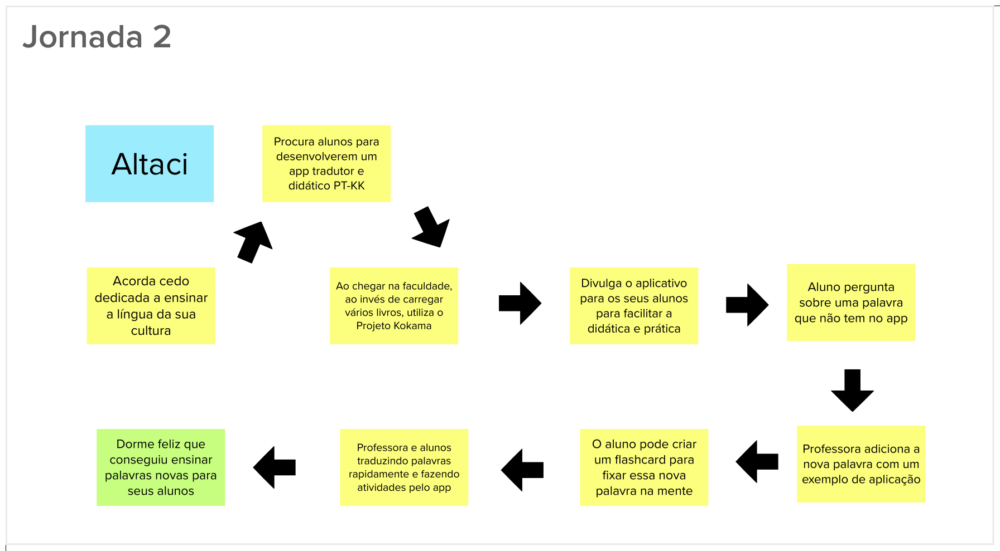
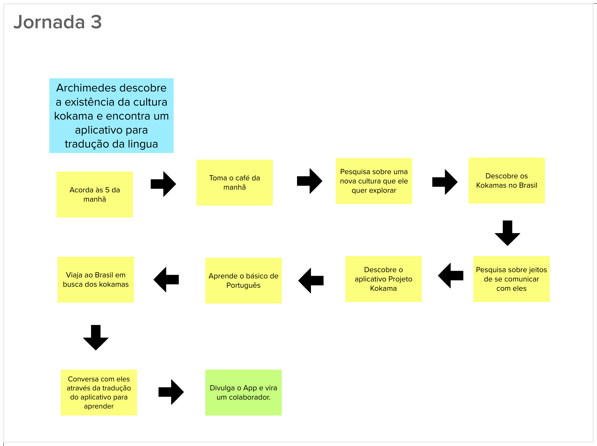

# Lean Inception - Jornada do usuário

## Histórico de revisão

| Data       | Autor                                        | Modificações                                   | Versão |
| ---------- | -------------------------------------------- | ---------------------------------------------- | ------ |
| 28/02/2020 | [Welison Regis](https://github.com/WelisonR) | Adiciona jornadas de usuário da Lean Inception | 1.0    |

## Introdução

A jornada descreve o percurso de um usuário por uma sequência de passos para alcançar um objetivo. Decorrente desses passos executados pelo usuário, surge interações que podem representar diferentes pontos de contato com o produto.

Nessa etapa, dividiu-se o grupo em três subgrupos com os mesmos integrantes da etapa anterior (identificação de personas). Gerou-se diferentes jornadas de usuário que foram apresentadas entre os membros.

## Jornada de usuário 01

## Jornada de usuário 02

## Jornada de usuário 03

## Referências

[^1]: CAROLI, Paulo. Exemplo de Lean Inception: EasyBola. 2018. Disponível em: https://www.caroli.org/easy-bola/. Acesso em: 28 fev. 2021.
