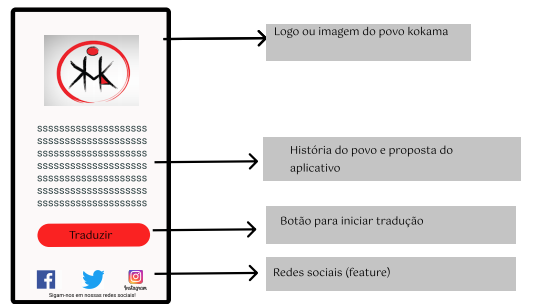
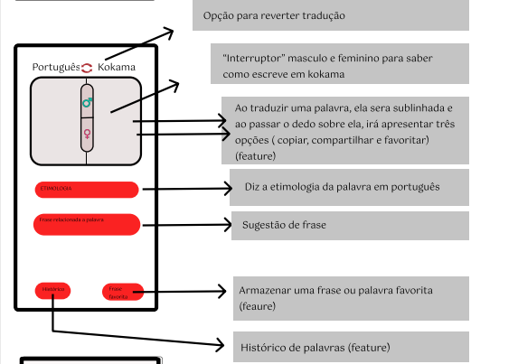
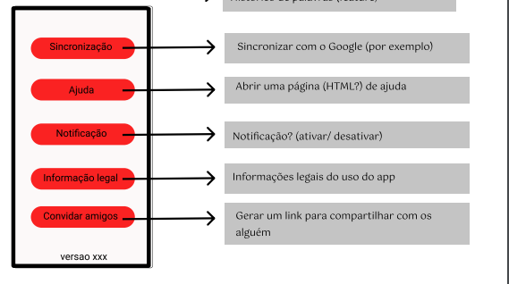
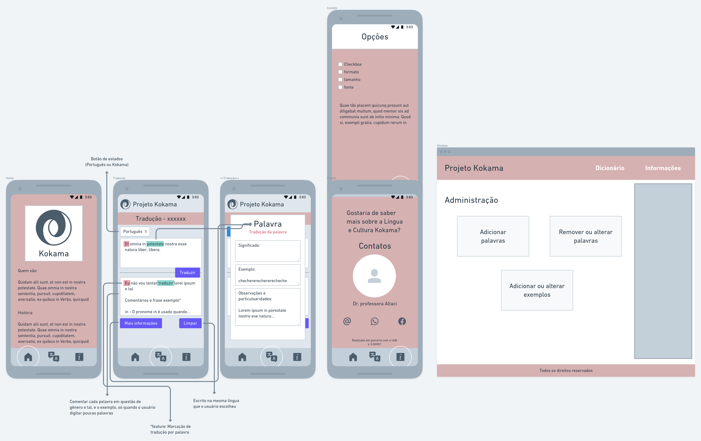
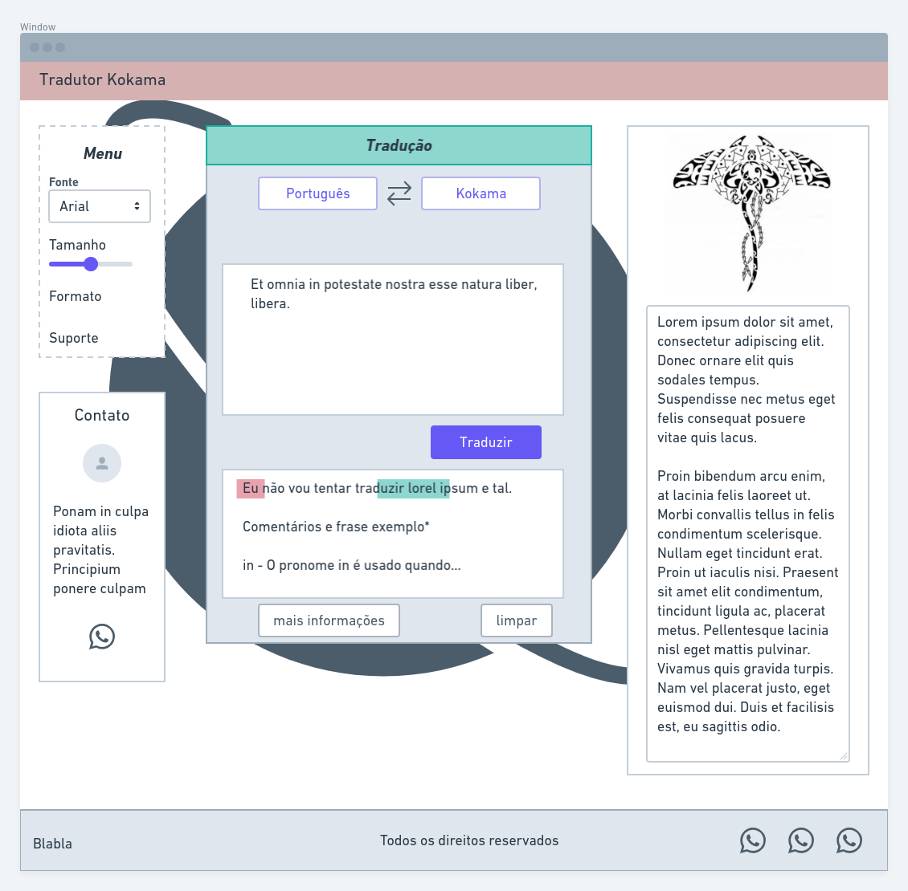
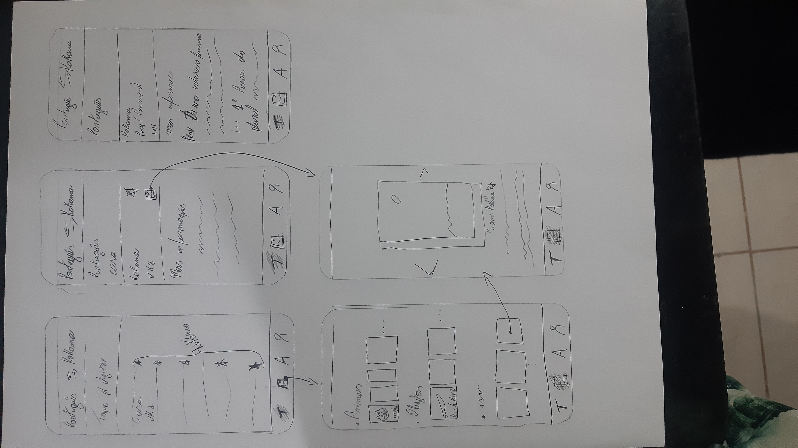
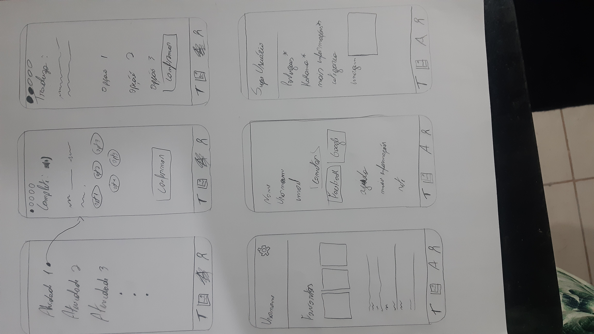
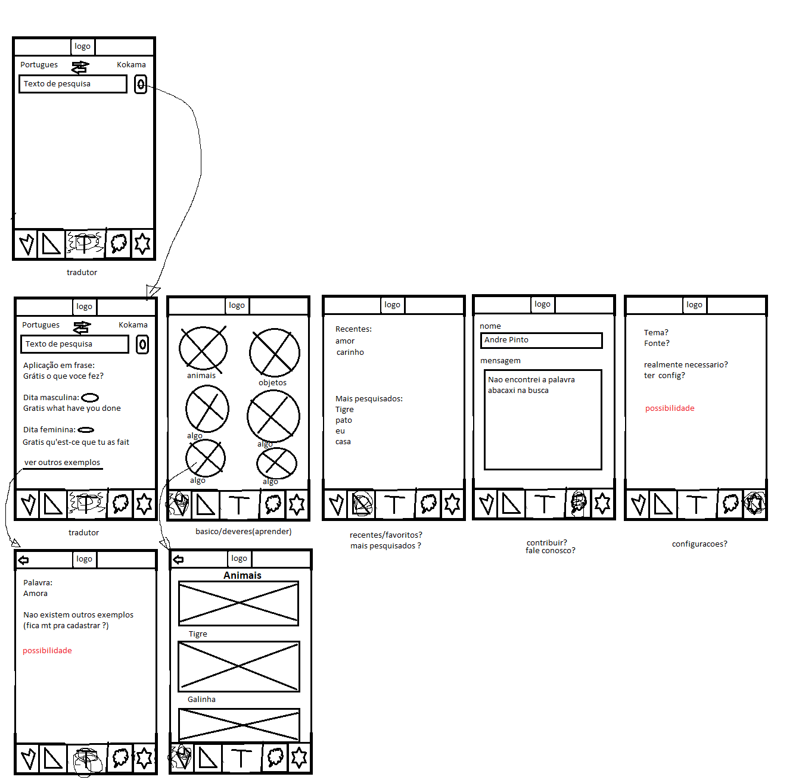

# Protótipo de baixa fidelidade

## Histórico de revisão

| Data       | Autor                                        | Modificações                      | Versão |
| ---------- | -------------------------------------------- | --------------------------------- | ------ |
| 23/02/2020 | [André Pinto](https://github.com/andrelucax) | Adiciona primeiras versões dos protótipos | 1.0    |

## Protótipo de baixa fidelidade

A equipe decidiu pela realização de quatro protótipos de baixa fidelidade com o intuito de discutir as visões diferentes e juntar as melhores idéias em uma reunião.

### Protótipo 1

Autores: [Fernando](https://github.com/SFernandoS) e [Laís](https://github.com/laispa)

Data: 22/02/2021

### Protótipo 2 

Autores: [Luís](https://github.com/luisgaboardi) e [Lucas](https://github.com/nickby2)

Data: 22/02/2021

### Protótipo 3

Autor: [Lieverton](https://lievertom.github.io/)

Data: 22/02/2021

### Protótipo 4

Autor: [André Pinto](https://github.com/andrelucax)

Data: 21/02/2021

