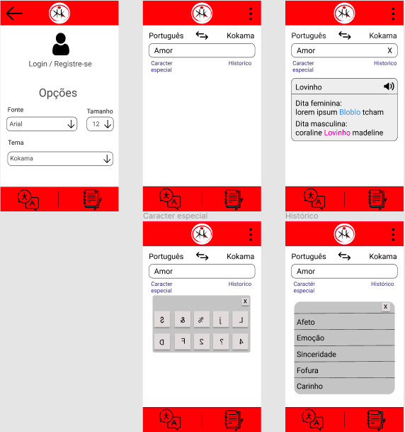
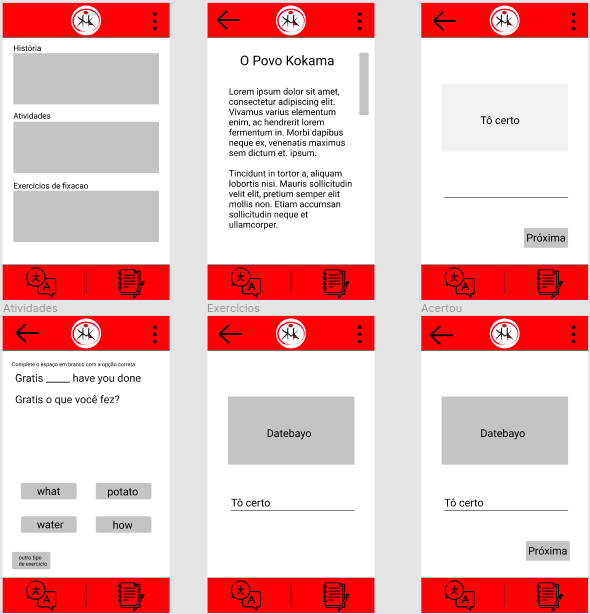

# Protótipo de média fidelidade

## Histórico de revisão

| Data       | Autor                                        | Modificações                      | Versão |
| ---------- | -------------------------------------------- | --------------------------------- | ------ |
| 23/02/2020 | [André Pinto](https://github.com/andrelucax) | Criação do template do documento | 0.1    |
| 27/02/2020 | [André Pinto](https://github.com/andrelucax) | Documentação inicial | 1.0    |

## Introdução

Com as ideias dos protótipos anteriores e uma reunião feita com a equipe para decidir o rumo do aplicativo desenvolveu-se o protótipo de média fidelidade. Tal protótipo foi levado ao cliente para validação

### Protótipo V1.0

Autores: [André Pinto](https://github.com/andrelucax) e [Luis](https://github.com/luisgaboardi)

Data: 25/02/2021

O protótipo pode ser acessado para navegação no [link](https://www.figma.com/proto/ygyGhkLbRf9R47KVQAbPvs/Prot%C3%B3tipo-de-M%C3%A9dia-fidelidade-Projeto-Kokama)

Em geral o protótipo foi bem elogiado mas o cliente resaltou alguns pontos durante a reunião:

* Necessidade do aplicativo ser tanto para android como iOS;

* Falta da tradução da frase em português;

* A parte das atividades ficaram legal mas seria necessário conversar e desenvolver um pouco mais para um melhor resultado.

