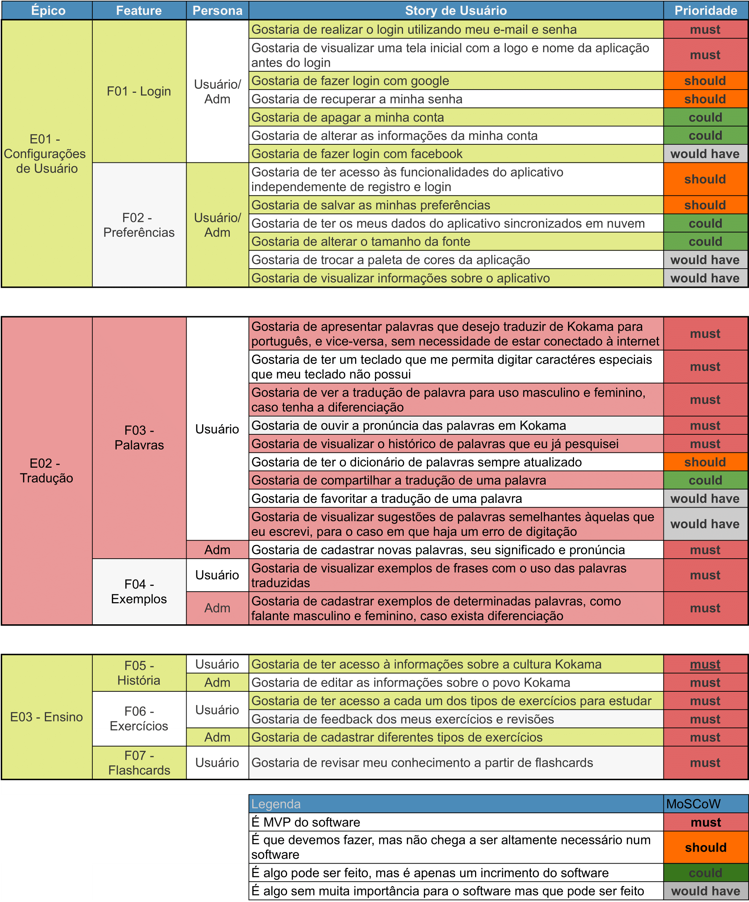

# Documentação do Backlog do Produto

## Histórico de revisão

| Data       | Autor                                        | Modificações                      | Versão |
| ---------- | -------------------------------------------- | --------------------------------- | ------ |
| 02/03/2021 | [Luis Lins](https://github.com/luisgaboardi) e [Laís Portela](https://github.com/laispa) | Criado template e preenchido documento | 1.0    |
| 02/03/2021 | [Luis Lins](https://github.com/luisgaboardi) e [Laís Portela](https://github.com/laispa) | Adicionado documento na Wiki | 1.0    |
| 02/03/2021 | [Luis Lins](https://github.com/luisgaboardi) e [Laís Portela](https://github.com/laispa) | Consertado visualização da imagem no documento | 1.0    |

## Sumário

1. Introdução
2. Especificações
3. Backlog
4. Referências

## 1. Introdução
<!-- O que é backlog de produto -->
O Backlog do produto é uma recurso da metodologia Scrum. Se trata de uma lista ordenada de todos os requisitos que se tem conhecimento de que precisam estar no produto. Estes são organizados por:

### 1.1 Época

Uma época representa uma coleção de funcionalidades da aplicação que estão logicamente agrupadas

### 1.2 Feature

Se trata de uma área específica de uma grande funcionalidade(época)

### 1.3 US (história de usuário)

Representa o que o Product Owner gostaria de ser capaz de fazer na aplicação através de um relato

### 1.4 Priodade

Classificar o quão importante é aquela funcionalidade pra aplicação.

Enfim, o backlog funciona como uma ferramenta auxiliar para garantir que um determinado projeto está sendo desenvolvido e aprimorado de maneira consistente, priorizando e controlando o que deve ser feito.

## 2. Especificações
<!-- Explicar como o backlog foi feito, quais são as épocas, features-->
A inserção de pontos no backlog foi realizada utilizando o Lean Inception realizado anteriormente pela equipe como base. A aplicação foi divida em 3(três) épocas que representam as maiores funcionalidades do produto, e cada história de usuário incluída nas features foi ordenada em ordem de prioridade a partir do Método MoSCow. Foi utilizado para definir o que seria mais importante para o projeto, ele foi feito de acordo com o Lean Inception feito pela equipe.

## 3. Backlog

## 4. Referências

[^1]: Camargo, Robson. Backlog: aprenda o que é e como compatibilizar com o fluxo de trabalho. Robson Camargo, 04/12/2019 . Disponível em: <https://robsoncamargo.com.br/blog/Backlog-o-que-e-e-como-pode-ajudar-em-seus-projetos>. Acesso em: 02, de março de 2021.

[^2]: PRODUCT BACKLOG. Desenvolvimento Ágill, 2014. Disponível em: <https://www.desenvolvimentoagil.com.br/scrum/product_backlog>. Acesso em: 02 de março de 2021.
