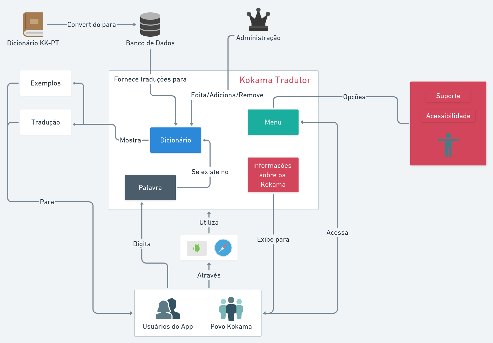

# Rich Picture

## Histórico de revisão

| Data       | Autor                                        | Modificações                      | Versão |
| ---------- | -------------------------------------------- | --------------------------------- | ------ |
| 24/02/2021 | [Luis Lins](https://github.com/luisgaboardi) e [Lucas Monteiro](https://github.com/nickby2) | Criação do documento da rich picture| 1.0    |
| 25/02/2021 | [Luis Lins](https://github.com/luisgaboardi) e [Lucas Monteiro](https://github.com/nickby2) | Descrição de rich picture| 1.0    |

## Rich Picture - Visão Geral

Rich picture é uma ferramenta de modelagem para análise de problemas e apresentaçes de ideias. É um desenho que descreve o problema e o produto de maneira visual, expressando quem são as entidades do projeto e as relações que precisam ser levadas em conta no desenvolvimento do projeto. Consiste de fotos, textos, símbolos e ícones, no qual todos são utilizados para ilustrar graficamente a situação.

Essa forma de representação foi escolhida tendo em vista o estágio atual do desenvolvimento do projeto, aproveitando o alto nível de abstração e de liberdade interpretativa para a elaboração do rich picture

### Rich Picture V1.0

Autores: [Luis Lins](https://github.com/luisgaboardi) e [Lucas Monteiro](https://github.com/nickby2)

Data: 23/02/2021

