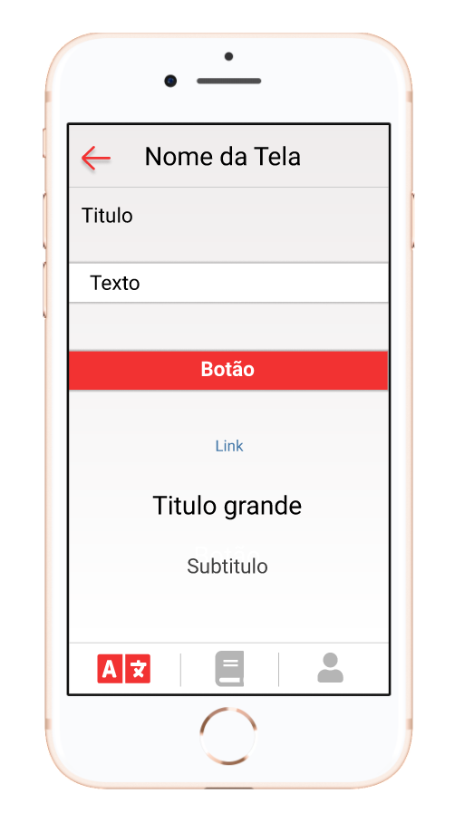
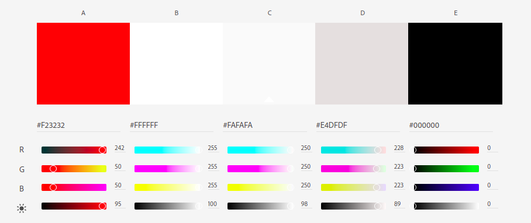

# Identidade Visual

## Histórico de revisão

| Data       | Autor                                                                                          | Modificações                                                                           | Versão |
| ---------- | ---------------------------------------------------------------------------------------------- | -------------------------------------------------------------------------------------- | ------ |
| 26/02/2021 | [Fernando Vargas](https://github.com/SFernandoS) e [Lais Aguiar](https://github.com/laispa)    | Adição do documento de identidade visual inicial                                       | 1.0    |
| 28/02/2021 | [André Pinto](https://github.com/andrelucax) e [Lieverton Silva](https://github.com/lievertom) | Adição do tópico histórico de revisão, revisão dos tópicos, mudança da paleta de cores | 2.0    |
| 28/02/2021 | [André Pinto](https://github.com/andrelucax) e [Lieverton Silva](https://github.com/lievertom) | Revisão da explicação da paleta de cores                                               | 2.1    |
| 28/02/2021 | [André Pinto](https://github.com/andrelucax) e [Lieverton Silva](https://github.com/lievertom) | Correção da data do histórico de revisão e adição do histórico antigo                  | 2.2    |
| 06/03/2021 | [André Pinto](https://github.com/andrelucax) e [Lieverton Silva](https://github.com/lievertom) | Atualização da logo                                                                    | 2.3    |
| 06/03/2021 | [Welison Regis](htpps://github.com/WelisonR)                                                   | Revisão do documento de identidade visual                                              | 2.4    |

## Introdução

O documento de identidade visual tem como principal objetivo definir os parâmetros dos objetos de design das telas da aplicação, sendo eles:

- Paleta de cores: cores utilizadas na aplicação. Caracterizaa o app;

- Logomarca: Logo do app;

- Tipografia: fonte utilizada.

## Paleta de cores

Para realizar a definição das cores, o critério inicial foi relacionado à identidade do povo Kokama, destacando suas cores.

As cores vermelha e preta estão relacionadas às árvores urucu e jenipapo.

A cor branca marca a ausência do povo kokama na história.

Com a cor branca como base para a aplicação foi escolhido o preto para melhor contraste e feito um degrade entre ambos. Com essa análise chegamos ao preto e tons de cinza.

Com as cores escolhidas foi feito um exemplo em aplicação para ver como ficaria a interface:

## Paleta

## Tipografia

A tipografia utilizada na produção do aplicativo será a tipografia padrão para Android do Native Base.

## Interface

Para manter o padrão do design do do aplicativo, decidimos usar o Native Base, que é uma biblioteca de componentes UI open source. Essa biblioteca produz o design tanto para Android quanto para iOS se baseando no mesmo JavaScript.

## Logomarca

A logomarca foi feita baseada na logomarca antiga que o cliente tinha, com mudanças no design para mostrar uma aplicação nova, mantendo os traços da logo antiga.

## Referências

[^1]: **color-blend**. Disponível em: https://meyerweb.com/eric/tools/color-blend/#:::hex/ . Acesso em: 25 fev. 2021.
[^2]: **Adobe Color CC**. Disponível em: https://color.adobe.com/pt/create/color-wheel/. Acesso em: 25 fev. 2021.
